# AI Evaluation — Detailed Learning Guide

> How to measure whether an LLM / RAG / agent system is actually *good*, keep it good as it
> changes, and prove it in an interview. Written for the AI engineer who has to ship and
> defend these systems at a big company.

---

## Table of Contents

1. [Why evaluation matters (the whole point)](#1-why-evaluation-matters)
2. [The mental model: a layered evaluation system](#2-the-mental-model-a-layered-evaluation-system)
3. [Offline vs online evaluation](#3-offline-vs-online-evaluation)
4. [Metric families](#4-metric-families)
   - 4.1 [Reference-based (BLEU / ROUGE / exact-match / F1)](#41-reference-based-metrics)
   - 4.2 [LLM-as-judge (pointwise, pairwise, biases)](#42-llm-as-judge)
   - 4.3 [RAG metrics (faithfulness, answer relevance, context precision/recall)](#43-rag-metrics)
   - 4.4 [Agent / trajectory metrics](#44-agent--trajectory-metrics)
   - 4.5 [Task & product metrics](#45-task--product-metrics)
5. [Building golden datasets](#5-building-golden-datasets)
6. [Regression testing & gating deploys in CI](#6-regression-testing--gating-deploys-in-ci)
7. [A/B testing, canary & online feedback](#7-ab-testing-canary--online-feedback)
8. [Human evaluation](#8-human-evaluation)
9. [Benchmarks & contamination](#9-benchmarks--contamination)
10. [Eval frameworks (RAGAS, DeepEval, TruLens, promptfoo, LangSmith, Langfuse, OpenAI Evals)](#10-eval-frameworks)
11. [Evaluating RAG vs LLM vs agents — what changes](#11-evaluating-rag-vs-llm-vs-agents)
12. [Observability integration](#12-observability-integration)
13. [Architecture, scale, performance & security of eval systems](#13-architecture-scale-performance--security)
14. [Interview cheat-answers & pitfalls](#14-interview-cheat-answers--pitfalls)
15. [Further reading](#15-further-reading)

---

## 1. Why evaluation matters

You cannot improve what you cannot measure — and LLM systems make measurement uniquely
hard because outputs are **open-ended, non-deterministic, and correct-in-many-ways**. A
traditional classifier is either right or wrong. A chatbot answer can be factually right
but rude, grounded but verbose, or fluent but hallucinated.

Three reasons eval is the backbone of any serious AI product:

- **It replaces vibes with numbers.** "It feels better" does not survive a promotion
  committee or an incident review. A score on a fixed dataset does.
- **It's your regression net.** A prompt tweak, model upgrade (GPT-4o → GPT-5), a new
  retriever, or a temperature change can silently break 10% of cases. Evals catch it
  *before* users do.
- **It's a business risk control.** A hallucinated dosage, a leaked PII field, or a
  wrong SQL query has real cost. Eval maps model behavior to business risk.

> **Interview one-liner:** "Evaluation is the CI/CD test suite of an AI system. Without
> it, every deploy is a bet."

### The core difficulty

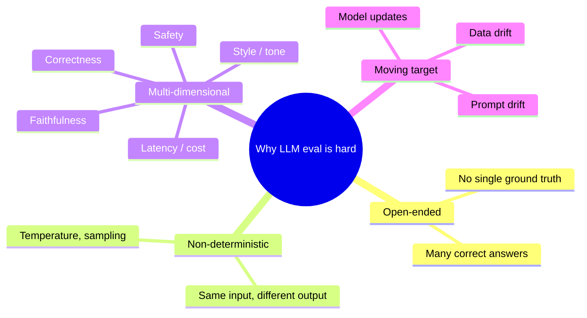

---

## 2. The mental model: a layered evaluation system

The single most important idea for interviews: **no one metric or tool is "evaluation."**
Shipping reliable LLM features needs a *layered* system — offline regression suites,
online/shadow evaluation, and a small set of human-calibrated anchors. Frameworks slot
into that architecture; they don't replace it. (This layered framing is the consensus of
2025–2026 practitioner guides.)

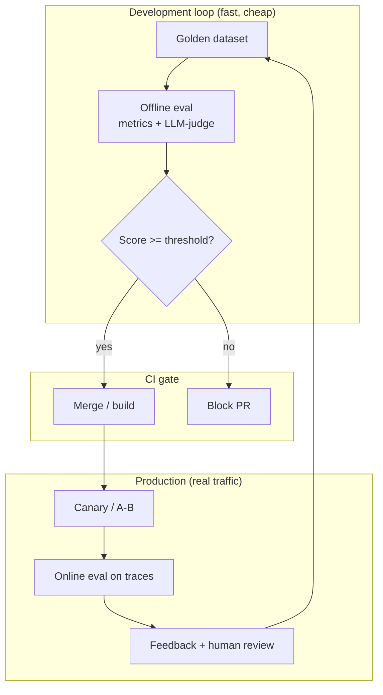

Each layer has a different cost/latency/fidelity trade-off:

| Layer | Speed | Cost | Fidelity to real users | Runs when |
|---|---|---|---|---|
| Deterministic checks (schema, regex, exact-match) | ms | ~0 | low | every row, CI |
| Semantic metrics + LLM-judge | seconds | $ | medium | CI, nightly |
| Human calibration set | hours | $$$ | high | weekly / release |
| Online eval on live traces | async | $ | highest | continuous |

---

## 3. Offline vs online evaluation

**Offline eval** uses a curated dataset (a "golden set"), scenario simulations, and
evaluators to benchmark prompts, workflows, and agents *before* deploy. **Online eval**
attaches evaluators to real production traces, spans, generations, and retrievals to
score live interactions *after* deploy.

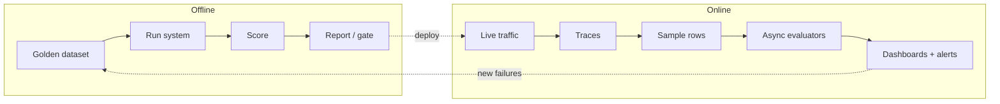

| | Offline | Online |
|---|---|---|
| **Data** | Fixed golden set | Real user traffic |
| **Ground truth** | Usually available | Rarely available |
| **When** | Pre-deploy, CI, nightly | Continuous, post-deploy |
| **Goal** | Catch regressions, compare candidates | Detect drift, real-world quality, edge cases |
| **Risk** | Overfitting to the set, staleness | No labels, sampling bias, cost |
| **Typical metrics** | Exact match, faithfulness, judge score | Feedback rate, thumbs, guardrail hits, deflection |

**Why you need both:** offline tells you a change is *safe to try*; online tells you it
*actually worked* on messy real inputs your golden set never imagined. Offline is
necessary but not sufficient.

---

## 4. Metric families

Choosing the metric is the hard part. Cheap deterministic checks come first, then
semantic metrics, then LLM-as-judge, then humans — a "ladder of cost."

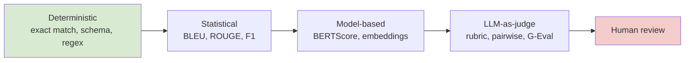

### 4.1 Reference-based metrics

These compare output against a known reference answer. Cheap, deterministic, fast — but
brittle for open-ended text because they measure surface overlap, not meaning.

| Metric | What it measures | Good for | Weakness |
|---|---|---|---|
| **Exact match (EM)** | Output == reference | Classification, closed QA, tool args | Zero partial credit |
| **F1 (token overlap)** | Precision/recall of tokens | Span QA (SQuAD-style) | Ignores meaning |
| **BLEU** | n-gram precision (+brevity penalty) | Machine translation | Penalizes valid paraphrases |
| **ROUGE (1/2/L)** | n-gram / longest-subseq recall | Summarization | Rewards copying, misses fluency |
| **BERTScore** | Embedding cosine of tokens | Semantic similarity | Needs a model; less interpretable |

```python
# Classic reference-based metrics — cheap, deterministic, good baselines.
from collections import Counter

def exact_match(pred: str, gold: str) -> int:
    # Normalize before comparing: lowercase, strip. WHY: "Paris." vs "paris"
    # should not count as a miss for a factual QA task.
    norm = lambda s: s.strip().lower().rstrip(".")
    return int(norm(pred) == norm(gold))

def token_f1(pred: str, gold: str) -> float:
    # Token-level F1 gives partial credit — the standard for extractive QA.
    p, g = pred.lower().split(), gold.lower().split()
    common = Counter(p) & Counter(g)
    overlap = sum(common.values())
    if overlap == 0:
        return 0.0
    precision, recall = overlap / len(p), overlap / len(g)
    return 2 * precision * recall / (precision + recall)

print(exact_match("Paris.", "paris"))          # 1
print(round(token_f1("the Eiffel tower", "Eiffel tower is tall"), 2))  # partial credit
```

> **When to use:** deterministic tasks (SQL, JSON extraction, math answers, classification).
> **When NOT to use:** free-form chat, summaries, creative text — BLEU/ROUGE correlate
> poorly with human judgment there. A common junior mistake is defaulting to BLEU/ROUGE
> for chatbot answers.

### 4.2 LLM-as-judge

Use a strong LLM to score another model's output against a rubric you write in the prompt.
This is the most widely used method in 2025–2026 for nuanced criteria because it captures
semantics that BLEU/ROUGE miss. Three modes:

- **Pointwise / direct scoring** — "Rate this answer 1–5 for helpfulness." Cheap, but
  scores drift and are hard to calibrate.
- **Pairwise comparison** — "Is A or B better?" More reliable for nuanced criteria;
  the backbone of preference data and arena rankings.
- **Reference-based (G-Eval style)** — score with chain-of-thought against a reference or
  retrieved context (best for factual grounding / faithfulness).

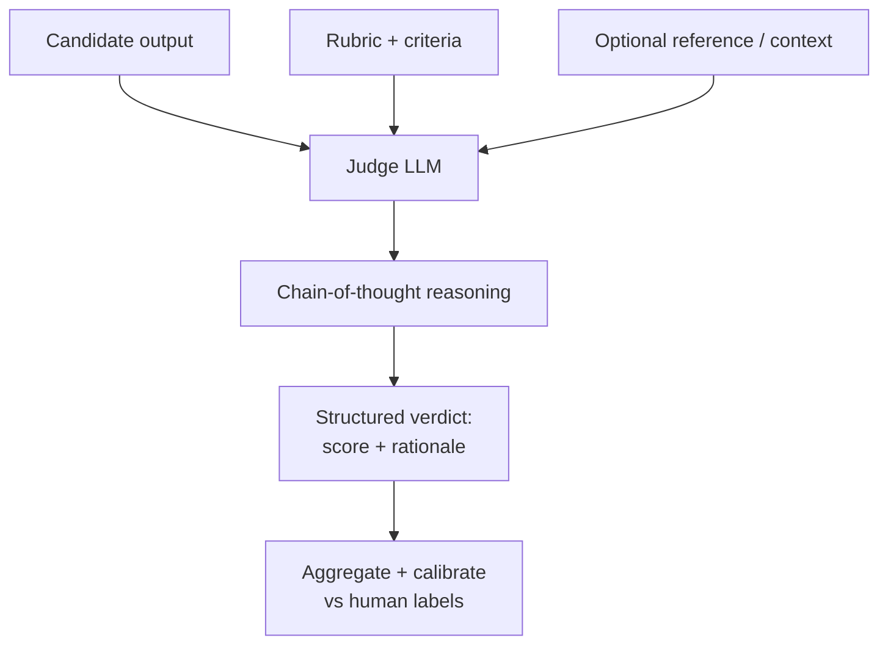

#### Judge biases (know these cold — classic senior question)

| Bias | What happens | Mitigation |
|---|---|---|
| **Position bias** | Prefers the first (or last) option shown | Alternate order; average both directions |
| **Verbosity / length bias** | Longer answers score higher | Normalize for length; instruct to ignore length |
| **Self-enhancement bias** | Judge favors outputs from its own model family | Use a different model family as judge |
| **Formatting bias** | Markdown/bullets look "smarter" | Strip formatting or tell judge to ignore |
| **Sycophancy** | Agrees with assertive/confident wording | Blind the judge to confidence cues |
| **Leniency / clustering** | Everything gets a 4/5 | Use pairwise; force rubric anchors |

```python
"""LLM-as-judge with the two biggest bias controls: position swap + structured rubric."""
import json
from openai import OpenAI

client = OpenAI()

JUDGE_PROMPT = """You are a strict evaluator. Compare two answers to the user's question.
Judge ONLY factual correctness and helpfulness. IGNORE length and formatting.
Return JSON: {{"winner": "A"|"B"|"tie", "reason": "..."}}.

Question: {q}
Answer A: {a}
Answer B: {b}"""

def judge_pairwise(q, ans1, ans2, model="gpt-4o"):
    # WHY swap: position bias means the judge over-picks whichever is shown first.
    # Run both orders and only trust the result if it's consistent.
    def one(a, b):
        r = client.chat.completions.create(
            model=model, temperature=0,
            response_format={"type": "json_object"},
            messages=[{"role": "user", "content": JUDGE_PROMPT.format(q=q, a=a, b=b)}],
        )
        return json.loads(r.choices[0].message.content)["winner"]

    fwd = one(ans1, ans2)               # ans1 as A
    rev = one(ans2, ans1)               # ans1 now as B
    # Map reverse verdict back to original labels
    rev_mapped = {"A": "B", "B": "A", "tie": "tie"}[rev]
    if fwd == rev_mapped:
        return fwd                      # consistent -> trustworthy
    return "tie"                        # inconsistent -> judge is biased/uncertain
```

> **Always calibrate the judge against a human-labeled set** using agreement metrics like
> **Cohen's kappa** (chance-corrected). If judge↔human kappa is low, the judge is not
> trustworthy for that criterion. A judge you never calibrated is just another opinion.

### 4.3 RAG metrics

RAG has two halves — **retriever** and **generator** — and you must measure them
separately, or you'll "fix" the wrong one. The RAG triad:

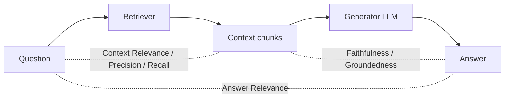

| Metric | Half | Question it answers | Needs ground truth? |
|---|---|---|---|
| **Context precision** | Retriever | Of retrieved chunks, how many are relevant (and ranked high)? | Sometimes |
| **Context recall** | Retriever | Did we retrieve all the chunks needed to answer? | Yes (reference answer/chunks) |
| **Context relevance** | Retriever | Is the retrieved context on-topic for the query? | No |
| **Faithfulness / groundedness** | Generator | Is every claim in the answer supported by the context? | No (uses context as reference) |
| **Answer relevance** | Generator | Does the answer actually address the question? | No |
| **Answer correctness** | End-to-end | Is the answer factually right vs a gold answer? | Yes |

- **Faithfulness** decomposes the answer into atomic claims, then checks each against the
  retrieved context. In 2025–2026, LLM-judge faithfulness became reliable *when paired with
  strong reference models* rather than cheap ones that under-detect contradiction.
- **Context recall** is the metric people forget — a beautiful answer built on incomplete
  context is a landmine.

```python
"""Faithfulness by claim decomposition — the idea behind RAGAS/DeepEval faithfulness."""
import json
from openai import OpenAI
client = OpenAI()

def faithfulness(answer: str, context: str, model="gpt-4o") -> float:
    # Step 1: break the answer into atomic factual claims.
    # WHY: scoring per-claim localizes hallucinations instead of a vague overall score.
    claims = json.loads(client.chat.completions.create(
        model=model, temperature=0, response_format={"type": "json_object"},
        messages=[{"role": "user", "content":
            f'Extract atomic factual claims as JSON {{"claims": [...]}}.\nText: {answer}'}],
    ).choices[0].message.content)["claims"]

    # Step 2: check each claim can be inferred from the retrieved context.
    supported = 0
    for c in claims:
        v = client.chat.completions.create(
            model=model, temperature=0, response_format={"type": "json_object"},
            messages=[{"role": "user", "content":
                f'Can this claim be inferred ONLY from the context? '
                f'JSON {{"supported": true|false}}.\nContext: {context}\nClaim: {c}'}],
        ).choices[0].message.content
        supported += int(json.loads(v)["supported"])
    return supported / max(len(claims), 1)   # 1.0 = fully grounded
```

### 4.4 Agent / trajectory metrics

Agents differ from single-shot LLMs in three ways that change how you measure them: they
run over **extended trajectories** (many steps), they **call tools** and change external
state, and they are **multi-turn**. So you evaluate both the **final outcome** and the
**path taken**.

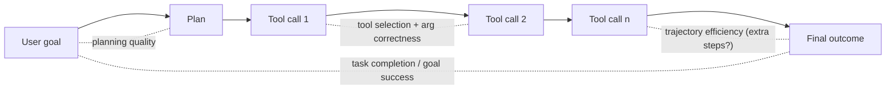

Metric groups that matter (2026 consensus): **tool calling** (right tool? right args?),
**planning**, **task completion / goal success**, **reasoning quality**, plus production
concerns — **safety, latency, cost, number of steps**.

| Metric | Measures | Method |
|---|---|---|
| Task completion / goal success | Did the agent achieve the user's goal? | End-state check or LLM-judge |
| Tool-selection accuracy | Chose the correct tool | Compare vs expected tool |
| Tool-argument correctness | Passed valid args | Schema + value check |
| Trajectory efficiency | Extra / redundant steps | Steps vs optimal path |
| Reference-trajectory match | Followed a valid path | Graph/sequence comparison |
| Cost & latency per task | Tokens, wall-clock, $ | Trace aggregation |

> **When outcome-only fails:** an agent can reach the right answer through a lucky,
> unsafe, or wildly expensive path. Trajectory-aware eval (e.g., step-level tool checks)
> catches "right answer, wrong reasons." But rigid single-reference-trajectory matching is
> too strict — many valid paths exist — so prefer outcome + step-level checks, or graph-based
> trajectory comparison for open-ended tasks.

### 4.5 Task & product metrics

Ultimately connect eval to the product:

- **Text-to-SQL:** execution accuracy (does the query return the right rows?), not string
  match.
- **Summarization:** faithfulness + coverage + conciseness.
- **Classification / routing:** accuracy, precision/recall, confusion matrix.
- **Support bot:** deflection rate, escalation rate, CSAT.
- **Code gen:** functional correctness via unit tests (pass@k), not text overlap.

---

## 5. Building golden datasets

A golden ("eval") dataset is a curated set of inputs with expected outputs / rubrics that
you score against. It is the single highest-leverage artifact in your eval stack.

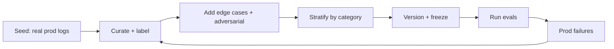

**Principles**

- **Source from reality.** Mine real production traces first; synthetic-only sets miss the
  weird stuff users do.
- **Stratify.** Cover intents, languages, difficulty, and known-hard categories so a single
  average doesn't hide a broken slice. Report **per-slice** scores.
- **Include adversarial & edge cases.** Prompt injections, empty inputs, ambiguous queries,
  out-of-scope questions, PII.
- **Version and freeze it.** Treat it like code — a Git-tracked, versioned dataset. Changing
  the dataset and the model at the same time makes results uninterpretable.
- **Right size.** Start with 50–200 well-chosen, labeled examples; a small, high-quality,
  well-stratified set beats 10k noisy rows.
- **Guard against leakage.** Keep the eval set out of any fine-tuning / prompt-optimization
  data (see contamination, §9).

```python
# A versioned golden record. Keep these in Git as JSONL; one dict per line.
golden = {
    "id": "sql-023",
    "category": "text2sql/joins",      # for per-slice reporting
    "difficulty": "hard",
    "input": "Total revenue per region for 2024",
    "expected_sql": "SELECT region, SUM(amount) ... WHERE year=2024 GROUP BY region",
    "rubric": "Must group by region, filter year=2024, sum amount.",
    "tags": ["adversarial:none"],
    "dataset_version": "2026-02-01",
}
```

---

## 6. Regression testing & gating deploys in CI

Evals belong in CI exactly like unit tests. A prompt/model/retriever change runs the golden
set; if aggregate or any critical slice drops below threshold, **block the PR**.

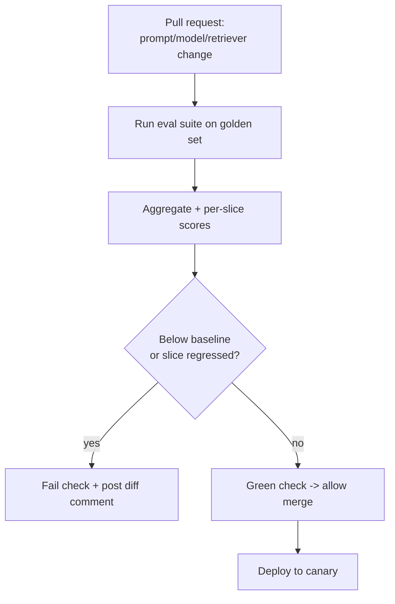

**Design choices**

- **Absolute thresholds vs baseline diff.** Gate on both: "faithfulness ≥ 0.9" *and* "no
  slice dropped > 3 points vs main."
- **Deterministic-first.** Run cheap schema/exact-match checks on every commit; run
  expensive LLM-judge on PRs / nightly to control cost & flakiness.
- **Handle judge non-determinism.** Set `temperature=0`, pin the judge model version, and
  average over N runs for borderline cases; otherwise flaky evals erode trust.
- **Report artifacts.** Post a table of pass/fail per slice as a PR comment so reviewers see
  *what* regressed, not just a red X.

```yaml
# .github/workflows/eval.yml  (illustrative)
name: llm-eval-gate
on: [pull_request]
jobs:
  eval:
    runs-on: ubuntu-latest
    steps:
      - uses: actions/checkout@v4
      - run: pip install -r 6-Implementation-Code-Examples/requirements.txt
      - name: Run golden-set regression
        env:
          OPENAI_API_KEY: ${{ secrets.OPENAI_API_KEY }}
        # Exit non-zero if aggregate < threshold or any slice regressed -> blocks merge.
        run: python 6-Implementation-Code-Examples/golden_set_regression.py --fail-under 0.9
```

---

## 7. A/B testing, canary & online feedback

Offline green doesn't guarantee real-world wins. Roll out progressively and measure on live
traffic.

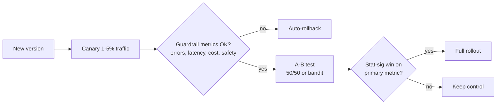

- **Canary:** send a tiny slice of traffic to the new version, watch guardrails (latency,
  error rate, cost, safety hits), auto-rollback on breach. Limits blast radius.
- **A/B test:** split traffic, compare a **primary metric** (task success, thumbs-up rate,
  conversion) with **statistical significance**; watch guardrail metrics don't degrade.
- **Shadow eval:** run the new version on real inputs without showing users the output;
  compare offline. Zero user risk, great for scary changes.
- **Online feedback:** explicit (thumbs, ratings) + implicit (edits, retries, copy, abandon,
  follow-up questions). Implicit signals are noisy but plentiful.

> **Watch out:** thumbs-up rates are biased (few users click), and A/B needs enough volume
> for significance. Pair online signals with sampled LLM-judge scoring on traces.

---

## 8. Human evaluation

Humans remain the gold standard and the **calibration anchor** for every automated metric.

- **When:** high-stakes launches, judge calibration, ambiguous/subjective quality
  (helpfulness, tone, safety), and building preference data.
- **How:** clear rubric, multiple annotators per item, measure **inter-annotator agreement**
  (Cohen's/Fleiss' kappa). Low agreement means the rubric is ambiguous — fix the rubric, not
  the annotators.
- **Prefer pairwise** ("which is better?") over absolute 1–5 scores — humans are far more
  consistent comparing than rating in isolation.
- **Cost control:** humans label a small anchor set; the LLM-judge scores the rest *after*
  you've shown it agrees with humans.

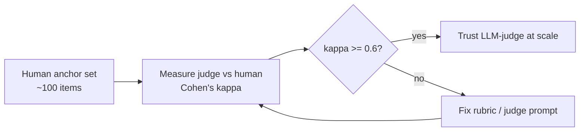

---

## 9. Benchmarks & contamination

Public benchmarks (MMLU, GSM8K, HumanEval, LMArena) are useful for *comparing foundation
models*, but they are **not** your application eval.

| Benchmark | Tests | Note |
|---|---|---|
| **MMLU** | 57-subject multiple-choice knowledge | Heavily reported; contamination found |
| **GSM8K** | Grade-school math word problems | Reasoning; leakage inflates scores |
| **HumanEval** | Python function synthesis (pass@k) | Functional correctness; widely leaked |
| **LMArena (Chatbot Arena)** | Human pairwise preference, Elo | Live, harder to game, but style-biased |

### Contamination (the big-company favorite question)

Because LLMs train on web-scale corpora, benchmark test data often ends up in training data,
inflating reported scores. Systematic reviews through late-2025 flagged this across the most-cited
benchmarks; researchers reported large contaminated fractions of HumanEval and meaningful
accuracy drops on GSM8K/MMLU after removing contaminated items. Reported figures vary by study
and method. ([systematic review](https://aclanthology.org/2026.gem-main.50/),
[rephrased samples](https://arxiv.org/abs/2311.04850))

**Implications & defenses**

- Treat public leaderboard numbers with suspicion; a 90% MMLU may not mean what the model
  card implies.
- Use **private, held-out eval sets** for your own decisions.
- **Rephrase / perturb** benchmark items to detect memorization (big drop = contamination).
- **Time-split:** evaluate on data created *after* the model's training cutoff.
- Watch **indirect leakage** via synthetic data generated by other models, and **overfitting**
  from repeatedly selecting on the same eval set.

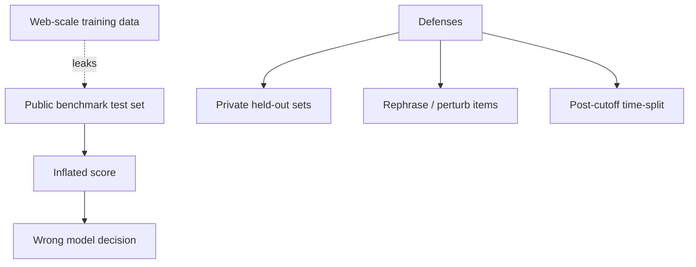

---

## 10. Eval frameworks

You rarely build all this from scratch. The 2025–2026 landscape splits by *style* and *scope*:
pytest-style, YAML-style, notebook/decorator-style, and platform-bundled (with tracing +
dashboards). Frameworks slot into the layered system — they don't replace the strategy.

| Tool | Style / focus | Strengths | Watch-outs |
|---|---|---|---|
| **RAGAS** | Library, RAG metrics | Faithfulness, answer/context relevance, context recall out of the box | RAG-centric; less of a full platform |
| **DeepEval** | Pytest-style, OSS | Many metrics (G-Eval), unit-test feel, CI-friendly | Self-host for dashboards |
| **TruLens** | Feedback functions | Instrument + score RAG/agents, the "RAG triad" | Smaller ecosystem now |
| **promptfoo** | YAML config, CLI | Fast prompt/model matrix comparisons, red-teaming, CI | Config sprawl on big suites; now under OpenAI |
| **LangSmith** | Platform (LangChain) | Tracing + datasets + eval + monitoring, great DX | Commercial; best with LangChain |
| **Langfuse** | OSS platform | Tracing + online eval + prompt mgmt, self-hostable | You run the infra |
| **OpenAI Evals** | Framework/registry | Standardized eval templates, model-graded | OpenAI-centric |
| **Arize Phoenix** | OSS observability | Tracing + eval, notebook-friendly | Leans observability |
| **Braintrust** | Commercial platform | Full lifecycle: eval → monitor → release gating | Paid |

> **Interview framing:** "I pick a metrics library (RAGAS/DeepEval) for offline CI, and an
> observability platform (Langfuse/LangSmith/Phoenix) for online eval on traces. The tool is
> plumbing; the golden set + rubric + human calibration is the substance."

```python
# DeepEval-style: an eval reads like a pytest test — perfect for CI gating.
from deepeval import assert_test
from deepeval.test_case import LLMTestCase
from deepeval.metrics import FaithfulnessMetric, AnswerRelevancyMetric

def test_rag_answer():
    tc = LLMTestCase(
        input="What is the refund window?",
        actual_output="You can get a refund within 30 days.",
        retrieval_context=["Refunds are accepted within 30 days of purchase."],
    )
    # threshold + judge model make this a hard gate; assert_test raises on failure.
    assert_test(tc, [FaithfulnessMetric(threshold=0.9),
                     AnswerRelevancyMetric(threshold=0.8)])
```

---

## 11. Evaluating RAG vs LLM vs agents

Same philosophy, different surface area:

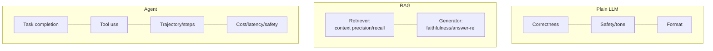

| System | Primary metrics | Extra concern |
|---|---|---|
| **Plain LLM** | Correctness, relevance, safety, format compliance | Prompt sensitivity |
| **RAG** | Faithfulness, answer relevance, context precision/recall | Isolate retriever vs generator failures |
| **Agent** | Task completion, tool accuracy, trajectory, cost | State changes, multi-turn, non-determinism explosion |

Rule of thumb: **evaluate at both the component level and end-to-end.** Component evals tell
you *where* it broke; end-to-end tells you *whether the user won*.

---

## 12. Observability integration

Everything above rests on **tracing**: every LLM call recorded with inputs, outputs,
retrieved context, tool calls, latency, tokens, and cost — stitched into a trace per user
request. This is table stakes; every other eval layer builds on top of it.

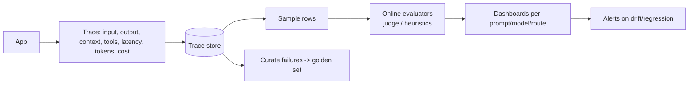

- **Per-dimension dashboards:** slice scores by prompt version, model, route, customer.
- **Alert on drift:** faithfulness dropping over a week signals data/prompt drift.
- **Close the loop:** production failures become new golden-set rows — the flywheel.
- OpenTelemetry-style **GenAI semantic conventions** are standardizing what a "span" for an
  LLM call looks like, so tools interoperate.

---

## 13. Architecture, scale, performance & security

**Architecture of an eval platform**

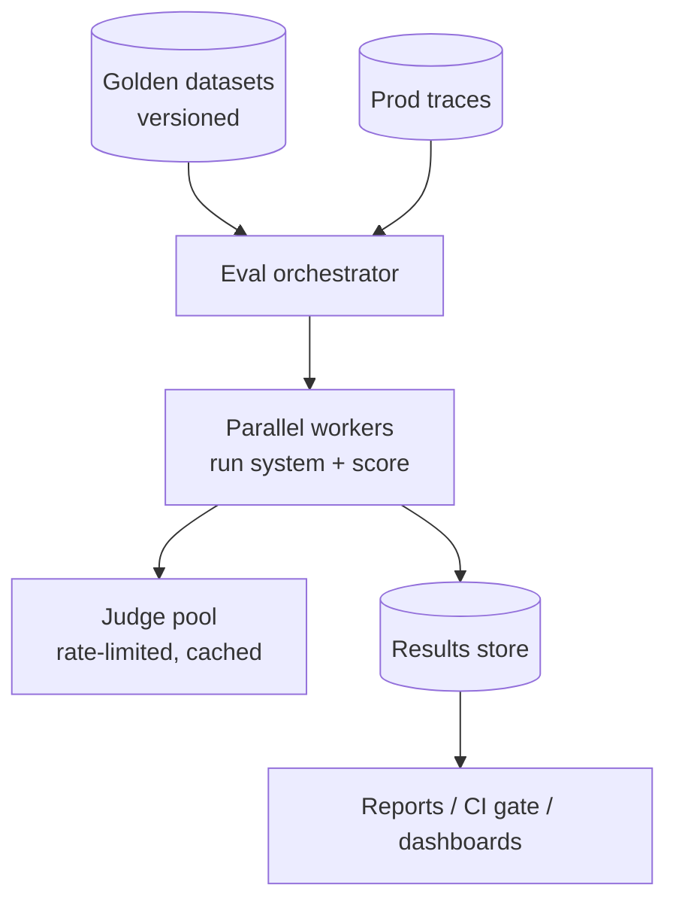

**Scale & performance**

- LLM-judge eval is **expensive and slow** (an API call per row per metric). Techniques:
  batch/parallelize with rate-limit-aware concurrency, **cache** judge verdicts by input hash,
  use a **cheaper judge** for easy rows and escalate only borderline ones (cascade), and
  **sample** production traffic instead of scoring 100%.
- Run deterministic checks on 100% of rows (nearly free) and reserve judges for the subset
  that needs semantics.
- Make evals **idempotent & reproducible**: pin model versions, `temperature=0`, fixed
  dataset version.

**Security & safety**

- **Prompt injection in eval data:** untrusted content (retrieved docs, user inputs) can
  hijack your *judge*. Sandbox judge prompts; never let eval content override system
  instructions.
- **PII / data governance:** traces contain user data. Mask PII before storing, control
  access, honor retention/deletion policies. Eval datasets are a data-privacy surface.
- **Leakage:** don't let your eval set flow into training/prompt-optimization data.
- **Red-teaming as eval:** include jailbreak / injection / toxic-output test suites
  (promptfoo and others support this) as first-class gated metrics.

---

## 14. Interview cheat-answers & pitfalls

**If you say one thing, say this:** "Evaluation is a *layered system* — cheap deterministic
checks, semantic + LLM-judge metrics on a versioned golden set gating CI, online eval on
sampled production traces, and a small human-calibrated anchor set. Tools are plumbing;
the golden set, rubric, and calibration are the substance."

Common pitfalls to name:
- Using BLEU/ROUGE for open-ended chat.
- An uncalibrated LLM-judge (no kappa vs humans).
- Ignoring position/verbosity bias in judges.
- Reporting only an average — hiding a broken slice.
- Trusting contaminated public benchmarks for product decisions.
- Offline-only: never validating on real traffic.
- Changing dataset + model together (uninterpretable).
- Outcome-only agent eval (missing unsafe/expensive trajectories).

---

## 15. Further reading

- [LLM evaluation & monitoring in production (Pedro Alonso)](https://www.pedroalonso.net/blog/llm-evaluation-monitoring-production/)
- [LLM eval frameworks & metrics — the layered system (BigData Boutique)](https://bigdataboutique.com/blog/llm-evaluation-frameworks-metrics-best-practices)
- [RAG evaluation metrics (Confident AI / DeepEval)](https://www.confident-ai.com/blog/rag-evaluation-metrics-answer-relevancy-faithfulness-and-more)
- [LLM-as-a-judge: how it works, when it fails (Future AGI)](https://futureagi.com/blog/llm-as-a-judge/)
- [LLM agent evaluation guide (Confident AI)](https://www.confident-ai.com/blog/llm-agent-evaluation-complete-guide)
- [Benchmark contamination systematic review (ACL)](https://aclanthology.org/2026.gem-main.50/)
- [RAGAS docs](https://docs.ragas.io/) · [DeepEval](https://github.com/confident-ai/deepeval) · [promptfoo](https://www.promptfoo.dev/) · [Langfuse](https://langfuse.com/) · [LangSmith](https://docs.smith.langchain.com/) · [OpenAI Evals](https://github.com/openai/evals) · [TruLens](https://www.trulens.org/)

---

> Content synthesized from general domain knowledge and current (2025-2026) interview trends; rephrased for compliance with licensing restrictions.
