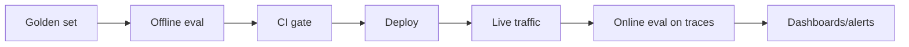
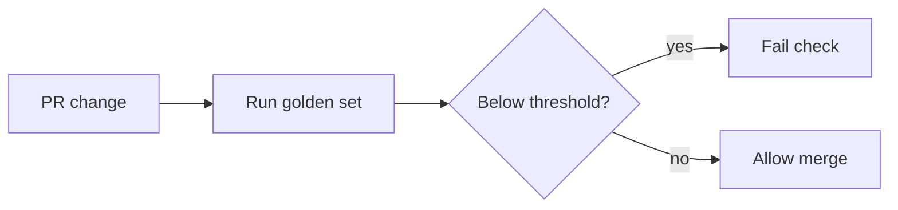

# AI Evaluation — Basic Interview Questions

Foundational questions you should answer smoothly. Natural tone, with the *why* behind each
answer — that's what interviewers actually score.

## Quick Coverage Map

| # | Question | Theme |
|---|---|---|
| 1 | Why is evaluating LLMs harder than classic ML? | Motivation |
| 2 | Offline vs online evaluation? | Core concepts |
| 3 | What is a golden dataset? | Data |
| 4 | Why are BLEU/ROUGE weak for chatbots? | Reference metrics |
| 5 | What is LLM-as-a-judge? | Model-based eval |
| 6 | Name the core RAG metrics | RAG |
| 7 | What's faithfulness / hallucination? | RAG |
| 8 | Precision vs recall in retrieval? | RAG |
| 9 | Why evals in CI? | Regression |
| 10 | What is human evaluation for? | Human eval |
| 11 | Exact match vs F1? | Reference metrics |
| 12 | What does a trace capture? | Observability |

---

### 1. Why is evaluating LLMs harder than classic ML?

Classic ML outputs are usually a class or a number, so "right vs wrong" is clean. LLM outputs
are **open-ended** (many valid answers), **non-deterministic** (same prompt → different text),
and **multi-dimensional** (an answer can be correct but rude, grounded but verbose, fluent but
hallucinated). So there's rarely a single ground truth and you must measure several qualities at
once — correctness, faithfulness, safety, tone, latency, cost.

> **One-liner:** "There's no single right answer, and the same input gives different outputs —
> so you measure qualities, not exact matches."

---

### 2. What's the difference between offline and online evaluation?

- **Offline:** run the system on a fixed, curated **golden dataset** *before* deploy. Great for
  catching regressions and comparing candidates. You usually have expected answers.
- **Online:** score **real production traffic** *after* deploy, usually by attaching evaluators
  to traces. Catches drift and real-world edge cases. You rarely have ground-truth labels.

You need both: offline says a change is *safe to try*; online says it *actually worked* on messy
real inputs.

---

### 3. What is a golden dataset?

A curated, **versioned** set of inputs with expected outputs (or a rubric) that you score
against. It's the highest-leverage artifact in eval. Best practice: source it from **real
production logs**, add edge/adversarial cases, **stratify by category**, keep it small but
high-quality (50–200 solid examples beats 10k noisy ones), and treat it like code in Git.

**Why versioned:** if you change the dataset and the model at the same time, results become
uninterpretable.

---

### 4. Why are BLEU and ROUGE weak for chatbot answers?

They measure **surface n-gram overlap** with a reference, not meaning. A perfectly correct
paraphrase that shares few words gets a low score, and copied-but-wrong text can score high. They
were built for machine translation (BLEU) and summarization (ROUGE) where overlap is a decent
proxy. For open-ended chat they correlate poorly with human judgment — use semantic metrics or
LLM-as-judge instead.

**When they're still fine:** deterministic tasks (translation, extractive QA, structured output).

---

### 5. What is LLM-as-a-judge?

Using a strong LLM to evaluate another model's output against a **rubric** you spell out in a
prompt — e.g., "rate faithfulness 1–5" or "which answer is better, A or B?" It captures semantic
quality that BLEU/ROUGE miss and scales far cheaper than humans. It's the most common method in
2025–2026.

**Catch:** judges have biases (position, verbosity, self-preference), so you must control for them
and **calibrate against human labels** before trusting the scores.

---

### 6. Name the core RAG evaluation metrics.

Split by the two halves of RAG:

- **Retriever:** context precision (are retrieved chunks relevant / well-ranked?), context recall
  (did we get *all* needed chunks?), context relevance.
- **Generator:** faithfulness (is every claim supported by the context?), answer relevance (does it
  address the question?).
- **End-to-end:** answer correctness vs a gold answer.

Measure the halves separately or you'll fix the wrong component.

---

### 7. What is faithfulness / what is a hallucination?

**Faithfulness** (a.k.a. groundedness) measures whether every claim in the answer is supported by
the retrieved context. A **hallucination** is a claim that isn't supported — the model made it up
or contradicted the source. Typical measurement: decompose the answer into atomic claims, then
check each against the context (often with an LLM judge). Per-claim scoring localizes *which*
statement is unsupported.

---

### 8. Precision vs recall in retrieval — why care about both?

- **Precision:** of the chunks you retrieved, how many are relevant. Low precision = noise that
  distracts the generator.
- **Recall:** of the chunks that *were* relevant, how many you retrieved. Low recall = the answer
  is built on incomplete evidence.

People often optimize precision and forget recall — but a fluent answer on missing context is a
landmine. You typically balance both (e.g., retrieve more, then rerank).

---

### 9. Why put evals in CI?

So a prompt tweak, model upgrade, or retriever change can't silently break 10% of cases. Evals in
CI act like unit tests: run the golden set on every PR, and **block the merge** if the aggregate
or any critical slice drops below threshold. This turns "it feels better" into a hard, reviewable
gate.

---

### 10. What is human evaluation used for?

Humans are the **gold standard** and the **calibration anchor**. Use them for high-stakes
launches, subjective quality (helpfulness, tone, safety), and — crucially — to check that your
LLM-judge agrees with people (via inter-annotator/judge agreement like Cohen's kappa). Because
humans are expensive, they label a small anchor set and the judge scales the rest once you've
shown it agrees.

Prefer **pairwise** ("which is better?") over 1–5 ratings — humans are more consistent comparing.

---

### 11. Exact match vs F1 — when do you use each?

- **Exact match (EM):** output must equal the reference (after light normalization). Zero partial
  credit. Good for closed QA, classification, tool arguments, math answers.
- **Token F1:** precision/recall over overlapping tokens — gives partial credit. Standard for
  extractive/span QA where an answer can be "mostly right."

Use EM when there's exactly one acceptable string; use F1 when partial overlap is meaningful.

---

### 12. What does a trace capture, and why does it matter?

A trace records everything about one request: input, output, retrieved context, tool calls,
latency, token counts, and cost — stitched together per user request. It's **table stakes**:
online eval, dashboards, drift alerts, and curating new golden-set rows all build on top of
traces. No tracing, no real observability or online eval.

---

## Further Reading

- [Offline vs online evals (Maxim)](https://www.getmaxim.ai/articles/rag-evaluation-a-complete-guide-for-2025/)
- [RAG eval metrics (Confident AI)](https://www.confident-ai.com/blog/rag-evaluation-metrics-answer-relevancy-faithfulness-and-more)
- [LLM-as-a-judge (DataCamp)](https://www.datacamp.com/tutorial/llm-as-a-judge-rag)
- [Production LLM eval & monitoring (Pedro Alonso)](https://www.pedroalonso.net/blog/llm-evaluation-monitoring-production/)

---

> Content synthesized from general domain knowledge and current (2025-2026) interview trends; rephrased for compliance with licensing restrictions.
