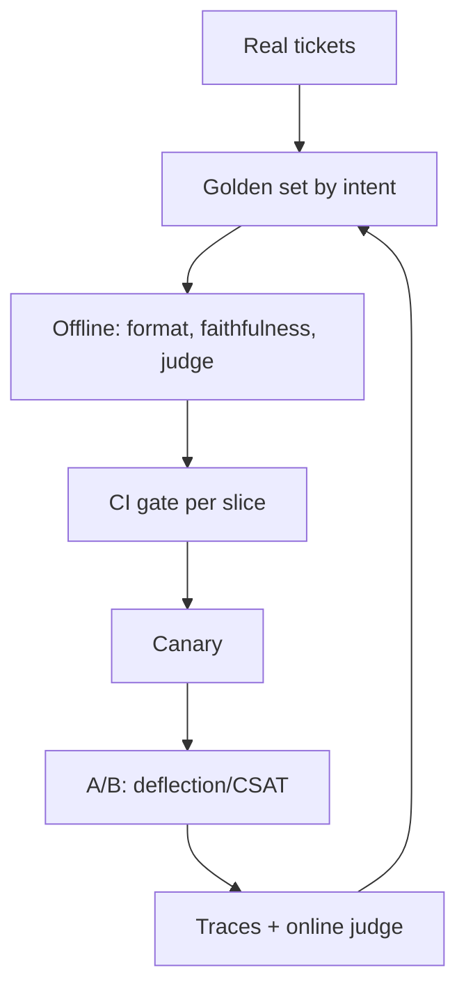
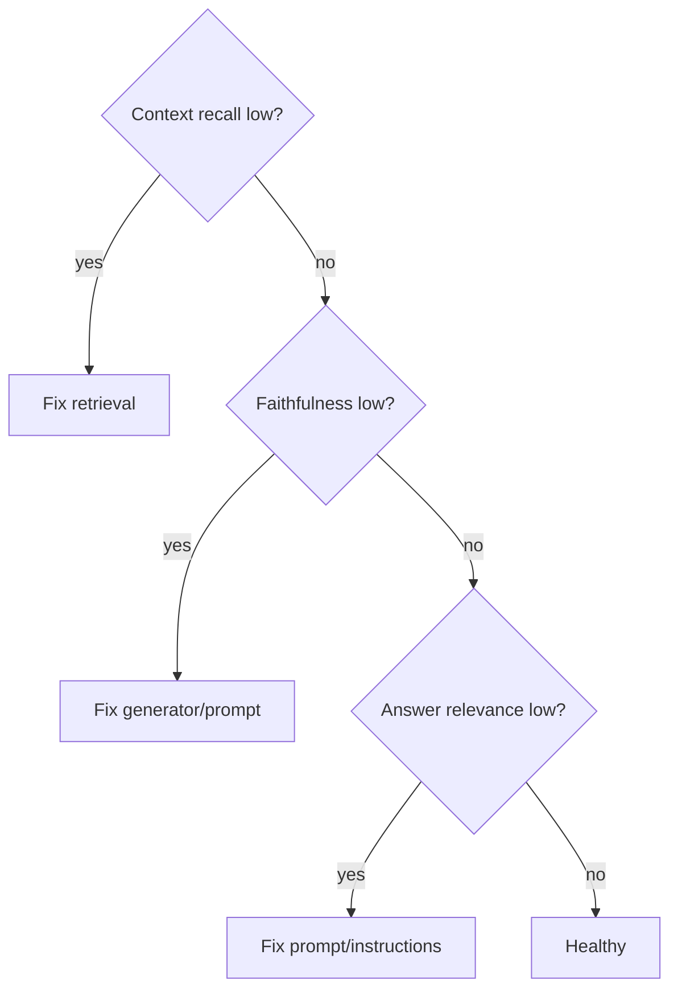

# AI Evaluation — Medium Interview Questions

Mid-level questions: you should reason about trade-offs, not just recite definitions.

## Quick Coverage Map

| # | Question | Theme |
|---|---|---|
| 1 | Design an eval for a support chatbot | System design |
| 2 | How do you control LLM-judge bias? | Judge reliability |
| 3 | Pointwise vs pairwise judging? | Judge methods |
| 4 | How do you calibrate a judge? | Calibration |
| 5 | Retriever failing vs generator failing? | RAG debugging |
| 6 | How do you gate a deploy on evals? | CI |
| 7 | Canary vs A/B vs shadow? | Rollout |
| 8 | Why not trust public benchmarks? | Contamination |
| 9 | Handling judge non-determinism in CI | Reproducibility |
| 10 | Metrics for a text-to-SQL feature? | Task metrics |
| 11 | Online feedback signals — explicit vs implicit | Online eval |
| 12 | Picking an eval framework | Tooling |

---

### 1. Design an evaluation setup for a customer-support chatbot.

Think **layered**:

1. **Golden set** from real tickets, stratified by intent (billing, refunds, tech), difficulty,
   and language; include adversarial/injection cases. Version it in Git.
2. **Offline metrics:** deterministic checks (does it follow required format / not leak PII),
   faithfulness + answer relevance (it's RAG over help docs), and an LLM-judge for helpfulness/tone
   calibrated against humans.
3. **CI gate:** block PRs if aggregate or any intent slice regresses.
4. **Online:** trace every conversation; sample and run judge evals; track deflection rate,
   escalation rate, thumbs, and guardrail hits.
5. **Human anchor set** for calibration and high-stakes review.

Key point: **report per-slice**, not one average — an average hides a broken "refunds" intent.

---

### 2. How do you control LLM-as-judge bias?

Name the biases and the fix:

| Bias | Fix |
|---|---|
| Position (prefers first/last) | Swap order, average both directions; only trust consistent verdicts |
| Verbosity (longer = better) | Tell judge to ignore length; normalize |
| Self-enhancement (favors own family) | Use a different model family as judge |
| Formatting (markdown looks smart) | Strip formatting or instruct to ignore |
| Leniency (everything 4/5) | Use pairwise + rubric anchors |

Plus: `temperature=0`, a clear rubric with explicit anchors, structured JSON verdicts, and
**calibration against human labels**. An uncalibrated judge is just an opinion.

---

### 3. Pointwise vs pairwise judging — which and when?

- **Pointwise:** score one output on an absolute scale (1–5). Simple, cheap, gives an absolute
  number — but scores drift and cluster (everything's a 4).
- **Pairwise:** "is A or B better?" Far more reliable for nuanced quality and the basis of
  preference data / arena Elo — but it's relative (no absolute score) and needs O(n²) comparisons
  for full ranking.

Use pointwise for coarse thresholds/regression tracking; pairwise when comparing two candidate
prompts/models or building preferences.

---

### 4. How do you calibrate an LLM judge?

Build a **human-labeled anchor set** (~100 items), run the judge on it, and measure agreement with
a chance-corrected metric like **Cohen's kappa** (not raw accuracy, which is inflated when one
label dominates). If kappa is low (< ~0.6), fix the rubric or judge prompt and re-measure. Only
then trust the judge to score the rest at scale. Re-calibrate when you change the judge model.

---

### 5. How do you tell whether the retriever or the generator is failing?

Measure the halves separately:

- **Retriever metrics** (context precision/recall/relevance) low → retrieval problem: bad chunking,
  wrong embeddings, weak reranking, missing docs.
- **Retriever good but faithfulness low** → generator problem: the model ignores or contradicts
  good context (prompt issue, weak model, too much context).
- **Faithful but answer-relevance low** → grounded but off-topic; prompt/formatting issue.

---

### 6. How do you gate a deploy on evals?

Run the golden set in CI on every PR that touches prompts/models/retrieval. Gate on **both** an
absolute threshold (e.g., faithfulness ≥ 0.9) **and** a baseline diff (no slice drops > 3 points
vs main). Run cheap deterministic checks on every commit; run expensive judge metrics on PRs /
nightly. Post a per-slice pass/fail table as a PR comment so reviewers see *what* regressed. Exit
non-zero to block the merge.

---

### 7. Canary vs A/B vs shadow deployment — what's the difference?

- **Canary:** route a tiny % of traffic to the new version, watch guardrails (latency, error, cost,
  safety), auto-rollback on breach. Limits blast radius.
- **A/B:** split traffic (e.g., 50/50), compare a primary metric with **statistical significance**.
  Answers "is new actually better?"
- **Shadow:** run the new version on real inputs but **don't show users** the output; compare
  offline. Zero user risk — ideal for scary changes.

Order in practice: shadow → canary → A/B → full rollout.

---

### 8. Why shouldn't you trust public benchmarks for product decisions?

Two reasons: (1) **contamination** — benchmark test data leaks into training corpora, inflating
scores; researchers found large contaminated fractions of HumanEval and notable accuracy drops on
GSM8K/MMLU after removing leaked items. (2) **Relevance** — MMLU/GSM8K don't reflect *your* task,
data, or users. Use benchmarks to roughly compare foundation models; use a **private, held-out
eval set** for your own decisions. To detect contamination, rephrase/perturb items or use a
post-training-cutoff time split.

---

### 9. LLM-judge scores are non-deterministic — how do you use them in CI?

Reduce variance and make it reproducible: `temperature=0`, **pin the judge model version**, fix the
dataset version, and use structured outputs. For borderline rows, average over N runs. Prefer
pass/fail thresholds with a small buffer over exact scores so tiny wobbles don't flip the gate.
Cache verdicts by input hash so re-runs are stable and cheap. If a metric is still flaky, it's not
ready to be a hard gate — track it as a warning instead.

---

### 10. What metrics would you use for a text-to-SQL feature?

Not string match — **execution accuracy**: run the generated SQL against a test DB and compare the
returned rows to the expected result. Two different-looking queries can be equally correct. Also
track: valid-SQL rate (does it parse/run?), and for safety, that it doesn't emit destructive
statements. Add per-category slices (joins, aggregations, date filters) since difficulty varies
wildly.

---

### 11. Online feedback: explicit vs implicit signals?

- **Explicit:** thumbs up/down, star ratings, "was this helpful?" Clear intent but **sparse and
  biased** (few users click, often only angry ones).
- **Implicit:** copy-to-clipboard, edits, retries, follow-up questions, abandonment, dwell time.
  Plentiful but **noisy**.

Combine them, and back them with **sampled LLM-judge scoring on traces** so you're not relying on
biased thumbs alone.

---

### 12. How do you pick an eval framework?

Match the tool to the layer, not hype:

- **Offline metrics/CI:** RAGAS (RAG metrics) or DeepEval (pytest-style, CI-friendly).
- **Prompt/model matrix + red-teaming:** promptfoo (YAML/CLI).
- **Online eval + tracing dashboards:** Langfuse (OSS, self-host), LangSmith (LangChain), Arize
  Phoenix (OSS).
- **Full lifecycle platform:** Braintrust / LangSmith.

The framework is plumbing — the golden set, rubric, and human calibration are the substance.
Pick for CI integration, tracing support, self-host vs SaaS, and ecosystem fit.

---

## Further Reading

- [LLM eval frameworks & metrics (BigData Boutique)](https://bigdataboutique.com/blog/llm-evaluation-frameworks-metrics-best-practices)
- [LLM-as-a-judge biases (Future AGI)](https://futureagi.com/blog/llm-as-a-judge/)
- [RAG evaluation guide (Maxim)](https://www.getmaxim.ai/articles/rag-evaluation-a-complete-guide-for-2025/)
- [OSS eval frameworks compared (DataTalks.Club)](https://datatalks.club/blog/open-source-free-ai-agent-evaluation-tools.html)

---

> Content synthesized from general domain knowledge and current (2025-2026) interview trends; rephrased for compliance with licensing restrictions.
