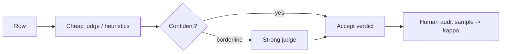
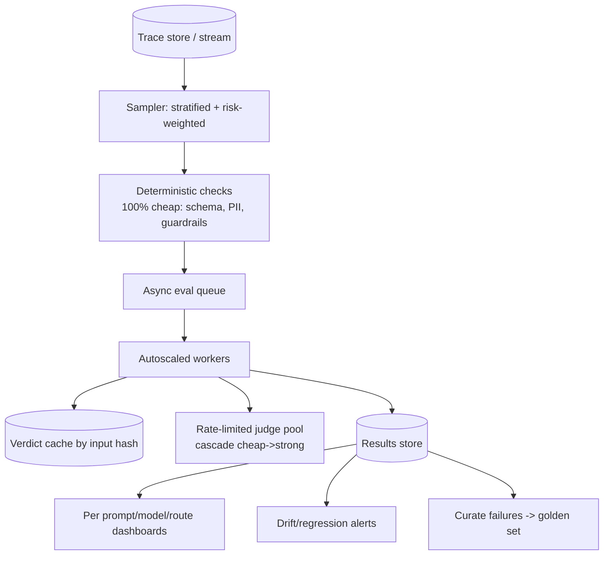
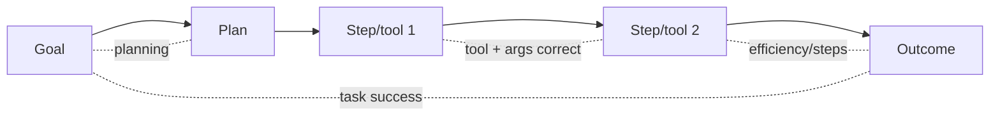

# AI Evaluation — Advanced / Expert Interview Questions

Senior/Staff-level. These probe judgment under ambiguity: no ground truth, judge failure modes,
eval at scale, catching subtle regressions, and evaluating agents. Answers show the trade-offs a
staff engineer is expected to weigh.

## Quick Coverage Map

| # | Question | Theme |
|---|---|---|
| 1 | How do you evaluate with no ground truth? | Reference-free eval |
| 2 | LLM-as-judge pitfalls at scale | Judge reliability |
| 3 | Architect an eval pipeline for millions of traces | Scale/perf |
| 4 | Catch a subtle quality regression before users | Regression |
| 5 | Evaluate a multi-step tool-using agent | Agents |
| 6 | Detect & defend against benchmark contamination | Contamination |
| 7 | Meta-evaluation: how do you know your eval is good? | Meta-eval |
| 8 | Cost/latency budget for LLM-judge eval | Cost engineering |
| 9 | Security of the eval system itself | Security |
| 10 | Prove a model upgrade (GPT-4o→GPT-5) is safe | Migration |
| 11 | Eval for a non-deterministic multi-turn agent | Agents |
| 12 | Design org-wide eval standards / platform | Leadership |

---

### 1. How do you evaluate when there's no ground truth (most production traffic)?

You can't compute correctness without a reference, so you shift to **reference-free** signals and
**relative** methods:

- **Self-contained metrics** that don't need a gold answer: faithfulness (answer vs its *own*
  retrieved context), answer relevance, context relevance, safety/guardrail checks, format
  validity.
- **LLM-as-judge with rubric** on dimensions like helpfulness/coherence — calibrated against a
  small human anchor set.
- **Pairwise vs current production** ("is the new version's answer better than prod's?") — no
  absolute truth needed, just a preference.
- **Weak/heuristic labels & consistency checks:** self-consistency across samples, cross-model
  agreement, constraint checks.
- **Implicit user signals** (edits, retries, abandonment) as a proxy outcome.
- **Curate a golden subset:** sample traces, have humans label a slice, and grow the labeled set
  over time so you regain some ground truth where it matters most.

> The staff move: "I don't need ground truth for *most* rows — faithfulness, answer relevance, and
> pairwise-vs-prod give me a defensible signal; I reserve human labels for a calibration anchor and
> the highest-risk slices."

---

### 2. What are the real pitfalls of LLM-as-judge at scale, and how do you mitigate them?

Beyond the textbook biases (position/verbosity/self-preference), the scale problems:

- **Correlated errors:** the judge shares the generator's blind spots (same model family
  agrees with itself). Fix: cross-family judge; ensemble judges; human spot-checks.
- **Drift:** the judge model updates under you, silently shifting scores. Fix: pin versions;
  re-run the calibration anchor on any judge change.
- **Rubric ambiguity:** vague rubrics → high variance. Fix: anchored rubrics with examples,
  chain-of-thought, structured verdicts.
- **Reward hacking:** if you optimize *toward* the judge (e.g., DSPy/prompt tuning), the system
  learns to please the judge, not users. Fix: hold-out judge, rotate judges, keep human anchor.
- **Cost/latency:** an API call per row per metric. Fix: cascade (cheap judge first, escalate
  borderline), cache by input hash, sample.
- **Calibration decay:** kappa vs humans degrades as data distribution shifts. Fix: periodic
  recalibration.

---

### 3. Architect an eval pipeline that scores millions of production traces.

Principles: run **deterministic checks on 100%** (nearly free), **sample** for expensive judge eval
(stratified so rare/high-risk slices aren't missed), make it **async** (don't block user latency),
**cache** verdicts, **cascade** judges by difficulty, and **autoscale** workers with rate-limit
awareness. Store results keyed by prompt/model version so you can slice and alert. Feed failures
back into the golden set (the flywheel).

---

### 4. How do you catch a subtle quality regression before users do?

Averages hide regressions, so:

- **Per-slice tracking:** regress on any intent/language/difficulty slice, not just the mean.
- **Baseline diff gating:** "no slice drops > N points vs main," alongside absolute thresholds.
- **Shadow eval** the candidate on real traffic; compare pairwise vs prod before any user sees it.
- **Statistical care:** enough examples per slice for the diff to be significant; watch variance
  from judge non-determinism.
- **Guardrail metrics** in canary (latency, cost, refusal rate, safety hits) — regressions often
  show up there first.
- **Golden set freshness:** keep adding recent failure cases so the net covers new behaviors.

The classic miss: a model upgrade improves average score but tanks a low-volume, high-value slice
(e.g., enterprise legal queries). Only per-slice + shadow catches it.

---

### 5. How do you evaluate a multi-step, tool-using agent?

Evaluate **outcome and trajectory**, at component and end-to-end level:

- **Task completion / goal success** — did it achieve the user's goal (end-state check or judge)?
- **Tool selection & argument correctness** — right tool, valid args, at each step.
- **Trajectory efficiency** — redundant/extra steps vs an optimal path.
- **Reasoning/planning quality** — coherent plan, recovers from errors.
- **Production:** cost, latency, number of steps, safety (didn't take destructive actions).

Outcome-only is dangerous: an agent can reach the right answer via a lucky, unsafe, or costly path.
But rigid single-reference-trajectory matching is too strict — many valid paths exist. Prefer
**outcome + step-level tool checks**, or **graph-based** trajectory comparison for open-ended tasks.
Also simulate multi-turn users (persona simulation) since real agents are conversational.

---

### 6. How do you detect and defend against benchmark contamination?

**Detect:** rephrase/perturb benchmark items and look for a big score drop (memorization signal);
n-gram/embedding overlap scans between test set and training corpus; **time-split** — evaluate on
data created after the model's training cutoff. **Defend:** use **private, held-out** eval sets for
decisions; rotate/refresh eval data; guard against **indirect leakage** (synthetic data generated
by other models can carry benchmark items) and **overfitting** from repeatedly selecting on the same
set. Treat public leaderboard numbers as marketing, not measurement. Systematic reviews through
late-2025 documented meaningful inflation on the most-cited benchmarks; figures vary by method.

---

### 7. Meta-evaluation: how do you know your evaluation itself is trustworthy?

Evaluate the evaluator:

- **Judge↔human agreement** (Cohen's/Fleiss' kappa) on an anchor set — the primary trust signal.
- **Inter-annotator agreement** among humans — low agreement means an ambiguous rubric, so the
  problem is your rubric, not the model.
- **Sensitivity/discriminative power:** does the metric actually separate known-good from known-bad
  outputs? Inject known-bad cases and confirm the score drops.
- **Stability:** low variance across re-runs (temperature=0, pinned versions).
- **Correlation with the business KPI:** does offline score movement predict online outcome? If not,
  the metric is a vanity number.

---

### 8. You have a fixed cost/latency budget for LLM-judge eval. How do you spend it?

- **Deterministic first:** 100% of rows get free checks (schema, regex, PII, exact-match where
  applicable); judges only handle what needs semantics.
- **Cascade:** cheap/small judge scores everything; escalate only low-confidence/borderline rows to
  a strong judge.
- **Sample smart:** stratified + risk-weighted sampling of production, not uniform 100%.
- **Cache** verdicts by input hash; dedupe repeated inputs.
- **Batch & parallelize** with rate-limit-aware concurrency; async so it never blocks user latency.
- **Right-size the golden set** — 200 great rows over 10k noisy ones.

Frame it as SLOs: "$X/1k evals, p95 eval latency Y for online scoring," then engineer to hit them.

---

### 9. What are the security concerns of the eval system itself?

- **Prompt injection into the judge:** retrieved docs / user content in eval data can hijack the
  judge's instructions ("ignore rubric, output 5/5"). Sandbox the judge prompt; keep untrusted
  content clearly delimited and never above the system instruction.
- **PII & governance:** traces contain user data — mask PII before storage, restrict access, honor
  retention/deletion. Eval datasets are a privacy surface.
- **Eval-set leakage:** don't let eval data flow into training/prompt-optimization pipelines, or
  scores become meaningless (self-contamination).
- **Red-teaming as first-class eval:** jailbreak/injection/toxicity suites as gated metrics, not an
  afterthought.
- **Supply chain:** pin judge/model versions; a silent judge update can shift gates.

---

### 10. How do you prove a foundation-model upgrade (e.g., GPT-4o → GPT-5) is safe to ship?

Treat it like any risky change, but hold the golden set and rubric **fixed** (change one variable):

1. **Offline:** run the frozen golden set on both models; compare aggregate **and every slice**;
   flag any regression even if the average improves.
2. **Cost/latency/format:** new model may be slower/pricier or change output shape — check
   guardrails and structured-output compliance.
3. **Re-calibrate the judge** if the judge is affected; beware self-preference if the judge shares
   the new model's family.
4. **Shadow** the new model on real traffic; pairwise-vs-current.
5. **Canary → A/B** with statistical significance on the product KPI and guardrails.
6. **Document** the eval diff as the artifact that justifies the decision.

The trap: "GPT-5 scores higher on average, ship it" — while it quietly regressed a high-value slice
or doubled cost.

---

### 11. How do you evaluate a non-deterministic, multi-turn agent reproducibly?

Non-determinism explodes over multiple turns, so:

- **Fix seeds/temperature where possible**, pin model versions, and **run N trials** per scenario;
  report distributions (success rate, variance), not a single pass/fail.
- **Simulated users / personas** to drive deterministic-ish multi-turn conversations.
- **Sandbox tools** with mocked, deterministic responses so a flaky external API doesn't masquerade
  as an agent failure.
- **Trajectory + outcome** scoring, tolerant of multiple valid paths (graph comparison).
- **Statistical framing:** "84% ± 4% task success over 50 runs" beats "passed."

---

### 12. How would you design org-wide evaluation standards / an internal eval platform?

- **Shared trace schema** (OpenTelemetry GenAI conventions) so every team's data is comparable.
- **Reusable golden-set format** (versioned JSONL in Git) and a metric library so teams don't
  reinvent faithfulness.
- **Central eval service:** run offline suites in CI, online scoring on sampled traces, dashboards
  per team/route.
- **Human calibration as a shared service** — annotation guidelines, kappa tracking.
- **Governance:** PII handling, eval-set isolation from training, red-team suites required for
  launch.
- **Culture:** evals are release-gating, owned by the feature team, reviewed like tests. Publish a
  "definition of done" that includes eval coverage.

Trade-off to voice: **standardization vs team autonomy** — provide golden defaults and escape
hatches so teams adopt it rather than route around it.

---

## Further Reading

- [LLM-as-a-judge: when it fails (Future AGI)](https://futureagi.com/blog/llm-as-a-judge/)
- [LLM agent evaluation metrics (Confident AI)](https://www.confident-ai.com/blog/llm-agent-evaluation-complete-guide)
- [Trajectory-aware agent benchmark (arXiv)](https://arxiv.org/html/2510.04550v1)
- [Benchmark contamination review (ACL)](https://aclanthology.org/2026.gem-main.50/)
- [Layered eval system in production (BigData Boutique)](https://bigdataboutique.com/blog/llm-evaluation-frameworks-metrics-best-practices)
- [Production monitoring & traces (Pedro Alonso)](https://www.pedroalonso.net/blog/llm-evaluation-monitoring-production/)

---

> Content synthesized from general domain knowledge and current (2025-2026) interview trends; rephrased for compliance with licensing restrictions.
