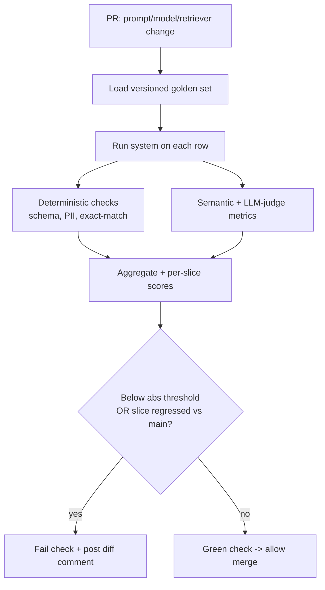
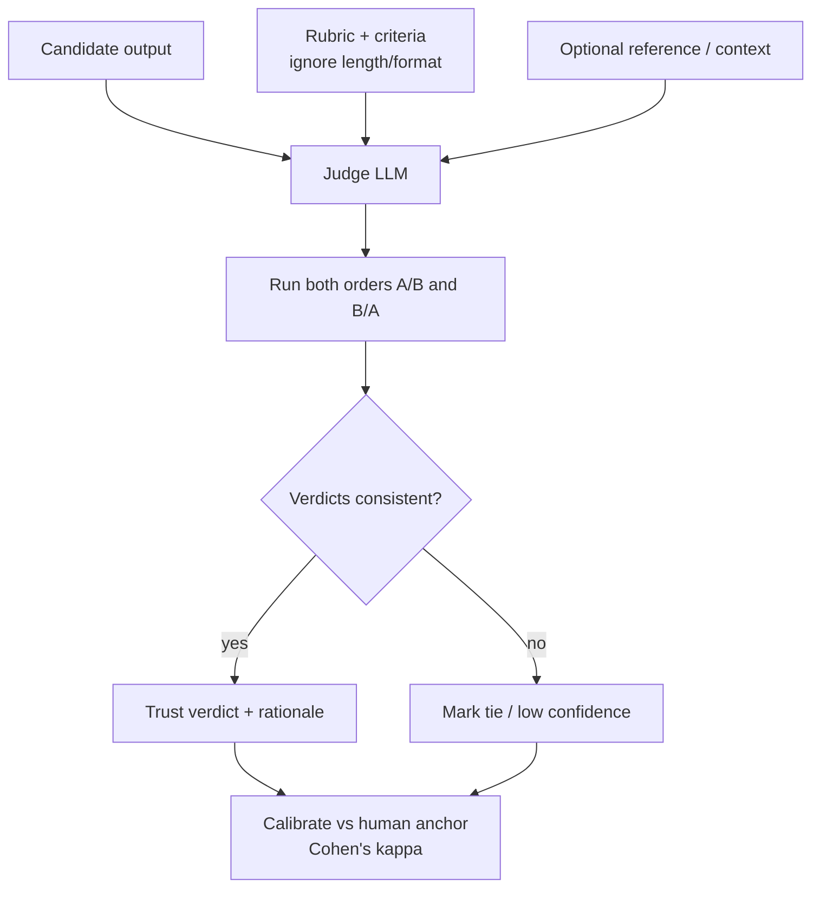
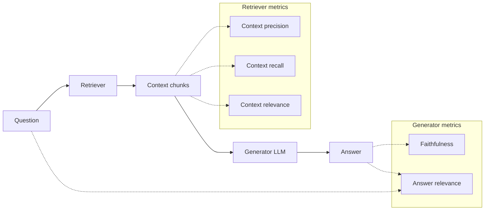
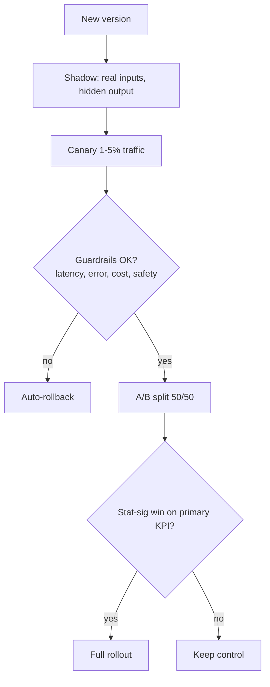
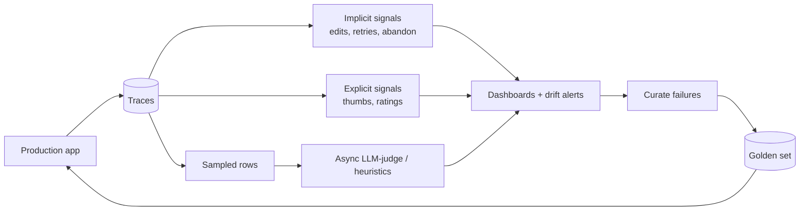
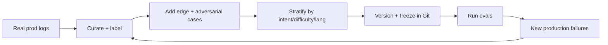
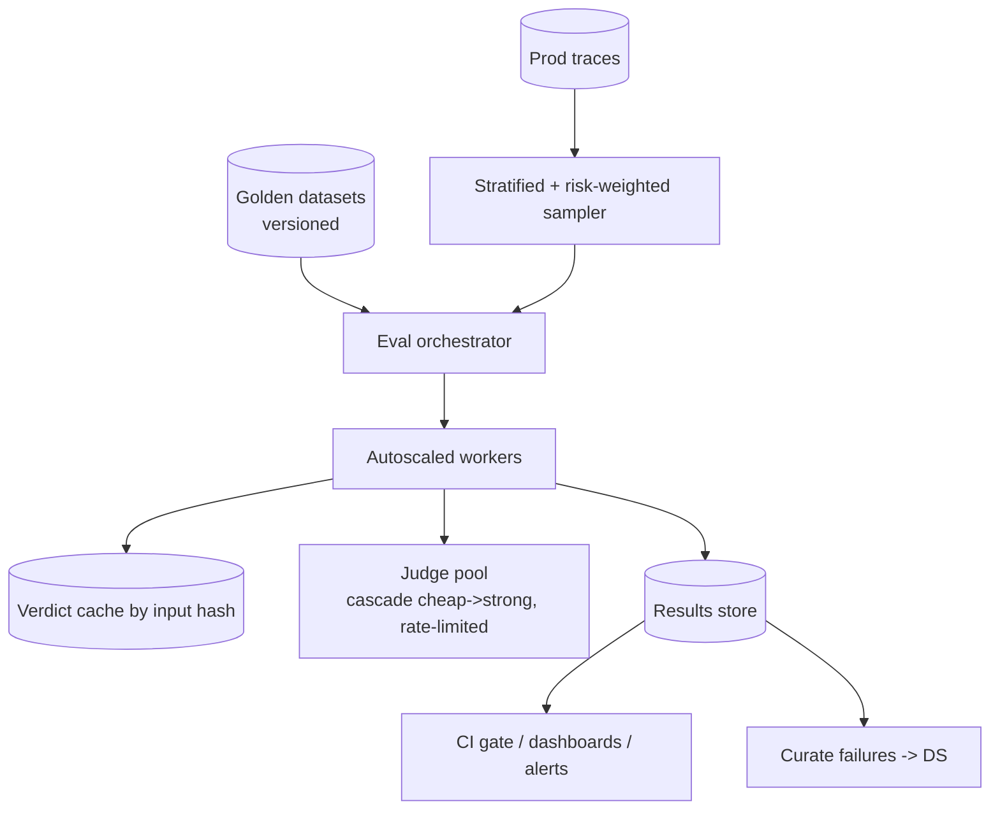
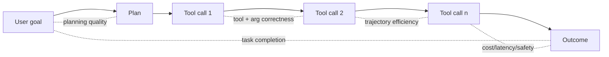
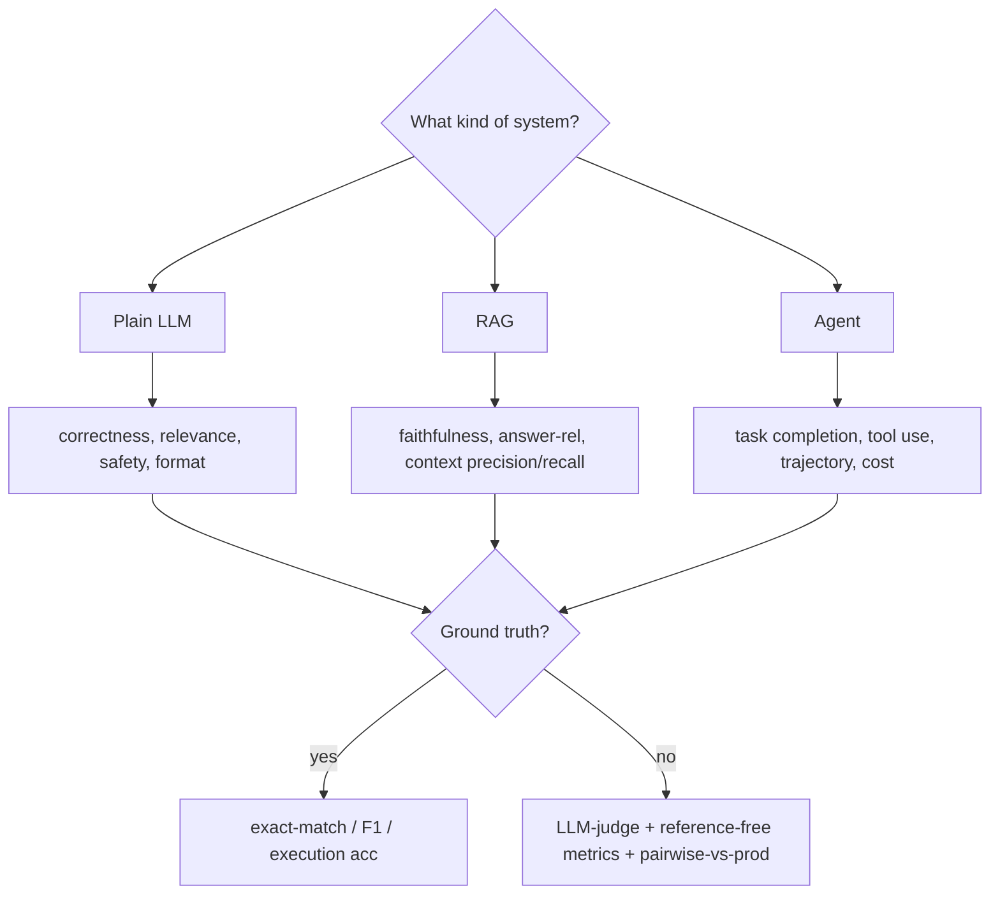

# AI Evaluation — Use-Case Diagrams

Mermaid diagrams for the core evaluation workflows. Each includes a short "why it matters" note.

---

## 1. Offline eval pipeline in CI (deploy gate)

Runs the golden set on every PR and blocks merges that regress quality.

*Why:* turns "feels better" into a hard, reviewable gate; catches regressions before users.

---

## 2. LLM-as-judge flow (with bias controls)

*Why:* order swapping neutralizes position bias; calibration proves the judge agrees with humans.

---

## 3. RAG evaluation split (retriever vs generator)

*Why:* isolating the halves tells you whether to fix retrieval or the prompt/generator.

---

## 4. A/B test & canary rollout

*Why:* progressive exposure limits blast radius and proves real-world wins, not just offline.

---

## 5. Online feedback loop

*Why:* closes the loop — real failures become new eval cases (the flywheel).

---

## 6. Golden dataset lifecycle

*Why:* a living, versioned, stratified set is the highest-leverage eval artifact.

---

## 7. Eval platform architecture at scale

*Why:* deterministic on 100%, sample + cascade + cache for judges, async so user latency is untouched.

---

## 8. Agent trajectory evaluation

*Why:* evaluate outcome AND path — a right answer via an unsafe/costly route is still a failure.

---

## 9. Metric selection decision tree

*Why:* the right metric depends on system type and whether ground truth exists.

---

> Content synthesized from general domain knowledge and current (2025-2026) interview trends; rephrased for compliance with licensing restrictions.
