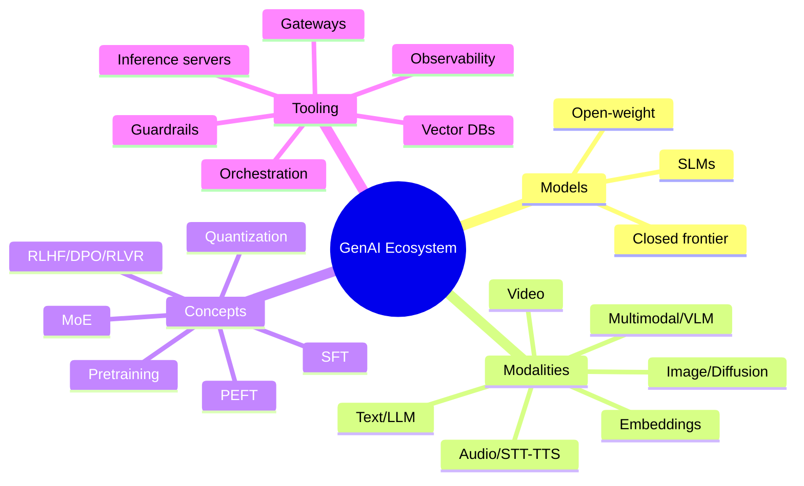
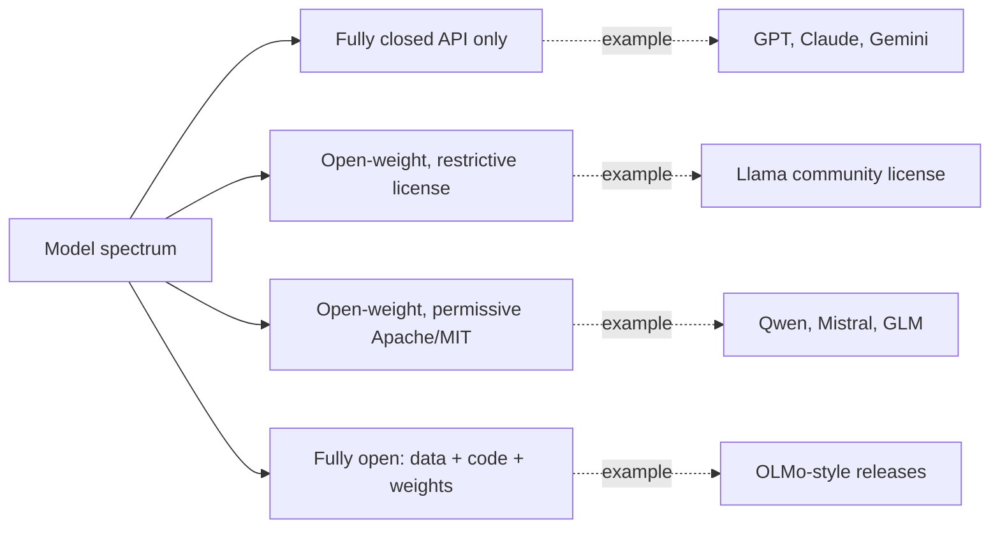
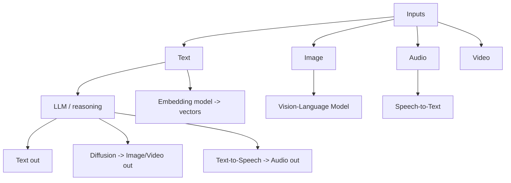
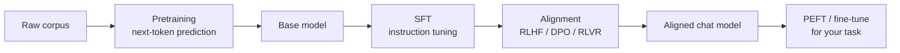
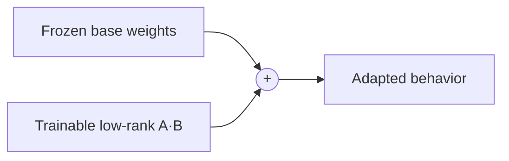
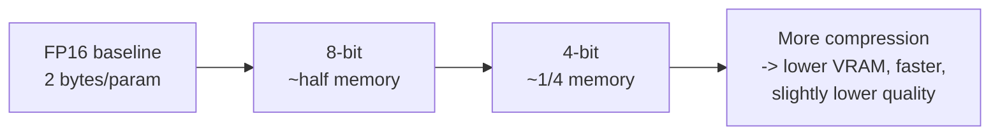
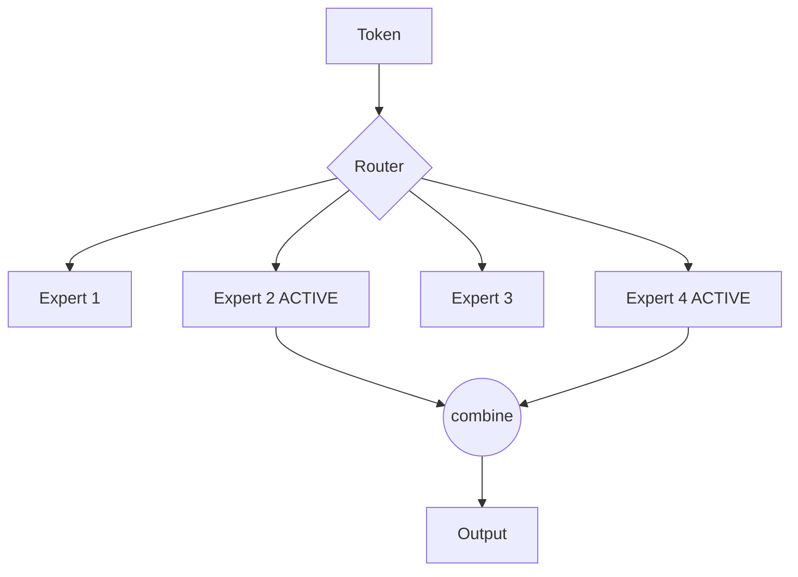
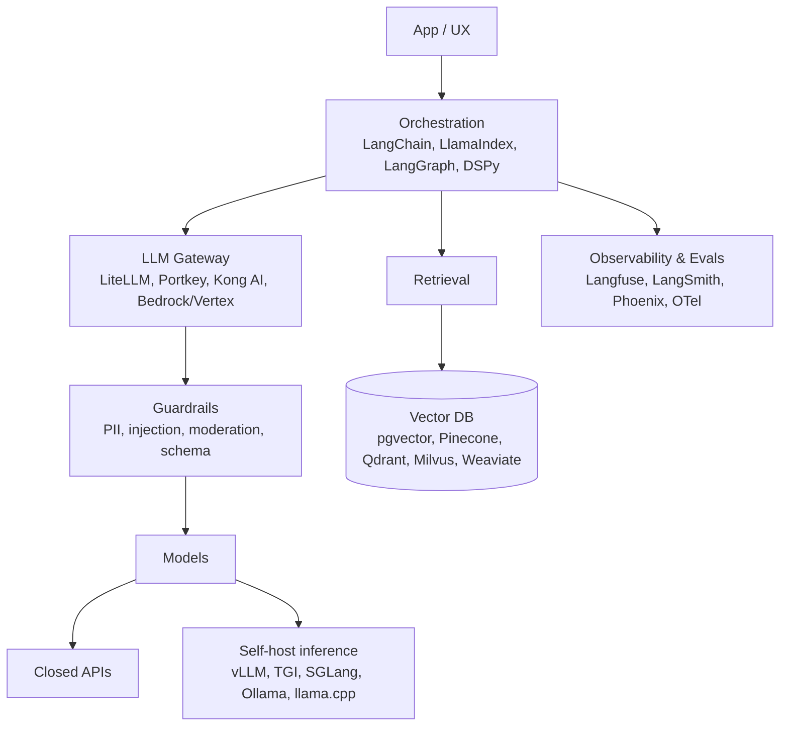
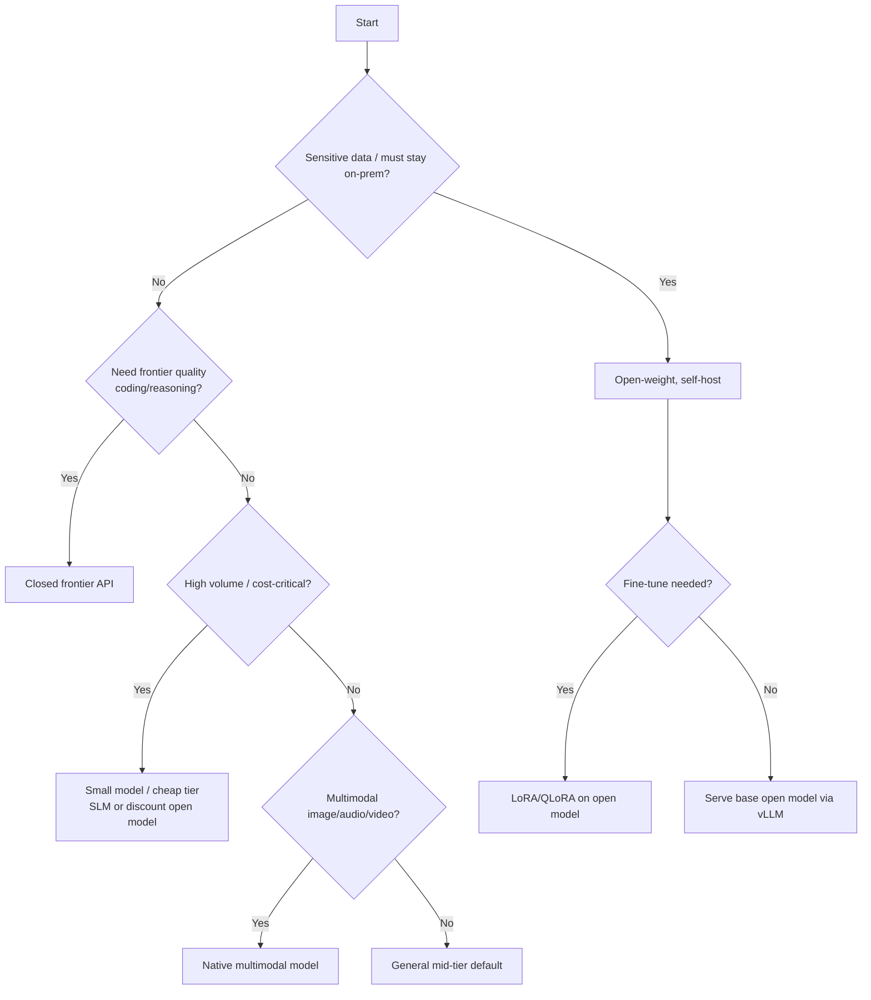
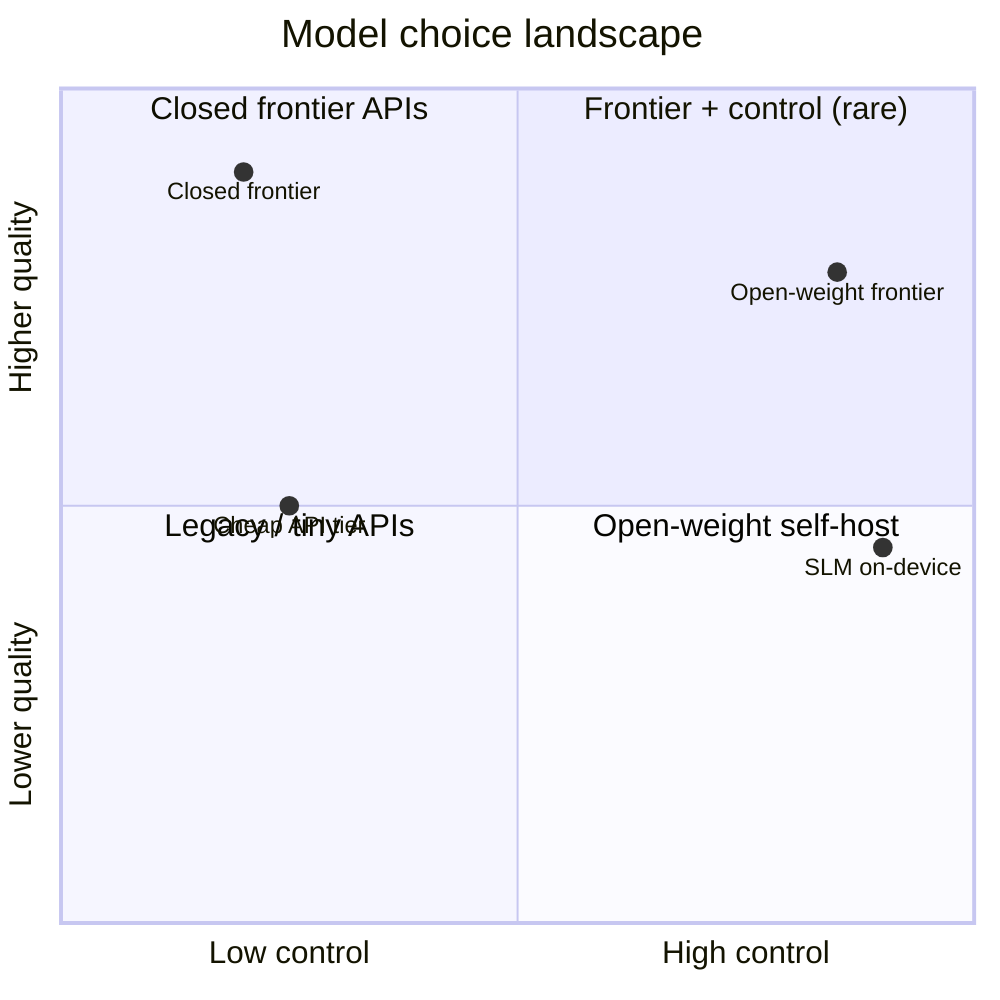

# GenAI Ecosystems — Detailed Learning Guide

> The big-picture map of the modern generative-AI world: who makes the models, what
> modalities exist, the concepts that actually matter, and the tooling that glues it all
> together in production. Written to get you through the toughest AI-engineer interview at
> a large company — but in plain, human language.

---

## Table of Contents

1. [Why "ecosystem" thinking matters](#1-why-ecosystem-thinking-matters)
2. [The model landscape: closed vs open-weight](#2-the-model-landscape-closed-vs-open-weight)
3. [Key players and when to use each](#3-key-players-and-when-to-use-each)
4. [Modalities: text, image, audio, video, multimodal, embeddings](#4-modalities)
5. [Core concepts every AI engineer must know](#5-core-concepts)
6. [Training pipeline: pretraining -> SFT -> alignment](#6-training-pipeline)
7. [PEFT: LoRA, QLoRA, adapters](#7-peft-lora-qlora-adapters)
8. [Quantization: GGUF, AWQ, GPTQ, FP8](#8-quantization)
9. [Context windows, MoE, distillation & SLMs](#9-context-windows-moe-distillation--slms)
10. [The tooling ecosystem](#10-the-tooling-ecosystem)
11. [Inference serving deep dive](#11-inference-serving-deep-dive)
12. [How to choose a model (framework)](#12-how-to-choose-a-model)
13. [Cost / latency / quality trade-offs](#13-cost--latency--quality-trade-offs)
14. [Open vs proprietary trade-offs](#14-open-vs-proprietary-trade-offs)
15. [Security & governance across the ecosystem](#15-security--governance)
16. [Scale, load & performance patterns](#16-scale-load--performance)
17. [Trends: where the field is heading](#17-trends)
18. [Interview cheat-answers](#18-interview-cheat-answers)
19. [Further reading](#19-further-reading)

---

## 1. Why "ecosystem" thinking matters

Two years ago the interview question was "which is the best model?" Today that question is
basically meaningless. In 2025-2026 there is no single winner: there is a best model for
coding, a best model for cheap high-volume classification, a best model for long documents,
a best model for on-prem/private deployment, and a best model for live web search. The
senior-engineer skill is **assembling a stack** — often several models plus retrieval,
gateways, guardrails, and observability — not memorizing one API.

> Mental model: you are not "using an LLM." You are operating a **portfolio of models**
> behind a routing layer, with cost, latency, quality, and compliance as your dials.

---

## 2. The model landscape: closed vs open-weight

Two broad camps, with a spectrum in between.

| Dimension | Closed / proprietary (API) | Open-weight (downloadable) |
|---|---|---|
| Access | HTTPS API only | Download weights, run anywhere |
| Examples (families) | OpenAI GPT, Anthropic Claude, Google Gemini, xAI Grok | Llama, Mistral, Qwen, DeepSeek, Gemma, Phi, GLM, Kimi |
| Where it runs | Vendor cloud | Your GPU / cloud / laptop / edge |
| Customization | Limited (fine-tune API, prompts) | Full — fine-tune, quantize, distill, surgery |
| Data control | Leaves your boundary (unless zero-retention) | Stays on your infra |
| Cost model | Per-token, no infra | You pay for GPUs + ops |
| Frontier quality | Usually leads | Trails by single digits on many benchmarks |
| Vendor lock-in | High | Low |

**Terminology nuance interviewers probe:** "open-weight" ≠ "open-source." Most downloadable
models (Llama, Gemma) release *weights* under a custom or permissive license but **not** the
training data or full training code. Truly open-source (data + code + weights, e.g. some
DeepSeek/OLMo-style releases) is rarer. Know the difference and check the license (Apache-2.0
and MIT are the cleanest; Llama's community license has acceptable-use and scale clauses).

---

## 3. Key players and when to use each

The specific version numbers churn every few weeks (in this era we saw GPT-5.x, Claude Opus
4.x, Gemini 3.x, Grok 4.x, Llama 4, DeepSeek V3/V4, Qwen 3.x, Gemma 3, Kimi K2, Mistral
Large). **Do not memorize version numbers for an interview** — memorize the *shape* of each
provider's strengths, because that shape is stable.

| Provider | Family | Reputation / sweet spot | Reach for it when |
|---|---|---|---|
| **OpenAI** | GPT / o-series | All-round, strong ecosystem, agentic/tool use, computer use | Default general assistant, function calling, broad tooling |
| **Anthropic** | Claude | Top-tier coding & agentic reasoning, long safe outputs, careful | Complex coding, refactors, long agent runs, safety-sensitive |
| **Google** | Gemini | Best multimodal + multilingual, huge context, low price/quality | Image+video+audio understanding, cheap high-quality, long context |
| **xAI** | Grok | Real-time/web-grounded, large context, fast | Live info, current events, big-context tasks |
| **Meta** | Llama | Open-weight workhorse, ultra-long context variants | Self-host, fine-tune, on-prem, cost at scale |
| **Mistral** | Mistral/Mixtral | Efficient European open models, permissive | EU data residency, efficient MoE, commercial-friendly |
| **Alibaba** | Qwen | Strong open coder + small dense models, Apache-2.0 | Best small self-host coder, multilingual, permissive license |
| **DeepSeek** | V3/R1/V4 | Cheap frontier-ish reasoning, MoE, aggressive pricing | Reasoning at low cost, open agentic coding |
| **Google** | Gemma | Small open models tuned for on-device/edge | Local, mobile, embedded, distillation base |
| **Microsoft** | Phi | Small models, strong per-parameter reasoning | SLM use cases, edge, fine-tune base |

> Interview soundbite: "Closed frontier models still lead the absolute leaderboards, but the
> gap to the best open-weight models has narrowed to single digits on most benchmarks. So the
> decision is rarely capability alone — it's data control, cost curve, latency, and lock-in."
> (Content synthesized from general domain knowledge; rephrased for compliance.)

---

## 4. Modalities

Generative AI is no longer just text. A modern system routes different **modalities** to
specialized models.

### 4.1 Text / LLM
The core. Autoregressive transformers predicting the next token. Used for chat, reasoning,
coding, extraction, summarization, agents. Key knobs: temperature, top-p, max tokens,
system prompt, tool/function calling, structured output (JSON schema).

### 4.2 Image / Diffusion
Text-to-image and image editing use **diffusion** (and increasingly diffusion-transformer,
DiT) models: start from noise, iteratively denoise toward the prompt. Families: Stable
Diffusion / SDXL / SD3 (open), FLUX (open-weight, strong), plus API models (DALL·E,
Imagen, Ideogram, Midjourney). Controls: guidance scale (CFG), steps, seed, negative
prompt, ControlNet/IP-Adapter for conditioning, LoRA for style. Trade-off: more steps =
higher quality but higher latency/cost.

### 4.3 Audio: STT and TTS
- **Speech-to-Text (STT / ASR):** Whisper (open, robust, multilingual) is the default;
  API options (Deepgram, AssemblyAI, provider realtime APIs) for streaming/low latency.
- **Text-to-Speech (TTS):** neural voices (ElevenLabs, OpenAI/Google voices, open models
  like Kokoro/XTTS). Metrics: naturalness (MOS), latency, streaming, voice cloning.

### 4.4 Video
Text-to-video and image-to-video (Sora, Veo, Runway, Kling, open efforts like
Wan/Mochi/LTX). Expensive, latency in seconds-to-minutes. Interview point: video is where
"generative" is least mature and most compute-hungry.

### 4.5 Multimodal / VLM
A single model that natively takes text **and** images (and sometimes audio/video) in one
context. Gemini, GPT, and Claude are natively multimodal; open VLMs include Qwen-VL,
Llama vision variants, LLaVA, InternVL, Pixtral. Used for document understanding, screen
understanding (agents that "see" a UI), charts, and OCR-plus-reasoning.

### 4.6 Embeddings
Not generative, but the backbone of retrieval. An embedding model maps text (or images) to
a dense vector so that semantically similar items are close in vector space. Powers RAG,
semantic search, clustering, dedup, recommendations. Families: OpenAI text-embedding-3,
Cohere Embed, Voyage, open BGE / E5 / GTE / Nomic / Jina. Key choices: dimension (cost vs
accuracy), max sequence length, multilingual, and whether it supports **Matryoshka**
truncation (shrink dimensions without retraining).

| Modality | Typical model type | Latency | Cost driver |
|---|---|---|---|
| Text | Autoregressive transformer | ms-s | tokens in+out |
| Image | Diffusion / DiT | 1-10 s | steps x resolution |
| STT | Encoder-decoder / CTC | realtime | audio minutes |
| TTS | Neural vocoder | ms-s | characters/seconds |
| Video | Diffusion (spatiotemporal) | 10s-min | frames x resolution |
| Embeddings | Encoder | ms | tokens |

---

## 5. Core concepts

A whistle-stop glossary of the ideas interviewers assume you can define instantly.

- **Token:** sub-word unit; models bill and reason in tokens. ~4 chars/token in English.
- **Context window:** max tokens the model can attend to at once (prompt + output).
- **Parameters:** learned weights; more params ~ more capacity (but not linearly better).
- **Temperature / top-p:** randomness controls at sampling time.
- **Function/tool calling:** model emits a structured call the app executes; core to agents.
- **Reasoning / "thinking" models:** spend extra tokens on internal chain-of-thought before
  answering; better on math/code/logic, higher latency and cost.
- **Grounding / RAG:** inject retrieved facts so the model answers from your data.
- **Hallucination:** confident but wrong output; mitigated by grounding, verification, evals.

---

## 6. Training pipeline

- **Pretraining:** self-supervised next-token prediction over trillions of tokens. Hugely
  expensive; produces a "base" model that knows language and world facts but is not a
  helpful assistant.
- **SFT (Supervised Fine-Tuning / instruction tuning):** train on curated
  instruction→response pairs so the model follows instructions and adopts a chat format.
- **Alignment:** shape behavior toward human preferences / correctness:
  - **RLHF** (RL from Human Feedback): train a reward model from human preference pairs,
    then optimize the policy (classically with PPO). Powerful but complex/unstable.
  - **DPO** (Direct Preference Optimization): skip the separate reward model — optimize
    directly on preference pairs. Simpler, cheaper, popular default.
  - **RLVR** (RL from Verifiable Rewards): use *automatic* verifiers (unit tests, math
    checkers) as the reward signal. Behind the recent leap in reasoning/coding models —
    the reward is objective, so you can scale RL without armies of human raters.

---

## 7. PEFT: LoRA, QLoRA, adapters

Full fine-tuning updates every weight — expensive and produces a full model copy per task.
**PEFT (Parameter-Efficient Fine-Tuning)** trains a tiny set of extra parameters instead.

- **LoRA (Low-Rank Adaptation):** freeze the base weights; inject small low-rank matrices
  (A·B) into attention/MLP layers and train only those. ~0.1-1% of params trained; the
  adapter is a few MB. You can hot-swap many LoRAs on one base model.
- **QLoRA:** load the base model in **4-bit** quantized form, then train LoRA on top. Lets
  you fine-tune a large model on a single consumer/prosumer GPU. The big democratizer.
- **Adapters / prefix / prompt tuning:** other PEFT flavors; LoRA/QLoRA dominate in practice.

**When to fine-tune vs RAG vs prompt:** prompt-engineer first; add RAG when you need *facts*
the model lacks; fine-tune (LoRA) when you need a *behavior/format/style* or to compress a
long system prompt. They compose — RAG + a small LoRA is common.

---

## 8. Quantization

Quantization stores weights (and sometimes activations) in fewer bits (FP16 → 8-bit → 4-bit)
to cut memory and speed up inference, trading a little quality.

| Format | How it works | Best for | Notes |
|---|---|---|---|
| **GGUF** | CPU/GPU file format used by llama.cpp/Ollama; many quant levels (Q4_K_M etc.) | Local, laptops, mixed CPU/GPU | Named bits are *effective* (Q4_K_M ≈ 4.9 bpw) |
| **GPTQ** | Post-training, layer-wise error minimization, GPU | GPU serving of 4-bit | Precise, mathematical calibration |
| **AWQ** | Activation-aware: protect the most salient weights | GPU serving, good quality at 4-bit | Popular with vLLM |
| **FP8 / INT8** | 8-bit, often hardware-accelerated (H100/Blackwell) | High-throughput serving | Minimal quality loss |
| **bitsandbytes NF4** | 4-bit for QLoRA training/inference | Fine-tuning on small GPUs | The QLoRA default |

Rule of thumb: **4-bit** is the sweet spot for running big models locally with small quality
loss; **8-bit/FP8** for production serving where quality matters; full precision for training.

---

## 9. Context windows, MoE, distillation & SLMs

**Context windows** have exploded (from a few K to hundreds of K, even multi-million-token
variants). But bigger isn't free:
- Attention cost grows with sequence length; long prompts raise **latency and price**.
- **"Lost in the middle":** models attend best to the start and end of a long context.
  Long context is not a substitute for good retrieval — put the most relevant chunks near
  the edges and keep prompts tight.

**MoE (Mixture of Experts):** instead of one big dense network, use many "expert" sub-networks
and a **router** that activates only a few per token. You get the *capacity* of a huge model
at the *inference cost* of a much smaller one (only "active params" run). Most recent frontier
and top open models (DeepSeek, Mixtral, Qwen, Llama 4) are MoE. Trade-off: total memory is
still large (all experts must be loaded), and load-balancing/quantizing experts is tricky.

**Distillation & SLMs (Small Language Models):** train a small "student" model to mimic a
large "teacher." Result: 1B-14B models that punch far above their size (Phi, Gemma, small
Qwen). SLMs enable on-device, edge, private, and cheap high-volume workloads. The 2025-2026
trend: route the easy 80% of traffic to a cheap SLM and escalate hard cases to a frontier
model.

---

## 10. The tooling ecosystem

The layers of a production GenAI stack:

- **Orchestration:** compose prompts, tools, memory, retrieval, and agent loops (LangChain /
  LangGraph, LlamaIndex, DSPy, Haystack, Semantic Kernel, Pydantic AI).
- **Gateways (AI/LLM proxy):** one OpenAI-compatible endpoint in front of *many* providers,
  adding routing, fallback, load-balancing, caching, cost tracking, rate limits, and key
  management. **LiteLLM** is the open-source default; Portkey, Kong AI Gateway, cloud
  gateways (Bedrock, Vertex) are alternatives. (Note: gateways concentrate API keys, so
  they're a security-sensitive component — a real supply-chain incident hit LiteLLM,
  underscoring the need to pin dependencies and lock down the proxy.)
- **Vector DBs:** store embeddings for RAG — pgvector (Postgres extension, easiest if you
  already run Postgres), Pinecone (managed), Qdrant/Weaviate/Milvus (open, scalable),
  Chroma (lightweight/dev).
- **Observability & evals:** trace every model/tool call, measure quality, catch
  regressions — Langfuse, LangSmith, Arize Phoenix, plus OpenTelemetry GenAI spans.
- **Guardrails:** input/output safety — PII masking, prompt-injection detection, content
  moderation, output-schema validation (Guardrails AI, NeMo Guardrails, Llama Guard,
  provider moderation endpoints).

---

## 11. Inference serving deep dive

If you self-host open-weight models, *how* you serve them dominates cost and latency.

| Engine | Strength | Best for | Weakness |
|---|---|---|---|
| **vLLM** | PagedAttention + continuous batching; high throughput; broad model support | Production GPU serving at scale | Needs tuning; GPU-first |
| **SGLang** | RadixAttention (prefix caching); excellent on shared-prefix workloads | Chatbots, RAG, multi-turn agents | Smaller ecosystem |
| **TGI** (Text Generation Inference) | Tight Hugging Face integration, continuous batching | HF-centric prod deployments | Slightly behind vLLM on peak throughput |
| **Ollama** | One-command local run, GGUF-native, cross-OS | Local dev, single user, prototyping | Throughput collapses under concurrency |
| **llama.cpp** | CPU/GPU, GGUF, runs almost anywhere incl. edge | CPU-only, low-memory, portability | Not a high-concurrency server |

Key serving concepts interviewers love:
- **Continuous batching:** dynamically add/remove requests from a running batch instead of
  waiting for a fixed batch — huge throughput win under load.
- **PagedAttention (vLLM):** manage the KV cache like OS virtual memory pages → far less
  fragmentation, more concurrent requests per GPU.
- **Prefix/KV caching (SGLang RadixAttention):** reuse the KV cache for shared prompt
  prefixes (system prompts, few-shot examples) across requests → lower TTFT and cost.
- **Metrics:** **TTFT** (time to first token), **TPOT/ITL** (per-token latency), **throughput**
  (tokens/sec aggregate), and **goodput** (useful throughput under SLA).

> Rough real-world shape (varies by hardware/model): under many concurrent requests, vLLM
> can deliver several times the aggregate tokens/sec of Ollama, because Ollama targets the
> single-user case. Pick the engine to match the *load pattern*, not the benchmark headline.

---

## 12. How to choose a model

Decision checklist:
1. **Data & compliance** — can data leave your boundary? (drives open vs closed)
2. **Task hardness** — reasoning/coding may demand a frontier or reasoning model.
3. **Volume & budget** — high QPS pushes you to cheap/small/open, with routing.
4. **Latency SLA** — reasoning models are slow; streaming helps perceived latency.
5. **Modality** — match the model to text/image/audio/video needs.
6. **Customization** — need behavior control? open + LoRA. Facts? RAG.
7. **Lock-in tolerance** — abstract behind a gateway so you can swap.

---

## 13. Cost / latency / quality trade-offs

You can usually optimize **two of three** (quality, cost, latency) at once — the "AI iron
triangle." Levers:

| Lever | Effect on cost | Effect on latency | Effect on quality |
|---|---|---|---|
| Smaller/quantized model | ↓↓ | ↓ | slight ↓ |
| Reasoning/"thinking" mode | ↑↑ | ↑↑ | ↑ (hard tasks) |
| Prompt caching / KV reuse | ↓ | ↓ (TTFT) | = |
| RAG (fewer tokens, better facts) | ↓ | ~ | ↑ (grounding) |
| Batching | ↓ (per req) | ↑ (per req) | = |
| Model routing (cheap→escalate) | ↓ | mixed | ~ |
| Streaming | = | ↓ (perceived) | = |
| Distillation to SLM | ↓↓ | ↓↓ | task-dependent |

Practical pattern: **cascade / router** — try a cheap model + self-check; escalate to a
frontier model only when confidence is low. Combined with prompt caching and RAG, this often
cuts spend 50-80% with little quality loss.

---

## 14. Open vs proprietary trade-offs

**Choose closed/proprietary when:** you want frontier quality now, minimal ops, fast
iteration, best multimodal, and you can accept per-token pricing and data leaving your
boundary (or use zero-retention/enterprise tiers).

Pros: best-in-class quality, no infra, instant scale, safety tooling.
Cons: recurring cost that grows with usage, vendor lock-in, data governance, opaque changes
(a model update can silently shift behavior), rate limits.

**Choose open-weight when:** data must stay in-house, you need deep customization
(fine-tune/quantize/distill), you want predictable cost at high volume, or you need edge/air-gapped
deployment.

Pros: full control & privacy, cost amortizes at scale, no lock-in, customizable, auditable.
Cons: you own the ops (GPUs, serving, upgrades, security), slightly behind the frontier,
license fine-print matters.

---

## 15. Security & governance

Interviewers at big companies weight this heavily. The OWASP LLM Top-10 themes:

- **Prompt injection** (direct & indirect via retrieved/tool content) — the #1 risk. Mitigate
  with input/output guardrails, least-privilege tools, content provenance, and never trusting
  model output as a command without validation.
- **Sensitive data disclosure / PII** — mask PII at the gateway; use zero-retention tiers;
  keep secrets out of prompts.
- **Supply chain** — pin and audit dependencies (a real incident compromised an LLM gateway
  package); vet model provenance and licenses.
- **Insecure output handling** — validate/escape model output before it hits shells, SQL, or
  the DOM (treat it like untrusted user input).
- **Excessive agency** — sandbox tool use, require human-in-the-loop for high-impact actions,
  scope permissions tightly.
- **Model/data governance** — logging, audit trails, data-residency, and eval gates on deploy.

A **gateway + guardrails** layer is where most of this is enforced centrally.

---

## 16. Scale, load & performance

- **Horizontal scale:** replicate inference servers behind the gateway; autoscale on
  queue depth / GPU utilization, not just CPU.
- **Batching & concurrency:** continuous batching (vLLM/TGI/SGLang) is the single biggest
  throughput lever for self-hosting.
- **KV-cache management:** the KV cache dominates GPU memory at long context — PagedAttention
  and prefix caching decide how many concurrent users a GPU holds.
- **Caching layers:** exact-match and **semantic caching** (embed the query, reuse near-dup
  answers) cut cost and latency for repetitive traffic.
- **Routing & fallback:** the gateway retries on 4xx/5xx, fails over across providers/regions,
  and load-balances by cost/latency.
- **Latency budget:** set an SLO for TTFT and total; stream tokens to keep UX snappy; cap
  max output tokens; use smaller models for latency-critical paths.
- **Capacity planning:** estimate tokens/request × QPS → tokens/sec → GPUs (given a model's
  tok/s/GPU). Leave headroom for spikes; use spot/burst for batch jobs.

---

## 17. Trends

- **Agents everywhere:** models that set goals, call tools, verify themselves, and loop —
  the defining shift of 2025-2026. Serving must handle long, tool-heavy, multi-turn sessions.
- **RLVR & reasoning models:** verifiable rewards drove big gains in math/code; "thinking"
  budgets are now a tunable dial.
- **MoE by default** at the frontier and in top open models.
- **Small + on-device:** capable SLMs push inference to laptops/phones/edge; hybrid
  cloud+edge routing.
- **Multimodal convergence:** one model for text+image+audio+video; "omni" models and native
  voice.
- **Open-weight catching up:** the closed↔open gap is single digits on many benchmarks;
  aggressive open pricing reshapes build-vs-buy.
- **Standard protocols:** tool/agent interop (e.g., MCP-style tool servers) and OTel GenAI
  observability becoming standard plumbing.
- **Falling prices:** per-token costs dropped sharply, pushing usage up and making cascades /
  routing even more valuable.

---

## 18. Interview cheat-answers

- *"How do you pick a model?"* → Start from constraints (data/compliance, task hardness,
  volume/budget, latency, modality, customization, lock-in) — not from the leaderboard. Often
  a **portfolio behind a gateway**, cheap-by-default with escalation.
- *"Open or closed?"* → Closed for frontier quality + low ops; open for control, privacy,
  cost-at-scale, and customization. Abstract behind a gateway to keep it swappable.
- *"How do you cut cost/latency?"* → Right-size the model, quantize, prompt/KV caching, RAG to
  shrink prompts, continuous batching, model routing/cascades, streaming.
- *"What's MoE / LoRA / quantization / RLVR?"* → (see sections 6-9; be able to define each in
  one sentence and say when to use it).
- *"How do you stay current?"* → Track leaderboards (Artificial Analysis, Chatbot Arena),
  provider changelogs, and — crucially — re-run *your own* eval suite when models change,
  because your task ≠ the benchmark.

---

## 19. Further reading

- Hugging Face — models, datasets, PEFT & Transformers docs: <https://huggingface.co/docs>
- vLLM documentation: <https://docs.vllm.ai>
- Ollama library & docs: <https://ollama.com>
- LiteLLM (gateway) docs: <https://docs.litellm.ai>
- Artificial Analysis (independent model benchmarks): <https://artificialanalysis.ai>
- LMArena / Chatbot Arena leaderboard: <https://lmarena.ai>
- OWASP Top 10 for LLM Applications: <https://genai.owasp.org>
- Langfuse (observability & evals): <https://langfuse.com/docs>

---

*Content synthesized from general domain knowledge and current (2025-2026) ecosystem trends;
rephrased for compliance with licensing restrictions.*
