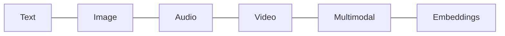

# GenAI Ecosystems — Basic Interview Questions

> Foundational questions you should be able to answer smoothly. Natural tone, concrete
> examples, and a diagram or table where it helps.

## Quick Coverage Map

| # | Question | Theme |
|---|---|---|
| 1 | What is generative AI vs traditional ML? | Fundamentals |
| 2 | Closed vs open-weight models? | Model landscape |
| 3 | Name the major model providers and their sweet spots | Players |
| 4 | What is a token / context window? | Fundamentals |
| 5 | What modalities exist in GenAI? | Modalities |
| 6 | What is an embedding and why does it matter? | Embeddings |
| 7 | What is RAG in one paragraph? | Retrieval |
| 8 | Prompt engineering vs fine-tuning vs RAG? | Customization |
| 9 | What is a diffusion model? | Image |
| 10 | What is an LLM gateway? | Tooling |
| 11 | What is quantization (simply)? | Efficiency |
| 12 | How do you run a model locally? | Tooling |

---

### 1. What is generative AI, and how is it different from traditional ML?

Traditional ML usually **predicts a label or number** — is this email spam, what's the house
price. Generative AI **produces new content** — text, images, audio, code — by modeling the
distribution of data and sampling from it. Most modern GenAI is built on **transformers** that
predict the next token given everything so far. The practical difference for an engineer: with
classic ML you train a model per task; with GenAI you often take one big pretrained model and
*steer* it with prompts, retrieval, or light fine-tuning.

### 2. What's the difference between closed and open-weight models?

- **Closed / proprietary** (GPT, Claude, Gemini, Grok): you call an API; the weights stay with
  the vendor. Easiest to start, usually best quality, but data leaves your boundary and you pay
  per token.
- **Open-weight** (Llama, Mistral, Qwen, DeepSeek, Gemma): you download the weights and run them
  yourself. Full control, privacy, and customization, but you own the ops.

Note "open-weight" ≠ "open-source" — most releases publish the weights, not the training data or
full code. Always check the license.

### 3. Name the major providers and what each is known for.

| Provider | Known for |
|---|---|
| OpenAI (GPT) | All-round, tooling/agents |
| Anthropic (Claude) | Coding & agentic reasoning, careful outputs |
| Google (Gemini/Gemma) | Multimodal, long context, cheap quality; Gemma = small/open |
| xAI (Grok) | Real-time/web-grounded |
| Meta (Llama) | Open-weight workhorse |
| Mistral | Efficient European open models |
| Alibaba (Qwen) | Strong open coders, permissive license |
| DeepSeek | Cheap reasoning, MoE |

Version numbers change constantly — remember the *shape* of each provider's strengths.

### 4. What is a token and a context window?

A **token** is a sub-word chunk (~4 English characters). Models read and bill in tokens. The
**context window** is the maximum number of tokens the model can consider at once — prompt plus
output. If your input exceeds it, you must truncate, summarize, or retrieve. Bigger windows cost
more and can suffer "lost in the middle," so they don't replace good retrieval.

### 5. What modalities does GenAI cover?

Text (LLMs), images (diffusion), audio (speech-to-text and text-to-speech), video, and
**multimodal / VLM** models that combine several. Plus **embeddings**, which aren't generative
but power search and RAG.

### 6. What is an embedding and why does it matter?

An embedding maps text (or an image) into a vector of numbers such that **similar meanings land
close together**. That lets you do semantic search, clustering, deduplication, and — most
importantly — **retrieval for RAG**: embed your documents, store the vectors, then embed a query
and fetch the nearest chunks. Choose by dimension, max length, language coverage, and cost.

### 7. Explain RAG in one paragraph.

**Retrieval-Augmented Generation** grounds an LLM in your data: you chunk and embed documents
into a vector DB, retrieve the most relevant chunks for a user's question, stuff them into the
prompt, and ask the model to answer using them. It reduces hallucination, keeps answers current
without retraining, and lets you cite sources — the default way to make an LLM "know" private or
fresh information.

### 8. When do you use prompt engineering vs RAG vs fine-tuning?

- **Prompt engineering** first — cheapest, fastest, no training.
- **RAG** when the model lacks *facts* (private/fresh data).
- **Fine-tuning (LoRA)** when you need a consistent *behavior, format, or style*, or to shrink a
  huge system prompt.

They combine well: RAG for knowledge + a small fine-tune for tone/format.

### 9. What is a diffusion model?

The dominant approach for image (and video) generation. It learns to **remove noise**: training
adds noise to images, and the model learns to reverse it. At generation time you start from pure
noise and iteratively denoise toward your prompt. More denoising steps = better quality but more
latency. Examples: Stable Diffusion / SDXL / SD3, FLUX (open); DALL·E, Imagen (API).

### 10. What is an LLM gateway and why use one?

A gateway (e.g., **LiteLLM**) is a proxy that gives every provider one **OpenAI-compatible**
endpoint. Your app calls the gateway; it handles routing, fallback, load-balancing, caching,
cost tracking, rate limits, and key management. Benefits: swap models without code changes, add
resilience, and centralize governance. Caution: it concentrates API keys, so secure it well.

### 11. What is quantization, simply?

Storing the model's numbers in **fewer bits** (e.g., 16-bit → 4-bit) so it uses less memory and
runs faster, at a small quality cost. 4-bit is the popular sweet spot for running big models on
modest hardware. Common formats: GGUF (local), AWQ/GPTQ (GPU serving), FP8/INT8 (production).

### 12. How do you run a model locally?

Easiest is **Ollama**: install it and run `ollama run llama3` — it downloads a quantized GGUF and
gives you a chat + local API. Under the hood it uses **llama.cpp**, which also runs on CPU-only or
edge devices. For production throughput on a GPU you'd move to **vLLM** or **TGI** instead, since
Ollama targets single-user use.

---

## Further Reading

- Hugging Face docs: <https://huggingface.co/docs>
- Ollama: <https://ollama.com>
- LiteLLM docs: <https://docs.litellm.ai>
- Artificial Analysis benchmarks: <https://artificialanalysis.ai>

---

*Content synthesized from general domain knowledge and current (2025-2026) interview trends;
rephrased for compliance with licensing restrictions.*
