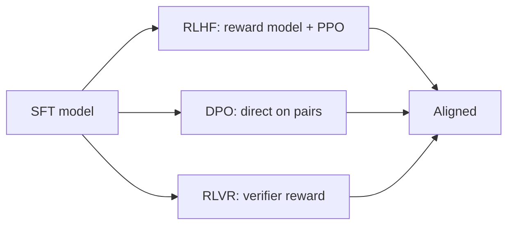
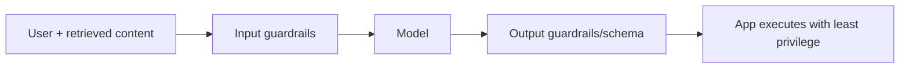

# GenAI Ecosystems — Medium Interview Questions

> Mid-level questions that probe whether you can reason about trade-offs, not just recite
> definitions. Answers include why/when, pros/cons, and diagrams.

## Quick Coverage Map

| # | Question | Theme |
|---|---|---|
| 1 | RLHF vs DPO vs RLVR | Alignment |
| 2 | LoRA vs QLoRA vs full fine-tune | PEFT |
| 3 | GGUF vs AWQ vs GPTQ | Quantization |
| 4 | What is MoE and why does it help? | Architecture |
| 5 | vLLM vs Ollama vs llama.cpp vs TGI | Serving |
| 6 | Reasoning models — when worth it? | Model types |
| 7 | Picking an embedding model | Embeddings |
| 8 | Long context vs RAG | Retrieval |
| 9 | Cost/latency optimization levers | Performance |
| 10 | Multimodal / VLM use cases | Modalities |
| 11 | Distillation & SLMs | Efficiency |
| 12 | Guardrails & prompt injection | Security |

---

### 1. Explain RLHF vs DPO vs RLVR.

All three **align** a base model to desired behavior after SFT.

- **RLHF:** collect human preference pairs, train a reward model, then use RL (e.g., PPO) to
  push the model toward high-reward outputs. Powerful but complex and unstable.
- **DPO:** optimize *directly* on the preference pairs — no separate reward model or RL loop.
  Simpler, cheaper, and now a common default.
- **RLVR (verifiable rewards):** the reward comes from an *automatic verifier* — unit tests for
  code, a checker for math. Because the signal is objective, you can scale RL without human
  raters. This is a big reason reasoning/coding models jumped recently.

### 2. LoRA vs QLoRA vs full fine-tuning — when each?

- **Full fine-tune:** updates every weight; best fidelity but expensive and a full model copy per
  task. Use when you have lots of data/compute and need maximum adaptation.
- **LoRA:** freeze the base, train tiny low-rank adapters (~0.1-1% of params). Cheap, fast,
  hot-swappable adapters on one base. The default for most teams.
- **QLoRA:** LoRA on top of a **4-bit** base — fine-tune large models on a single GPU. Use when
  VRAM is the constraint.

Rule: reach for LoRA/QLoRA unless you have a strong reason (and budget) for full fine-tuning.

### 3. GGUF vs AWQ vs GPTQ — how do they differ and when do you pick each?

| Format | Approach | Best for |
|---|---|---|
| **GGUF** | File format for llama.cpp/Ollama, many quant levels | Local/laptop, mixed CPU+GPU |
| **GPTQ** | Post-training, layer-wise error minimization | GPU 4-bit serving, precise |
| **AWQ** | Activation-aware: protect salient weights | GPU 4-bit serving, good quality |

Pick **GGUF** for local/Ollama, **AWQ or GPTQ** for GPU production serving (AWQ is popular with
vLLM). Remember GGUF quant names are *effective* bit-widths (Q4_K_M ≈ 4.9 bpw, not exactly 4).

### 4. What is Mixture of Experts (MoE) and why does it help?

Instead of one dense network, MoE has many "expert" sub-networks plus a **router** that activates
only a few experts per token. You get the *capacity* of a giant model at the *compute* of a much
smaller one, because only the "active parameters" run each step. Most recent frontier and top open
models are MoE. Catch: **all** experts must be in memory, so total VRAM is still large, and
load-balancing/quantizing experts is tricky.

### 5. Compare vLLM, Ollama, llama.cpp, and TGI.

| Engine | Sweet spot | Watch out |
|---|---|---|
| **vLLM** | High-throughput GPU production (PagedAttention, continuous batching) | Needs tuning |
| **SGLang** | Shared-prefix workloads (chat/RAG) via prefix caching | Smaller ecosystem |
| **TGI** | Hugging Face-native production serving | Slightly behind vLLM on peak |
| **Ollama** | Local dev, one-command, GGUF | Throughput drops under concurrency |
| **llama.cpp** | CPU-only / edge / portability | Not a high-concurrency server |

Match the engine to the **load pattern**: single user → Ollama; many concurrent users → vLLM/TGI;
CPU/edge → llama.cpp.

### 6. When is a "reasoning" (thinking) model worth the extra cost?

Reasoning models spend extra tokens on internal chain-of-thought before answering. They shine on
**math, hard coding, multi-step logic, and planning**, where accuracy matters more than speed or
price. They're overkill (slow and costly) for simple extraction, classification, or chit-chat —
use a fast standard model there. A good pattern: default to a fast model and **escalate** to a
reasoning model only when the task is detected as hard.

### 7. How do you choose an embedding model for RAG?

Consider: **retrieval quality** on your domain (benchmark on your own data, e.g., MTEB is a
starting point but your data is the real test), **dimension** (higher = more accurate but pricier
storage/search; Matryoshka models let you truncate), **max sequence length** (fits your chunk
size), **multilingual** needs, and **hosting** (API like OpenAI/Cohere/Voyage vs open BGE/E5/GTE
you can self-host for privacy/cost). Keep the *same* model for indexing and querying.

### 8. Long context vs RAG — which do you use?

They solve different problems. **Long context** is great for reasoning over one big document you
already have in hand. **RAG** is for selecting the relevant slices out of a large, changing corpus
you can't fit (or afford to send) every time. Long context isn't a free substitute: it costs more,
adds latency, and models attend worst to the middle. Best practice: use RAG to keep prompts tight,
and use the extra context room for the *most relevant* retrieved chunks.

### 9. What are your main levers to cut cost and latency?

Right-size / quantize the model, **prompt & KV caching**, **RAG** to shrink prompts, **continuous
batching** when self-hosting, **model routing/cascades** (cheap first, escalate), **semantic
caching** for repeat queries, capping max output tokens, and **streaming** to improve perceived
latency. Combining routing + caching + RAG commonly cuts spend 50-80%.

### 10. Give real use cases for multimodal / VLM models.

Document understanding (invoices, forms, contracts), chart/diagram Q&A, OCR-plus-reasoning,
**screen understanding for UI agents** ("see" a page and click), image-based support ("what's
wrong with this photo of my router?"), and accessibility (describe images). VLMs take text + image
in one context, so they reason across both instead of bolting an OCR step in front.

### 11. What are distillation and SLMs, and why care?

**Distillation** trains a small "student" to mimic a large "teacher," producing **SLMs (Small
Language Models)** of 1-14B that punch above their size (Phi, Gemma, small Qwen). They enable
on-device, edge, private, and cheap high-volume workloads, and they're the "cheap tier" in routing
cascades. Trade-off: lower ceiling on the hardest tasks.

### 12. How do you defend against prompt injection?

Treat model input **and** output as untrusted. Defenses: input/output **guardrails** (PII masking,
injection detection, moderation), **least-privilege tools** and sandboxing, **human-in-the-loop**
for high-impact actions, validating/escaping output before it hits shells/SQL/DOM, and being
careful with **indirect injection** (malicious instructions hidden in retrieved docs or web
pages). Centralize enforcement at the gateway/guardrails layer.

---

## Further Reading

- vLLM docs: <https://docs.vllm.ai>
- Hugging Face PEFT: <https://huggingface.co/docs/peft>
- LLM quantization overview (HF): <https://huggingface.co/docs/transformers/quantization>
- OWASP LLM Top 10: <https://genai.owasp.org>

---

*Content synthesized from general domain knowledge and current (2025-2026) interview trends;
rephrased for compliance with licensing restrictions.*
