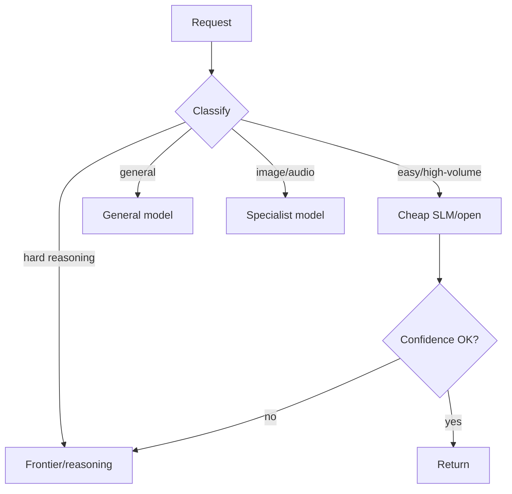
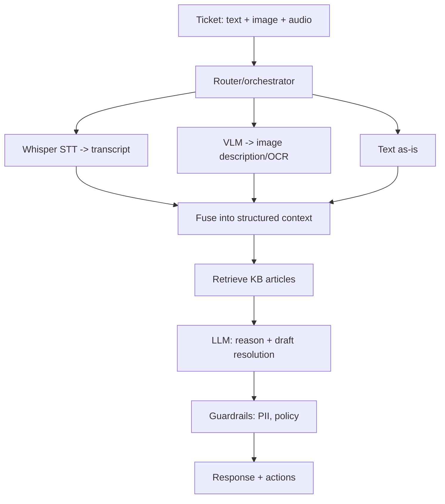

# GenAI Ecosystems — Advanced / Expert Interview Questions

> Senior / staff-level questions. These are less about definitions and more about
> **strategy, trade-offs, and running GenAI at scale** in a large organization. Answers show
> the reasoning a company wants to hear.

## Quick Coverage Map

| # | Question | Theme |
|---|---|---|
| 1 | Design a model-selection strategy for a product org | Model selection |
| 2 | Build vs buy: open vs closed at scale | Strategy / cost |
| 3 | Architect a multimodal system | Multimodal |
| 4 | Cost & latency at scale (10k QPS) | Scale / performance |
| 5 | Migrating providers without lock-in | Portability |
| 6 | Fine-tune vs RAG vs long-context decision | Customization |
| 7 | Serving economics: GPU capacity planning | Infra |
| 8 | Security & governance for GenAI | Security |
| 9 | Evaluating models for your task | Evals |
| 10 | Handling model deprecation / drift | Operations |
| 11 | Routing / cascade architecture | Optimization |
| 12 | How do you stay current? | Meta |

---

### 1. Design a model-selection strategy for a whole product organization.

Don't pick "a model" — build a **policy and a portfolio**. My approach:

1. **Classify workloads** by constraints: data sensitivity, task hardness, latency SLA, volume,
   modality.
2. **Tier the models:** a cheap/fast default (SLM or discount open model), a strong general model,
   a frontier/reasoning model for hard cases, plus specialist models (embeddings, vision, speech).
3. **Route** at runtime: cheap-by-default, escalate on low confidence or detected difficulty.
4. **Abstract behind a gateway** so any model is swappable and governed centrally.
5. **Gate with evals:** every workload has a task-specific eval suite; a model is "allowed" only
   if it passes.
6. **Review quarterly** — the frontier moves monthly; re-benchmark and re-tier.

### 2. Build vs buy — open self-host vs closed API at scale?

It's a **cost curve + control** decision. Closed APIs win at low/spiky volume and when you need
frontier quality fast with no ops. As **volume grows and stabilizes**, self-hosting open-weight
models can be dramatically cheaper per token — but you take on GPU capex/opex, serving, upgrades,
and security. The crossover depends on utilization: a GPU is only cheap if you keep it busy
(continuous batching, high occupancy). My rule: start on closed APIs to ship fast, instrument
token spend, and self-host the *high-volume, stable, privacy-sensitive* workloads once the math
and utilization justify it. Keep everything behind a gateway so the switch is config, not a
rewrite.

Pros of self-host at scale: predictable cost, privacy, customization, no lock-in.
Cons: ops burden, slightly behind frontier, you own reliability and security.

### 3. Architect a production multimodal system (e.g., "analyze a support ticket with screenshots and a voice note").

Route each modality to a specialist, then fuse:

Key decisions: native multimodal model vs specialist-per-modality (specialists are cheaper and
swappable; native VLM reasons jointly and is simpler); async processing for slow modalities
(audio/video); cost control by only invoking heavy models when needed; and strong guardrails since
inputs are user-supplied (indirect injection via image text is real).

### 4. How do you keep cost and latency sane at, say, 10k QPS?

- **Cascade/routing:** most traffic to cheap/small models; escalate a small fraction.
- **Caching:** exact-match + **semantic caching** for repeat queries; **prompt/KV caching** for
  shared system prompts and few-shot prefixes.
- **Continuous batching** on self-hosted vLLM/SGLang to maximize GPU goodput.
- **Right-size + quantize** (AWQ/FP8) to fit more concurrency per GPU.
- **Trim tokens:** RAG to shrink prompts, cap max output, compress system prompts (or bake them
  into a LoRA).
- **Stream** tokens for perceived latency; set TTFT and end-to-end SLOs.
- **Autoscale** on queue depth/GPU utilization; use regions + provider fallback for resilience.
- **Capacity math:** tokens/req × QPS = tokens/sec needed; divide by model's tok/s/GPU to size the
  fleet, with headroom for spikes.

### 5. How do you migrate providers without lock-in?

Put a **gateway** (LiteLLM/Portkey/etc.) between the app and models so every provider speaks the
same OpenAI-compatible interface. Keep prompts and tool schemas provider-neutral; avoid depending
on one vendor's proprietary features unless abstracted. Maintain a **shared eval suite** so you can
validate a new provider on *your* tasks before switching. Roll out via **shadow traffic** and
canary/percentage routing, comparing quality/cost/latency, then flip the config. Watch for subtle
behavior differences (tokenization, system-prompt handling, JSON mode) and re-tune prompts.

### 6. Fine-tune vs RAG vs long-context — how do you decide?

Map the *problem* to the *tool*:
- Missing **facts** (private/fresh) → **RAG**.
- Wrong **behavior/format/style**, or a giant repeated system prompt → **fine-tune (LoRA)**.
- Reasoning over **one large document already in hand** → **long context**.

They compose (RAG + LoRA + moderate context is common). Prefer the cheapest that works: prompt →
RAG → LoRA → full fine-tune. Fine-tuning has ongoing cost (data curation, retraining on model
upgrades), so justify it with a behavior RAG/prompting can't achieve.

### 7. Walk through GPU capacity planning for self-hosted serving.

Steps: (1) pick the model and quantization → gives VRAM for weights; (2) estimate **KV-cache**
memory = f(batch, context length) — this often dominates at long context; (3) benchmark
**tokens/sec/GPU** under realistic concurrency with continuous batching; (4) compute demand =
avg tokens/request × QPS; (5) fleet size = demand ÷ per-GPU throughput, plus headroom (say 30-50%)
for spikes; (6) decide replicas + autoscaling policy (queue depth), and reserve vs spot mix (spot
for batch, reserved for latency-critical). Revisit when context length or QPS assumptions change —
KV cache scales with sequence length and can surprise you.

### 8. What does GenAI security & governance look like at a big company?

Layered, and mostly enforced at the gateway/guardrails tier:
- **Prompt injection** (direct + indirect via retrieved/tool content) — the top risk; validate,
  least-privilege tools, don't execute model output blindly.
- **Data protection:** PII masking, zero-retention/enterprise API tiers, data-residency, secrets
  out of prompts.
- **Supply chain:** pin/audit dependencies (a real incident compromised an LLM gateway package),
  vet model provenance & licenses.
- **Output handling:** treat model output as untrusted before shell/SQL/DOM.
- **Excessive agency:** sandbox tools, human-in-the-loop for high-impact actions.
- **Governance:** full audit logging/tracing, eval gates on deploy, model registry & approval,
  incident runbooks.

### 9. How do you actually evaluate models for your use case?

Benchmarks like MMLU/SWE-bench and leaderboards (Artificial Analysis, Chatbot Arena) are a
*starting filter*, not the decision — your task ≠ the benchmark. Build a **task-specific eval set**
from real data with clear metrics: automatic checks (exact match, unit tests, JSON-schema
validity), **LLM-as-judge** for open-ended quality (calibrated against human labels), and
regression tracking over time. Measure quality, cost, and latency together. Run **offline** evals
before deploy and **online** (A/B, canary, user feedback) after. Re-run whenever a model changes.

### 10. How do you handle model deprecation and behavior drift?

Providers retire and silently update models, which can break prompts. Mitigations: pin explicit
model versions where possible; keep the gateway abstraction so swaps are config; maintain evals to
**detect drift** (run them on a schedule and on version bumps); subscribe to provider changelogs;
keep an open-weight fallback for critical paths so you're never fully dependent on one vendor's
lifecycle. Treat a model version like a dependency — with a rollout, canary, and rollback plan.

### 11. Describe a routing / cascade architecture and its risks.

A cascade tries a cheap model first and escalates on low confidence; a router classifies the
request up front and sends it to the right tier/specialist. Benefits: big cost savings, latency
wins for easy traffic, right tool per job. Risks: the **router/judge itself** adds latency and can
be wrong; escalation logic needs a reliable confidence signal (self-consistency, verifier,
uncertainty); cascades can *increase* cost if too many requests escalate. Tune the escalation
threshold against your eval set and monitor the escalation rate as a live metric.

### 12. How do you stay current in a field that changes weekly?

- Track **independent** benchmarks (Artificial Analysis, LMArena) and provider changelogs/model
  cards.
- Follow a few high-signal sources (release notes, key labs, HF trending) — filter the hype.
- **Re-run your own eval suite** when models change; that's the only benchmark that matters for
  *your* product.
- Prototype quickly behind the gateway so trying a new model is low-cost.
- Focus on durable fundamentals (architecture, serving, evals, cost) — version numbers churn, the
  principles don't.

---

## Further Reading

- Artificial Analysis (independent benchmarks): <https://artificialanalysis.ai>
- LMArena / Chatbot Arena: <https://lmarena.ai>
- vLLM production docs: <https://docs.vllm.ai>
- LiteLLM gateway: <https://docs.litellm.ai>
- OWASP Top 10 for LLM Apps: <https://genai.owasp.org>
- Langfuse evals & tracing: <https://langfuse.com/docs>

---

*Content synthesized from general domain knowledge and current (2025-2026) interview trends;
rephrased for compliance with licensing restrictions.*
