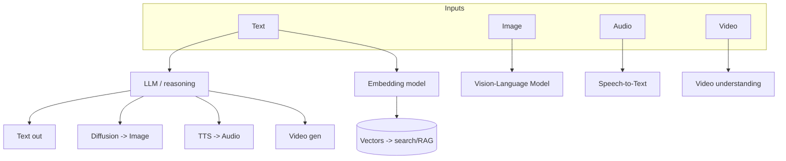
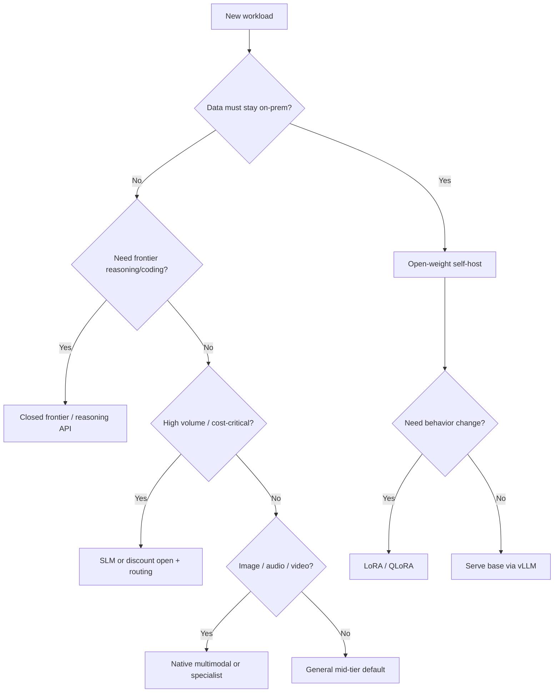
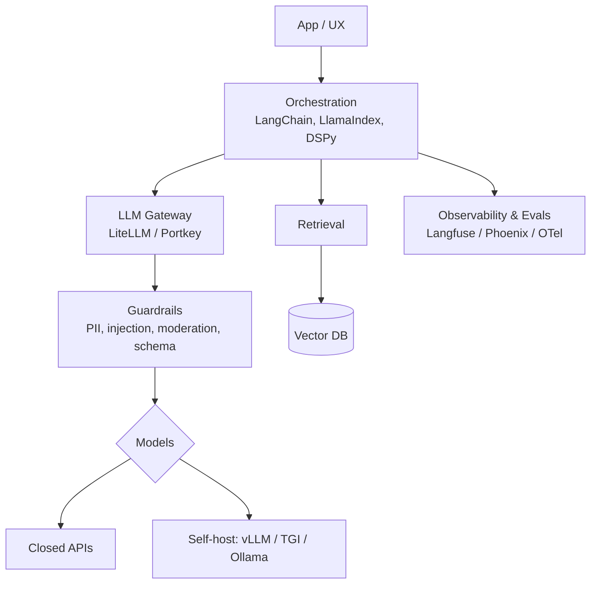
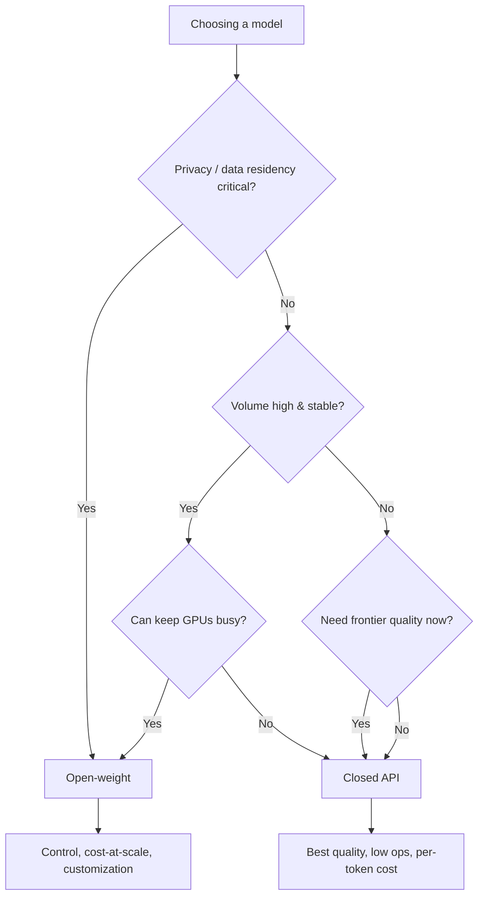
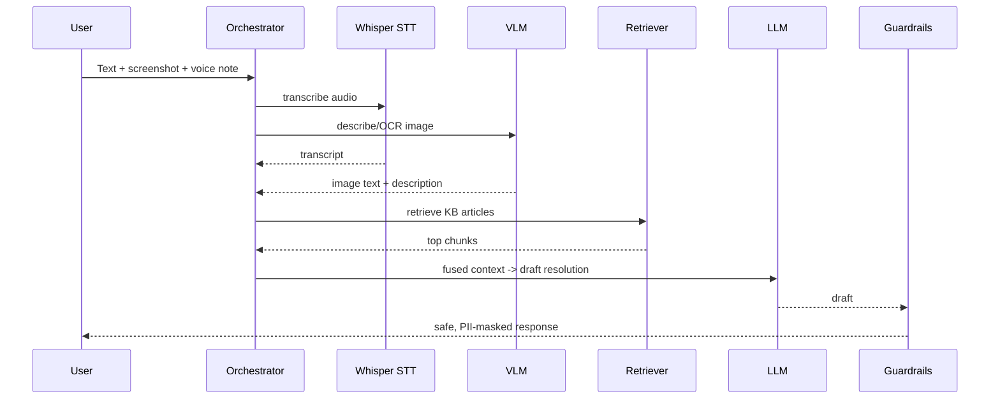
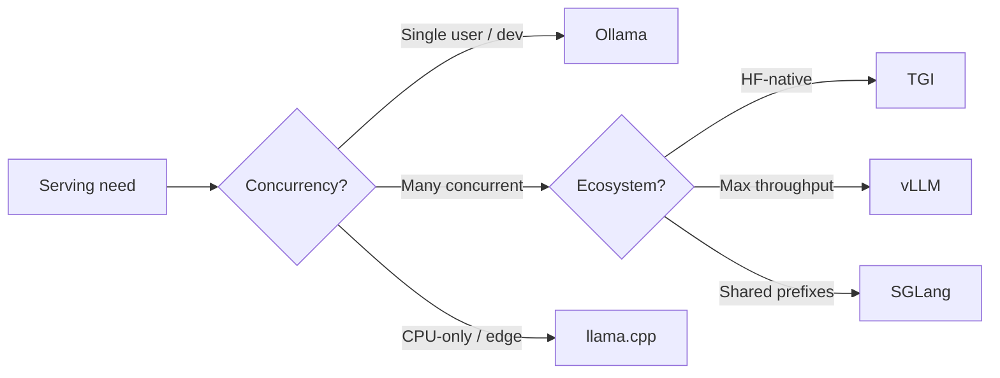
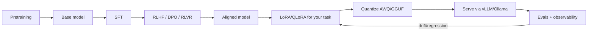
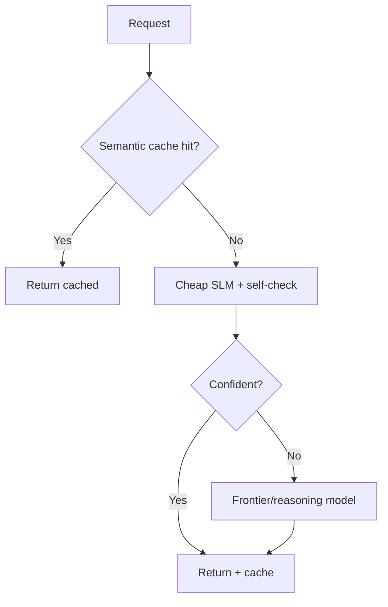
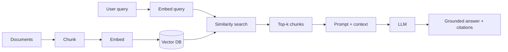

# GenAI Ecosystems — Use-Case Diagrams

> Visual mental models. Each diagram is rendered with Mermaid and paired with a short "how to
> read it" note.

---

## 1. Modality map — inputs, model types, outputs

How different data types flow through specialized models.

**Read it:** pick the model type by modality; embeddings feed retrieval, not generation.

---

## 2. Model-selection flowchart

The decision tree a senior engineer walks when choosing a model.

**Read it:** constraints first (data, hardness, volume, modality), leaderboard last.

---

## 3. GenAI tooling stack

The layers of a production application.

**Read it:** the gateway + guardrails layer is where routing, cost, and security concentrate.

---

## 4. Open vs closed decision

**Read it:** open wins on privacy/control/cost-at-scale *if* you can keep GPUs utilized; closed
wins on speed-to-frontier and low ops.

---

## 5. Multimodal pipeline (support ticket example)

**Read it:** route each modality to a specialist, fuse into one context, ground with retrieval,
then guardrail the output.

---

## 6. Inference-serving options

**Read it:** match the engine to the load pattern, not the headline benchmark.

---

## 7. Training-to-deployment lifecycle

**Read it:** the loop never ends — evals feed back into re-tuning and re-tiering.

---

## 8. Cost-optimizing router / cascade

**Read it:** cache -> cheap-by-default -> escalate. Monitor the escalation rate as a live cost
metric.

---

## 9. RAG data flow (grounding a model)

**Read it:** same embedding model for indexing and querying; keep prompts tight and put the best
chunks near the edges.

---

*Content synthesized from general domain knowledge and current (2025-2026) trends; rephrased for
compliance with licensing restrictions.*
