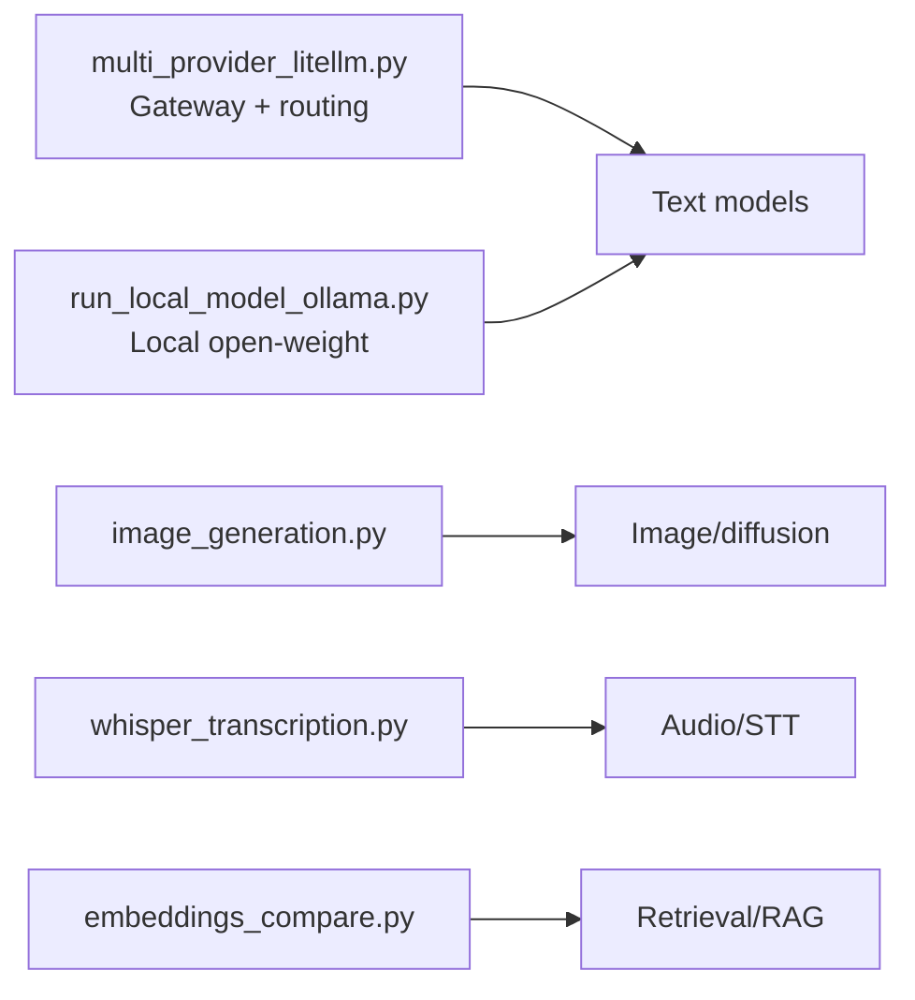

# GenAI Ecosystems — Implementation Code Examples

Runnable, heavily-commented examples that turn the concepts from the detailed guide into
working code. Every file explains **why** it exists, not just what it does. None of these
require all dependencies at once — install per script from `requirements.txt`.

## Index

| # | File | Modality / concept | What it teaches |
|---|---|---|---|
| 1 | [`multi_provider_litellm.py`](./multi_provider_litellm.py) | Text · Gateway | One interface for every provider; fallback chains; cost cascade (cheap-first, escalate) |
| 2 | [`run_local_model_ollama.py`](./run_local_model_ollama.py) | Text · Local/open | Run open-weight models locally (privacy, zero per-token cost); streaming; local embeddings |
| 3 | [`image_generation.py`](./image_generation.py) | Image · Diffusion | API vs local diffusion trade-off; steps/CFG/negative-prompt knobs |
| 4 | [`whisper_transcription.py`](./whisper_transcription.py) | Audio · STT | Whisper speech-to-text; model-size + int8 quantization trade-offs |
| 5 | [`embeddings_compare.py`](./embeddings_compare.py) | Embeddings · RAG | Local vs API embeddings; cosine similarity; the retrieval step; Matryoshka dims |

## How these map to the ecosystem



## Setup

```bash
# Create an environment, then install only what a given script needs:
pip install -r requirements.txt        # or cherry-pick lines

# Provider keys (only for the API paths):
export OPENAI_API_KEY=...              # + ANTHROPIC_API_KEY / GEMINI_API_KEY as needed

# For the local model example, install Ollama separately:
#   https://ollama.com/download
#   ollama pull llama3.2
```

## Suggested run order

1. `multi_provider_litellm.py` — see the gateway pattern (needs an API key).
2. `run_local_model_ollama.py` — same idea, fully local (needs Ollama).
3. `embeddings_compare.py` — understand retrieval before doing RAG.
4. `whisper_transcription.py` — turn audio into text (pass an audio file).
5. `image_generation.py` — explore the image modality (API or GPU).

## Notes

- These are teaching examples: error handling is intentionally light and secrets come from
  environment variables (never hard-code keys).
- For production you'd add retries/timeouts, structured logging, an observability layer
  (Langfuse/OTel), and guardrails — see the detailed guide's security section.

---

*Content synthesized from general domain knowledge and current (2025-2026) trends; rephrased
for compliance with licensing restrictions.*
