# AI Real Projects — Detailed Learning (Deep Dive)

> This is the "build these, be able to talk about them, and clear the toughest AI-engineer interviews" guide. It is written for someone who wants a **portfolio that gets callbacks** and who wants to **defend every design decision** in a system-design round. Read it top to bottom once, then use the headings as a revision index.
>
> The theme throughout: a project only counts if you (1) shipped something a reviewer can run, (2) measured how good it is, and (3) can explain the tradeoffs you made on cost, latency, reliability, and security.

---

## Table of Contents
1. [Why portfolio projects matter for AI-engineer hiring](#1-why-portfolio-projects-matter)
2. [What hiring managers actually look for in 2025–2026](#2-what-hiring-managers-look-for)
3. [How to structure a project so it counts](#3-how-to-structure-a-project)
4. [The evaluation habit (the thing most portfolios miss)](#4-the-evaluation-habit)
5. [Deployment, observability, and cost — the "production" signal](#5-deployment-observability-cost)
6. [The project catalog — beginner](#6-catalog-beginner)
7. [The project catalog — intermediate](#7-catalog-intermediate)
8. [The project catalog — advanced](#8-catalog-advanced)
9. [How to talk about projects in interviews (STAR + metrics)](#9-how-to-talk-about-projects)
10. [A suggested build path](#10-suggested-build-path)
11. [Cross-cutting concerns: security, scale, load, performance](#11-cross-cutting-concerns)
12. [Common mistakes that sink portfolios](#12-common-mistakes)
13. [Further reading](#13-further-reading)

---

<a name="1-why-portfolio-projects-matter"></a>
## 1. Why portfolio projects matter for AI-engineer hiring

Certifications say you *watched* something. Projects say you *built* something. For AI engineering roles, that gap is enormous, because the job is almost entirely about the messy space between a model that works in a notebook and a system that survives real users.

A recruiter spends a few seconds on a résumé line. But a link to a repo with a live demo, a clear README, and honest evaluation numbers changes the conversation — the interviewer stops asking "can you do this?" and starts asking "tell me about the tradeoff you made here." That is a much better interview to be in.

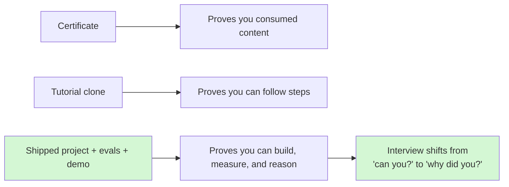

**The core idea:** the best projects are not the most complex. They are the ones where you can point at a number and say "here is how good it is, here is where it fails, and here is what I would do next." That sentence is the whole game.

**Why this matters more in 2025–2026:** GenAI moved from "cool demo" to "must ship reliably and cheaply." Job descriptions now list RAG, agents, evaluation, and deployed applications as *core* requirements, not nice-to-haves. A weekend RAG app that is deployed and measured beats a three-month deep-learning notebook that only lives in Colab. Recruiters click links; make the link worth the click. *(Content synthesized from general domain knowledge and current 2025–2026 hiring trends.)*

---

<a name="2-what-hiring-managers-look-for"></a>
## 2. What hiring managers actually look for in 2025–2026

Here is the honest scorecard interviewers use, whether or not they write it down:

| Signal | Weak portfolio | Strong portfolio |
|---|---|---|
| **Runnability** | "Here's my code" (won't run) | Live demo or one-command local run + small front-end |
| **Evaluation** | "It works" (one screenshot) | A test set + metrics (accuracy, faithfulness, latency, cost) |
| **Failure awareness** | "No bugs" | "Here are the 3 failure modes and how I mitigate them" |
| **Tradeoffs** | Used the default of everything | "I chose X over Y because of cost/latency/accuracy" |
| **Production sense** | Runs on my laptop | Deployed, has logging/tracing, handles errors, has a cost budget |
| **Scope honesty** | Claims it's "production-grade" | Clear about what's a prototype vs. hardened |

**The four patterns that carry the most weight right now:**

1. **RAG** — retrieval-augmented generation over your own documents. The bread-and-butter enterprise pattern.
2. **Agents / tool use** — an LLM that decides which tools to call (search, SQL, code, APIs), ideally with MCP-style tool integration.
3. **Multi-agent orchestration** — several specialized agents that plan, delegate, and combine results.
4. **Evaluation & observability** — you can measure quality and watch the system in production.

If your portfolio has one solid project per pattern, with a small front-end and honest evals, you are ahead of most candidates. *(Rephrased for compliance with licensing restrictions.)*

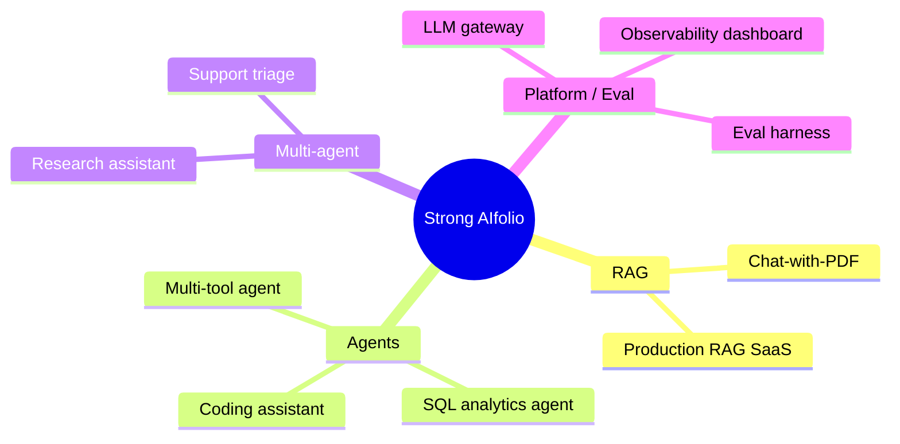

---

<a name="3-how-to-structure-a-project"></a>
## 3. How to structure a project so it counts

A project that "counts" tells a complete story. Here is the anatomy. Treat every heading as a section your README must have.

### 3.1 The README is the product

Reviewers read the README first (often *instead of* the code). A strong README answers, in order:

1. **What problem does this solve?** One sentence a non-engineer understands.
2. **Demo** — GIF, screenshot, or live link at the very top.
3. **Architecture diagram** — a Mermaid diagram beats three paragraphs.
4. **How to run it** — one command ideally (`docker compose up` or `make run`).
5. **Evaluation** — the numbers, the test set, how you measured.
6. **Tradeoffs & limitations** — what you chose and what you'd do with more time.
7. **Tech stack & why** — not just "I used Pinecone" but "I used Pinecone because…"

### 3.2 Architecture diagram

Every serious project has one diagram that shows data flow. Example for a generic LLM app:

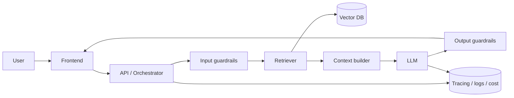

### 3.3 Evaluation numbers

The single biggest differentiator. See section 4 — this deserves its own habit.

### 3.4 Deployment

"It's live at this URL" or "run `docker compose up`." Hugging Face Spaces, Render, Fly.io, a small VPS, or a cloud run service are all fine. The point is: *someone else can experience it.*

### 3.5 Observability

Show you thought about what happens after launch: request tracing, token/cost logging, latency percentiles, and error tracking. Even a simple structured-log + a Langfuse/Phoenix trace screenshot signals maturity.

### 3.6 Tradeoffs

A short section titled "Design decisions" where each bullet is "I chose A over B because C." This is catnip for interviewers.

---

<a name="4-the-evaluation-habit"></a>
## 4. The evaluation habit (the thing most portfolios miss)

If you do one thing differently from everyone else, do this: **build a small evaluation set and report numbers.**

### 4.1 Why it matters

AI systems are *probabilistic*. "It works" is meaningless without "on what, and how often." Evaluation is what separates someone who plays with LLMs from someone who engineers with them.

### 4.2 What to measure (by project type)

| Project type | Core metrics |
|---|---|
| RAG / Q&A | Answer correctness, faithfulness (grounded-ness), context precision/recall, citation accuracy |
| Retrieval | Recall@k, MRR, nDCG, hit rate |
| Agents | Task success rate, tool-call accuracy, steps-to-success, cost per successful task |
| Classification / extraction | Precision, recall, F1, confusion matrix |
| All | p50/p95 latency, cost per request, error rate |

### 4.3 A minimal eval loop

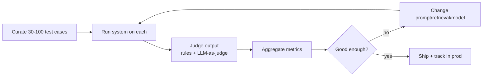

```python
# Tiny eval harness sketch — the WHY: a repeatable number beats a vibe.
import json, statistics

def evaluate(system, testset, judge):
    results = []
    for case in testset:                     # each case: {"q":..., "expected":...}
        out = system(case["q"])
        score = judge(case, out)             # 0..1; rules or LLM-as-judge
        results.append({"q": case["q"], "score": score,
                        "latency_ms": out["latency_ms"], "cost": out["cost"]})
    return {
        "mean_score": statistics.mean(r["score"] for r in results),
        "p95_latency": sorted(r["latency_ms"] for r in results)[int(0.95*len(results))-1],
        "avg_cost": statistics.mean(r["cost"] for r in results),
    }
```

> **Interview gold:** "I built a 60-question eval set. Faithfulness was 0.82 with naive chunking; after adding a reranker it rose to 0.91, at +40ms p95 and +12% cost. I judged that worth it for a support use case." That one sentence out-competes ten candidates.

Popular tooling to name-drop honestly: **RAGAS** (RAG metrics), **DeepEval / promptfoo** (test-style evals), **LangSmith / Langfuse / Phoenix** (tracing + eval).

---

<a name="5-deployment-observability-cost"></a>
## 5. Deployment, observability, and cost — the "production" signal

### 5.1 Deployment ladder (pick the rung that fits)

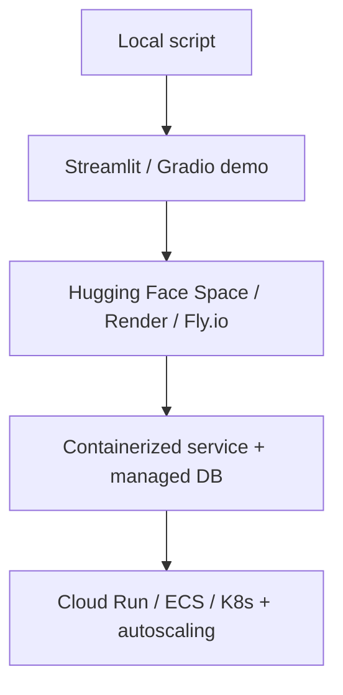

For a portfolio, rung C (a public demo) is the minimum that impresses. Rung D–E is what you *describe* in the "how would you scale this" part of the interview.

### 5.2 Observability essentials

- **Tracing:** capture each request as a span tree (retrieval → prompt → LLM → tools). Tools: Langfuse, LangSmith, Phoenix, OpenTelemetry.
- **Cost & tokens:** log input/output tokens and $ per request; aggregate per user/route.
- **Latency:** track p50/p95/p99, not the average (tails hurt UX).
- **Quality in prod:** sample real traffic, run offline evals or an LLM judge, watch for drift.

### 5.3 Cost control levers (know these cold)

| Lever | What it does | Watch out for |
|---|---|---|
| Model routing | Cheap model for easy queries, strong model for hard | Router mistakes can break UX — measure! |
| Prompt caching | Reuse cached prefixes | Only helps with stable prefixes |
| Semantic cache | Return cached answer for similar queries | Stale answers, privacy of cache |
| Smaller/quantized models | Lower $/token & latency | Quality drop; must eval |
| Truncation / chunk budget | Fewer context tokens | Losing needed context |
| Batching | Higher throughput | Adds latency for individual requests |

> A 2025–2026 cautionary tale worth citing in interviews: teams that blindly route everything to a cheap model to save cost can *break the product* — you must measure the quality hit per route, not assume it. *(Rephrased for compliance with licensing restrictions.)*

---

<a name="6-catalog-beginner"></a>
## 6. The project catalog — beginner

Each entry uses the same template: **Problem → Architecture → Key tech → What it demonstrates → Stand out → Pitfalls.** Build 1–2 from here to establish fundamentals, then move up.

### 6.1 Chat-with-your-PDF (RAG) ⭐ flagship

- **Problem:** Ask natural-language questions about a document (contract, textbook, manual) and get grounded answers with citations.
- **Architecture:**
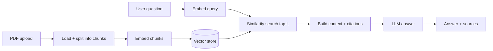
- **Key tech:** an embedding model, a vector store (FAISS/Chroma to start, pgvector/Pinecone later), an LLM, a chunker, a small UI (Streamlit/Gradio).
- **What it demonstrates:** the entire RAG pattern — chunking, embeddings, retrieval, grounding, citations.
- **Stand out:** add citations with page numbers; add an eval set measuring faithfulness; add a reranker and show the before/after number; handle multi-file and "I don't know" answers.
- **Pitfalls:** chunk size too big/small; no dedup; hallucinating when retrieval misses; ignoring token limits; no eval.

### 6.2 AI resume analyzer / job-fit scorer

- **Problem:** Given a résumé and a job description, score the fit and give targeted, structured feedback.
- **Architecture:** parse résumé → extract structured fields (Pydantic schema) → compare against JD via embeddings + LLM rubric → return JSON score + rationale.
- **Key tech:** structured output (Instructor/Pydantic), embeddings for skill matching, a rubric prompt.
- **What it demonstrates:** structured extraction, schema validation, prompt design, bias awareness.
- **Stand out:** enforce a strict JSON schema, add a fairness note (don't score on protected attributes), show precision on a labeled set.
- **Pitfalls:** free-text output that won't parse; hidden bias; overfitting to keywords.

### 6.3 Semantic search engine

- **Problem:** Search a corpus by meaning, not keywords ("docs about cancelling a subscription" finds "how to end your plan").
- **Architecture:** ingest corpus → embed → vector index → query embed → ANN search → (optional) rerank → results.
- **Key tech:** embeddings, a vector index (FAISS/HNSW), optional cross-encoder reranker, hybrid search (BM25 + vectors).
- **What it demonstrates:** embeddings, ANN indexes, hybrid retrieval, relevance evaluation.
- **Stand out:** implement **hybrid** search and report Recall@k / MRR vs. pure keyword; add filters/metadata.
- **Pitfalls:** ignoring keyword search entirely; no relevance metrics; wrong distance metric.

### 6.4 Content summarizer / newsletter digest

- **Problem:** Turn long content (articles, transcripts, threads) into a faithful, structured summary.
- **Architecture:** fetch → clean → chunk → map-reduce or refine summarization → structured output.
- **Key tech:** long-context handling, map-reduce summarization, structured output.
- **What it demonstrates:** context management, chunk aggregation, faithfulness.
- **Stand out:** measure faithfulness (no invented facts), add "cite the source sentence."
- **Pitfalls:** hallucinated details; losing key points in reduction; ignoring cost of long inputs.

---

<a name="7-catalog-intermediate"></a>
## 7. The project catalog — intermediate

### 7.1 Customer support bot (RAG + actions)

- **Problem:** Answer customer questions from a knowledge base and, when needed, take an action (create ticket, check order status).
- **Architecture:**
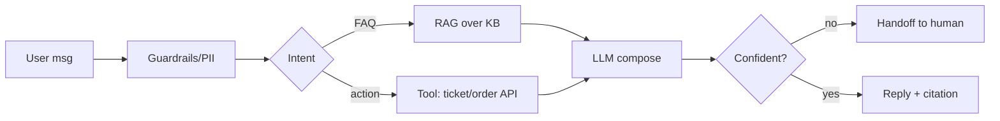
- **Key tech:** RAG, function calling, intent routing, escalation logic, conversation memory.
- **What it demonstrates:** blending retrieval with actions, safe fallback, human-in-the-loop.
- **Stand out:** add a confidence threshold + human handoff, measure deflection rate and CSAT-proxy, log every tool call.
- **Pitfalls:** taking actions without confirmation; no escalation path; leaking PII; answering out-of-scope.

### 7.2 Multi-tool agent (research/assistant)

- **Problem:** An agent that plans and uses tools — web search, calculator, code exec, APIs — to complete open-ended tasks.
- **Architecture:** planner → tool-selection loop (ReAct-style) → tool execution → reflection → answer, with step/cost limits.
- **Key tech:** function/tool calling, an agent loop (LangGraph or custom), MCP for tool integration, retries.
- **What it demonstrates:** agentic control flow, tool schemas, loop termination, cost guards.
- **Stand out:** hard limits on steps/cost, structured tool schemas, trace every decision, report task success rate.
- **Pitfalls:** infinite loops; runaway cost; tools with no error handling; no observability.

### 7.3 SQL analytics agent (text-to-SQL)

- **Problem:** Ask business questions in English; the agent writes SQL, runs it (read-only), and explains the answer.
- **Architecture:**
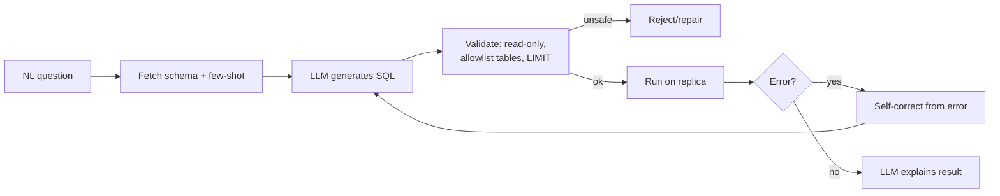
- **Key tech:** schema-aware prompting, SQL validation/sandboxing, self-correction from DB errors, read replicas.
- **What it demonstrates:** grounding in real data, safety (SQL injection / destructive queries), self-healing loops.
- **Stand out:** strict read-only enforcement, query allowlist, cost/row limits, accuracy on a labeled question set.
- **Pitfalls:** letting the LLM run `DROP`/`DELETE`; querying prod directly; no `LIMIT`; wrong joins with no validation.

### 7.4 Code review assistant

- **Problem:** Review a pull request diff and produce actionable comments (bugs, style, security).
- **Architecture:** fetch diff → retrieve relevant repo context → LLM review with a rubric → structured comments → post to PR.
- **Key tech:** diff parsing, repo retrieval, structured output, GitHub API integration.
- **What it demonstrates:** grounding in code context, structured actionable output, integration with dev tooling.
- **Stand out:** measure precision of comments (are they useful?), avoid noisy nitpicks, add a severity field.
- **Pitfalls:** hallucinating about code it didn't see; too many low-value comments; no context window management.

### 7.5 Meeting notes → action items (voice-in)

- **Problem:** Transcribe a meeting and extract decisions, action items, and owners.
- **Architecture:** audio → speech-to-text → chunk → LLM extraction (structured) → summary + tasks.
- **Key tech:** ASR (Whisper), diarization (optional), structured extraction.
- **What it demonstrates:** multimodal pipeline, structured extraction, long-transcript handling.
- **Stand out:** speaker attribution, confidence on action items, export to a task tool.
- **Pitfalls:** transcription errors cascading; losing owners; hallucinated action items.

---

<a name="8-catalog-advanced"></a>
## 8. The project catalog — advanced

These are the "senior signal" projects. You likely won't finish all — build one deeply and *describe* the rest.

### 8.1 Multi-agent research assistant

- **Problem:** Answer a complex research question by coordinating specialized agents (planner, searcher, analyst, writer, critic).
- **Architecture:**
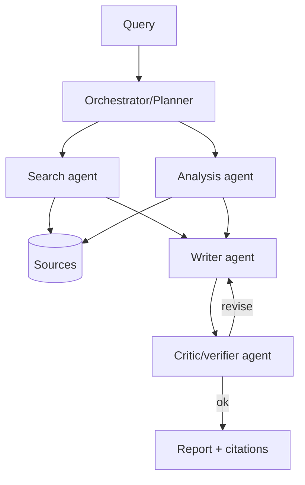
- **Key tech:** orchestration (LangGraph/AutoGen/CrewAI), shared memory/state, verifier agent, citation tracking.
- **What it demonstrates:** decomposition, delegation, a critic loop to reduce hallucination, cost control across many calls.
- **Stand out:** a **verifier** that checks claims against sources; a token/cost budget across agents; measured report quality.
- **Pitfalls:** agents talking in circles; exploding cost; no ground truth; over-engineering vs. a single strong prompt.

### 8.2 LLM gateway / router (platform project)

- **Problem:** One API in front of many model providers with routing, caching, rate limits, retries, fallback, and cost tracking.
- **Architecture:**
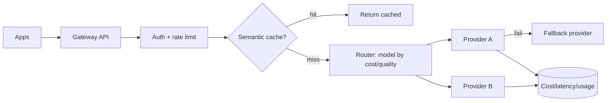
- **Key tech:** provider abstraction, semantic caching, rate limiting, retries with backoff, fallback, usage metering.
- **What it demonstrates:** platform thinking, reliability patterns, cost governance, multi-tenancy.
- **Stand out:** per-tenant budgets, circuit breakers, streaming passthrough, and a metrics dashboard.
- **Pitfalls:** router that degrades quality silently; cache serving stale/private data; no per-tenant isolation.

### 8.3 Production RAG SaaS (end-to-end)

- **Problem:** A multi-tenant "chat with your knowledge base" product: upload docs, ask questions, with auth, isolation, and evals.
- **Architecture:**
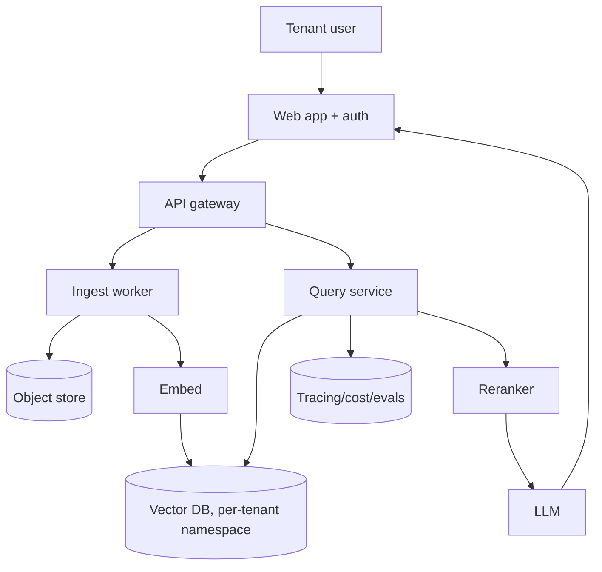
- **Key tech:** async ingestion queue, per-tenant isolation (namespaces/row-level security), reranking, auth, observability, CI evals.
- **What it demonstrates:** everything at once — scale, multi-tenancy, security, cost, evaluation in CI.
- **Stand out:** tenant data isolation you can prove, ingestion that scales horizontally, eval gate in CI that blocks regressions.
- **Pitfalls:** cross-tenant data leakage; synchronous ingestion that times out; no eval regression gate; unbounded cost.

### 8.4 Voice assistant (real-time, multimodal)

- **Problem:** A low-latency voice interface: speak → understand → act/answer → speak back.
- **Architecture:**
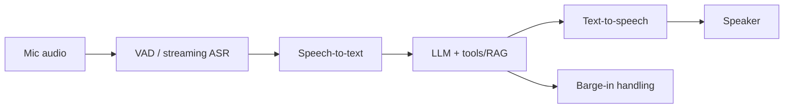
- **Key tech:** streaming ASR, low-latency LLM, streaming TTS, turn-taking / barge-in, WebRTC.
- **What it demonstrates:** hard latency engineering, streaming pipelines, real-time UX.
- **Stand out:** measure end-to-end latency (target sub-second turn), handle interruptions, degrade gracefully.
- **Pitfalls:** batch (non-streaming) design that feels laggy; no interruption handling; ignoring the latency budget.

### 8.5 Agentic coding tool

- **Problem:** An agent that reads a repo, plans a change, edits files, runs tests, and iterates until green.
- **Architecture:** repo index → planner → edit tool → run tests → read failures → self-correct loop → PR.
- **Key tech:** code retrieval, file-edit tools, sandboxed test execution, self-correction, tight step/cost limits.
- **What it demonstrates:** the frontier pattern — long-horizon agency with real feedback (tests) as ground truth.
- **Stand out:** sandbox everything, cap iterations, show pass rate on a benchmark of tasks, never auto-merge.
- **Pitfalls:** unsandboxed execution (danger!); infinite edit loops; huge context cost; trusting the agent blindly.

### Catalog summary

```mermaid
flowchart LR
    subgraph Beginner
      B1[Chat-with-PDF]
      B2[Resume analyzer]
      B3[Semantic search]
      B4[Summarizer]
    end
    subgraph Intermediate
      I1[Support bot]
      I2[Multi-tool agent]
      I3[SQL agent]
      I4[Code review]
    end
    subgraph Advanced
      A1[Multi-agent research]
      A2[LLM gateway]
      A3[Production RAG SaaS]
      A4[Voice assistant]
      A5[Agentic coding tool]
    end
    Beginner --> Intermediate --> Advanced
```

---

<a name="9-how-to-talk-about-projects"></a>
## 9. How to talk about projects in interviews (STAR + metrics)

Building the project is half the battle. The other half is the story. Use **STAR**, but make it *quantitative*.

- **S — Situation:** the problem and who has it. ("Support team drowning in repeat questions.")
- **T — Task:** what you set out to build and the constraint. ("A bot to deflect FAQs, under 2s p95, without hallucinating.")
- **A — Action:** the key design decisions *and the tradeoffs*. ("Chose hybrid retrieval + reranker; added a confidence gate with human handoff.")
- **R — Result:** the numbers. ("Faithfulness 0.91, 62% deflection on a 200-question set, $0.004/query.")

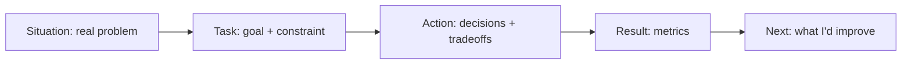

### The tradeoff sentence template

> "I chose **X** over **Y** because **Z** (cost / latency / accuracy / simplicity), and I verified it with **metric M**. The downside is **W**, which I'd address by **V**."

### Failure-mode honesty

Interviewers *love* "here's where it breaks." Have 2–3 ready per project: retrieval misses, ambiguous queries, cost spikes, latency tails, hallucination on out-of-scope questions. Naming them shows you actually ran the thing.

### Questions to be ready for

- "Walk me through the architecture." → Draw the diagram from memory.
- "Why this vector DB / model / framework?" → Tradeoff sentence.
- "How did you evaluate it?" → Test set + metrics.
- "How would you scale it to 10k users?" → Section 11.
- "What broke, and how did you fix it?" → A real war story.

---

<a name="10-suggested-build-path"></a>
## 10. A suggested build path

Don't build 12 shallow projects. Build a **sequence** where each adds a new skill.

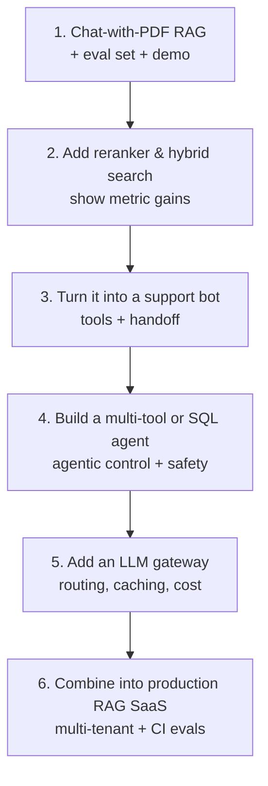

**Timeline sanity check:** #1 in a weekend, #2–#3 over a couple weeks, #4–#6 as your "deep" project over a month or two. Depth on one advanced project beats breadth on five demos.

**Deliverables per project:** repo + README + architecture diagram + eval numbers + live demo (or one-command run) + a short "design decisions" section.

---

<a name="11-cross-cutting-concerns"></a>
## 11. Cross-cutting concerns: security, scale, load, performance

These come up in *every* senior interview regardless of the project. Have crisp answers.

### 11.1 Security

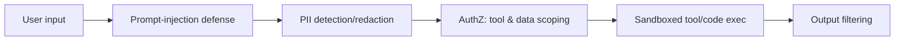

- **Prompt injection:** treat retrieved/tool content as untrusted; don't let it change system instructions; use allowlists for tools; separate "data" from "instructions."
- **Data isolation:** per-tenant namespaces / row-level security; never let retrieval cross tenant boundaries.
- **Secrets & keys:** server-side only; never in the client; rotate; use a gateway.
- **PII:** detect and redact before sending to models; mind data-retention and where logs live.
- **Tool/code safety:** SQL read-only + allowlist; sandbox code execution; confirm destructive actions.
- **Output safety:** filter harmful content; don't echo secrets; validate structured output.

### 11.2 Scale

- **Stateless services** behind a load balancer; scale horizontally.
- **Async ingestion** via a queue (workers embed/index in the background).
- **Vector DB scaling:** sharding, replicas, HNSW params (recall vs. latency vs. memory).
- **Caching:** exact + semantic caches to cut cost and latency.
- **Backpressure:** queue + rate limits so a spike degrades gracefully instead of falling over.

### 11.3 Load & performance

| Concern | Technique |
|---|---|
| High QPS | Horizontal scale, connection pooling, caching |
| Latency tails (p95/p99) | Streaming responses, smaller/faster models for easy paths, reranker only when needed |
| Throughput | Request batching, async I/O, prefetching embeddings |
| Cost under load | Model routing, semantic cache, token budgets, cheaper embeddings |
| Cold starts | Warm pools, keep-alive, provisioned concurrency |

> **Load-testing signal:** mention you'd load-test with something like Locust/k6, watch p95/p99 and cost/req under load, and set autoscaling on queue depth or latency — not just CPU.

### 11.4 Reliability

- Retries with exponential backoff + jitter; timeouts on every external call.
- Fallback models/providers; circuit breakers.
- Idempotency for ingestion; dead-letter queues.
- Graceful degradation: if the reranker or a tool is down, still return a (worse but valid) answer.

---

<a name="12-common-mistakes"></a>
## 12. Common mistakes that sink portfolios

1. **No evaluation.** "It works" with one screenshot. Fix: a small labeled set + metrics.
2. **Tutorial clone with no twist.** Add your own dataset, a reranker, an eval, or a deployment.
3. **No demo.** If a reviewer can't run it, it barely counts. Deploy it.
4. **Over-claiming "production-grade."** Be honest about prototype vs. hardened.
5. **No tradeoff story.** You used defaults everywhere and can't say why.
6. **Ignoring cost/latency.** Senior interviewers probe this immediately.
7. **Security afterthought.** No prompt-injection thought, unsandboxed exec, secrets in client.
8. **Breadth over depth.** Ten shallow demos < two deep, measured projects.
9. **Messy README.** The README *is* the interview's first impression.
10. **Can't explain your own code.** If an LLM wrote it, understand every line before you show it.

---

<a name="13-further-reading"></a>
## 13. Further reading

- Best AI projects sequenced for hiring (Dataquest): https://www.dataquest.io/blog/ai-projects/
- AI engineering portfolio guide (DataExpert): https://www.dataexpert.io/blog/ultimate-guide-ai-engineering-portfolios
- AI project ideas by domain/difficulty (InterviewQuery): https://www.interviewquery.com/p/ai-project-ideas
- Agentic system design interview (PromptLayer): https://blog.promptlayer.com/the-agentic-system-design-interview-how-to-evaluate-ai-engineers/
- AI/ML system design 2026 guide (DesignGurus): https://designgurus.substack.com/p/aiml-system-design-the-2026-guide
- RAGAS (RAG evaluation): https://docs.ragas.io/
- Langfuse (LLM observability): https://langfuse.com/docs

---

*Content synthesized from general domain knowledge and current (2025–2026) interview trends; rephrased for compliance with licensing restrictions.*
