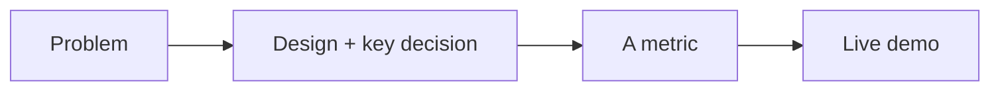
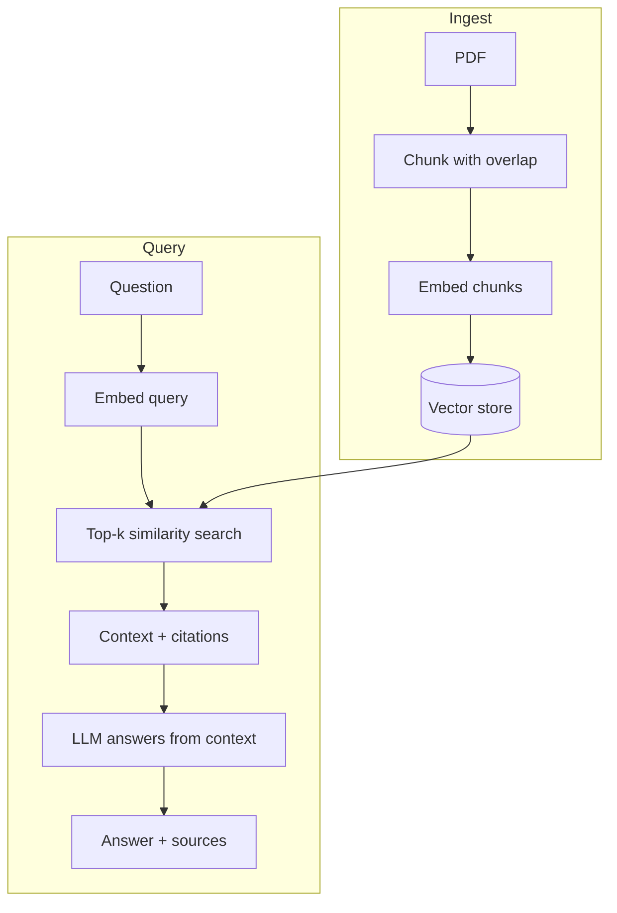
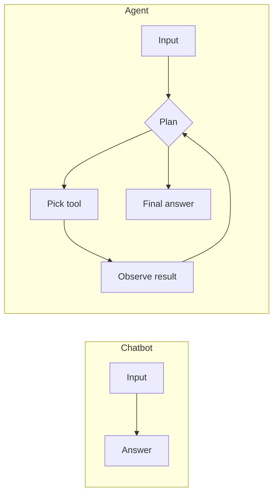

# AI Real Projects — Basic Interview Questions

> Foundational questions about the projects in an AI-engineer portfolio: what they are, how they're structured, and how to walk through them. Natural, plain-language answers you can actually say out loud.

## Quick Coverage Map

| # | Question | Theme |
|---|---|---|
| 1 | Walk me through a project you built | Storytelling / architecture |
| 2 | What is a RAG project and why build one? | RAG fundamentals |
| 3 | Explain your Chat-with-PDF architecture | RAG architecture |
| 4 | Why does chunking matter? | Retrieval basics |
| 5 | What is a vector database and why use one? | Vector DB |
| 6 | How did you evaluate your project? | Evaluation |
| 7 | What makes a portfolio project stand out? | Hiring signal |
| 8 | Difference between a chatbot and an agent? | Agents |
| 9 | How does a text-to-SQL agent work? | SQL agent |
| 10 | How did you deploy it? | Deployment |
| 11 | What did you do about cost and latency? | Cost/latency |
| 12 | What broke, and how did you handle it? | Failure modes |

---

### 1. "Walk me through a project you built."

This is the most common opener. Use **STAR** and lead with the problem, not the tech.

> "I built a **Chat-with-your-PDF** app because people waste time hunting through long documents. The goal was grounded answers with citations, under ~2 seconds. I ingest the PDF, split it into overlapping chunks, embed them into a vector store, and at query time I retrieve the top matches, build a context with citations, and ask the LLM to answer only from that context. I built a 60-question eval set and measured faithfulness — it was 0.82 with naive chunking and 0.91 after I added a reranker. It's deployed on a public demo so you can try it."

Notice the shape: **problem → design → a number → a demo.** Then pause and let them dig in.

---

### 2. "What is a RAG project and why build one?"

**RAG = Retrieval-Augmented Generation.** Instead of relying only on what the model memorized, you *retrieve* relevant text from your own data and put it in the prompt, so the answer is grounded in real sources.

Why build one for a portfolio:
- It's the single most common enterprise pattern — almost every company wants "chat with our docs."
- It teaches the whole stack: chunking, embeddings, vector search, grounding, citations, evaluation.
- It's small enough to finish in a weekend but deep enough to keep improving.

**Why/when:** use RAG when answers must be grounded in specific, changing, or private data that the base model doesn't know. Don't use it when the task is pure reasoning with no external facts.

---

### 3. "Explain your Chat-with-PDF architecture."

Two phases: **ingestion** (offline) and **query** (online).

Key point I'd add: I instruct the model to say "I don't know" when retrieval doesn't surface relevant context — that prevents confident hallucinations.

---

### 4. "Why does chunking matter?"

Chunking is how you split a document before embedding. It matters a lot:

- **Too big:** each chunk covers many topics, so retrieval is fuzzy and you waste context tokens.
- **Too small:** you lose surrounding context and answers become fragmentary.
- **Overlap** (e.g., 10–20%) keeps ideas that straddle a boundary from getting cut in half.

**Rule of thumb:** start around a few hundred tokens with some overlap, then *tune it with your eval set* — don't guess. Semantic or structure-aware chunking (by heading/paragraph) usually beats fixed-size splits.

---

### 5. "What is a vector database and why use one?"

A vector DB stores embeddings (lists of numbers representing meaning) and finds the nearest ones to a query embedding — that's **semantic search**. Regular databases match exact keywords; vector DBs match *meaning*.

| Option | When |
|---|---|
| FAISS / Chroma | Local, prototype, small scale |
| pgvector | You already use Postgres; want SQL + vectors together |
| Pinecone / Weaviate / Qdrant / Milvus | Managed/scaled, filtering, hybrid search |

They use **approximate nearest neighbor (ANN)** indexes like HNSW to stay fast at scale, trading a tiny bit of recall for big speed gains.

---

### 6. "How did you evaluate your project?"

This is the question that separates strong candidates. My answer:

> "I built a small labeled test set — around 60 question/answer pairs. I ran the system on each and scored the output two ways: rule checks (did it cite the right page?) and an LLM-as-judge for faithfulness. I tracked mean faithfulness, p95 latency, and cost per query. That let me A/B changes: adding a reranker moved faithfulness from 0.82 to 0.91 for +40ms and +12% cost, which I judged worth it."

The point: **a repeatable number beats a vibe.** Even a tiny eval set puts you ahead.

---

### 7. "What makes a portfolio project stand out?"

Four things, in order:
1. **It runs** — a live demo or one-command setup, ideally with a small UI.
2. **It's measured** — real eval numbers, not one lucky screenshot.
3. **It's honest about failure** — you can name where it breaks.
4. **It has a tradeoff story** — you chose X over Y for a reason.

A weekend project that's deployed and measured beats a huge notebook that never left Colab.

---

### 8. "What's the difference between a chatbot and an agent?"

- A **chatbot** responds to messages, maybe with RAG for grounding. The control flow is fixed: input → (retrieve) → answer.
- An **agent** *decides what to do* — it can choose tools (search, SQL, code, APIs), take multiple steps, observe results, and loop until done.

The catch with agents: you must add **limits** (max steps, cost budget) or they can loop forever and burn money.

---

### 9. "How does a text-to-SQL agent work?"

You give the LLM the database schema (and a few example queries), it writes SQL for the user's English question, you **validate** the SQL for safety, run it read-only, and the LLM explains the result. If the DB returns an error, the agent reads it and self-corrects.

The critical part is safety: read-only connection, allowlist of tables, force a `LIMIT`, and never let it run `DROP`/`DELETE`. That safety story is what interviewers listen for.

---

### 10. "How did you deploy it?"

I containerized it and put it on a public demo (e.g., Hugging Face Spaces / Render / Fly.io) so anyone can try it. The key is that a reviewer can *experience* it without cloning and configuring anything. In the README I also document a one-command local run (`docker compose up`).

**Deployment ladder:** local script → Streamlit/Gradio demo → public hosted demo → containerized service → autoscaled cloud. For a portfolio, a public hosted demo is the sweet spot.

---

### 11. "What did you do about cost and latency?"

Concretely:
- **Latency:** stream the response so it feels instant; only run the reranker when needed; cache repeated queries.
- **Cost:** log tokens and dollars per request; use a smaller/cheaper model for easy queries and the strong model for hard ones; cap context size.

I measured p95 latency and average cost/query in my eval, so I can tell you actual numbers rather than guessing.

---

### 12. "What broke, and how did you handle it?"

Have a real story. Mine:

> "Early on, when retrieval missed, the model would confidently make things up. I caught it because faithfulness on my eval set dropped for certain query types. I fixed it two ways: I added a reranker to improve retrieval quality, and I added an instruction plus a confidence check so it answers 'I don't know, here's the closest section' instead of hallucinating. Faithfulness went back up and the failure cases shrank."

Naming a real failure and the fix shows you actually ran the system, not just demoed it once.

---

## Further Reading
- Chat-with-PDF & RAG project walkthroughs: https://www.dataquest.io/blog/ai-projects/
- AI project ideas by difficulty: https://www.interviewquery.com/p/ai-project-ideas
- RAG evaluation (RAGAS): https://docs.ragas.io/
- AI engineering portfolio guide: https://www.dataexpert.io/blog/ultimate-guide-ai-engineering-portfolios

---

*Content synthesized from general domain knowledge and current (2025-2026) interview trends; rephrased for compliance with licensing restrictions.*
