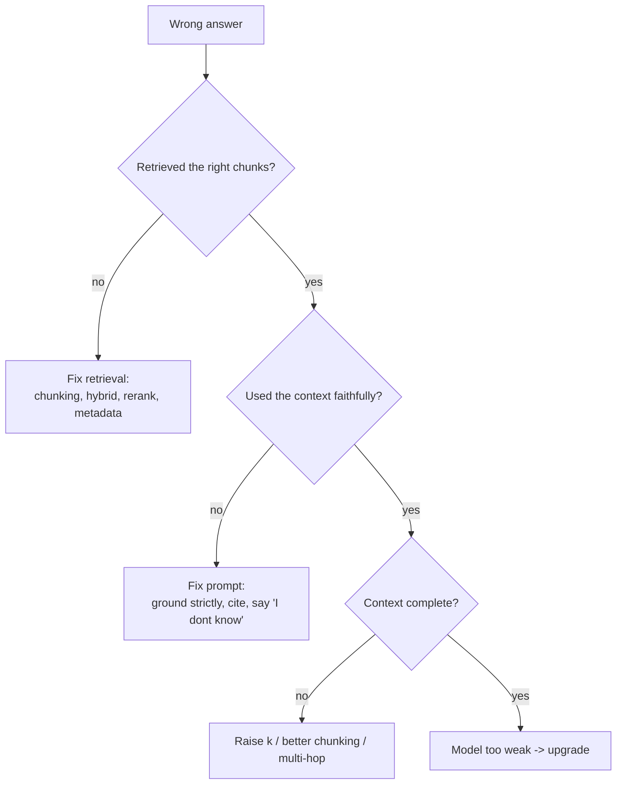
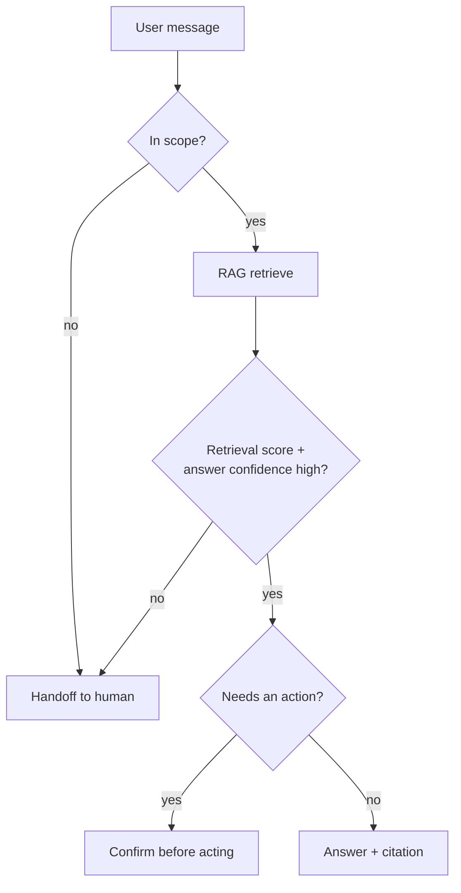
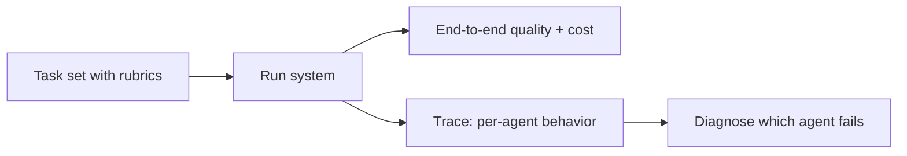
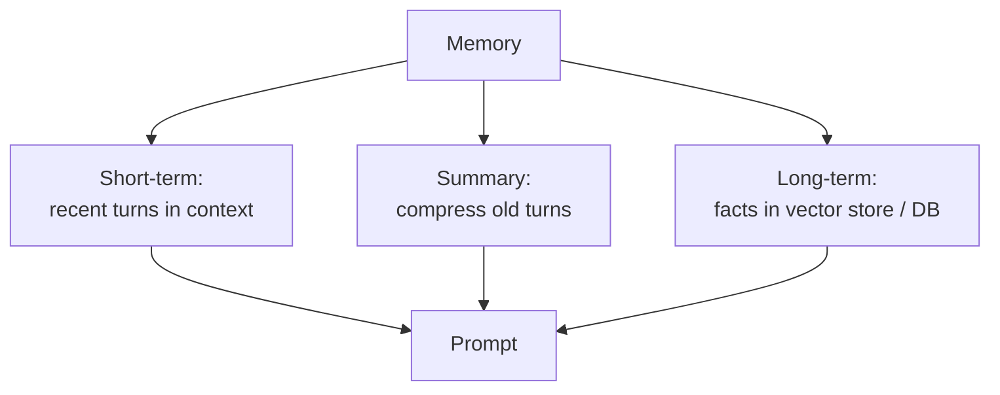
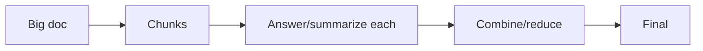
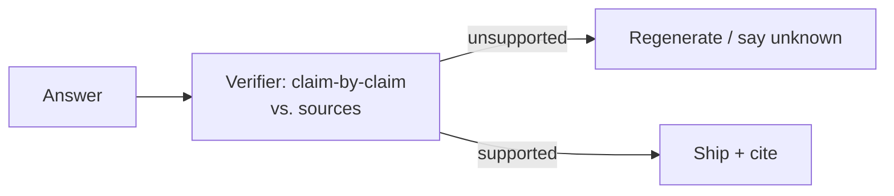

# AI Real Projects — Medium Interview Questions

> Deeper design and tradeoff questions about the projects. These probe *why* you made choices and whether you understand the alternatives. Answers include diagrams, code, and pros/cons.

## Quick Coverage Map

| # | Question | Theme |
|---|---|---|
| 1 | How would you improve a basic RAG that gives wrong answers? | RAG quality |
| 2 | Naive vs. hybrid vs. reranked retrieval — tradeoffs | Retrieval design |
| 3 | How do you design a support bot that knows when to escalate? | Agent + safety |
| 4 | How do you stop an agent from looping forever / burning cost? | Agent control |
| 5 | How do you make a text-to-SQL agent safe? | Security |
| 6 | How do you evaluate a multi-agent system? | Evaluation |
| 7 | Where does structured output help, and how do you enforce it? | Structured output |
| 8 | How do you choose an embedding model / vector DB? | Tech selection |
| 9 | How do you add memory to a conversational project? | Memory design |
| 10 | How do you handle documents that don't fit in context? | Context management |
| 11 | Build vs. buy: framework vs. raw API for a project? | Architecture |
| 12 | How do you measure and reduce hallucination? | Faithfulness |

---

### 1. "Your basic RAG gives wrong answers. Walk me through fixing it."

I'd diagnose *where* it breaks, because "RAG is wrong" has several distinct causes:



Concretely, in order of cheapness: improve chunking → add hybrid (keyword + vector) search → add a reranker → tune k → tighten the prompt to ground strictly and cite → last resort, upgrade the model. **I'd verify each change against my eval set** so I know which one actually helped.

---

### 2. "Naive vs. hybrid vs. reranked retrieval — what are the tradeoffs?"

| Approach | How | Pros | Cons |
|---|---|---|---|
| **Naive vector** | Embed + top-k ANN | Simple, fast | Misses exact terms (names, IDs, codes) |
| **Hybrid** | Combine BM25 keyword + vector | Catches both meaning and exact matches | More moving parts; need to fuse scores |
| **Reranked** | Retrieve many, re-score with a cross-encoder | Big precision boost | Extra latency + cost per query |

**Why/when:** start naive; add hybrid when you have exact identifiers (product codes, error messages); add a reranker when precision at the top matters (support, legal). I'd show the metric gain: e.g., reranking took faithfulness from 0.82 → 0.91 for +40ms — worth it for accuracy-critical use cases, maybe not for a casual demo.

---

### 3. "Design a support bot that knows when to escalate to a human."

The trick is a **confidence gate** plus a **scope check**.



Signals for escalation: low retrieval similarity, the model expressing uncertainty, detected frustration/negative sentiment, or a request that requires an action the bot isn't allowed to take. I'd measure **deflection rate** (share handled without a human) alongside a quality check, because a bot that deflects everything but answers badly is worse than one that escalates smartly.

---

### 4. "How do you stop an agent looping forever or burning cost?"

Guardrails on the loop itself:

```python
# WHY: agents can loop; hard limits keep them bounded and cheap.
MAX_STEPS = 8
COST_BUDGET_USD = 0.20

def run_agent(task):
    steps, spent = 0, 0.0
    while steps < MAX_STEPS and spent < COST_BUDGET_USD:
        action = plan_next(task)            # LLM decides tool/answer
        if action.type == "final":
            return action.answer
        result, cost = execute(action)      # run tool, meter cost
        spent += cost
        task.add_observation(result)
        steps += 1
    return escalate_or_partial(task)         # graceful stop, not a crash
```

Plus: detect repeated identical actions (loop detection), set per-tool timeouts, and log every step so you can see *why* it did what it did. I'd report **task success rate** and **cost per successful task** — averages hide the runaway cases.

---

### 5. "How do you make a text-to-SQL agent safe?"

Assume the generated SQL is untrusted. Layered defense:


- **Read-only DB user** — no write/DDL permissions at the database level (defense in depth beyond string checks).
- **Statement allowlist** — only `SELECT`; reject anything else by parsing, not regex-guessing.
- **Table/column allowlist** — the agent can only touch what it's allowed to.
- **Resource caps** — mandatory `LIMIT`, query timeout, row cap.
- **Replica, not prod** — so a heavy query can't hurt the live DB.

The self-correction loop (feed the DB error back to the model) stays *inside* these guardrails.

---

### 6. "How do you evaluate a multi-agent system?"

Evaluate at two levels:

- **End-to-end:** task success rate, output quality (rubric or LLM-judge), total cost, total latency.
- **Per-component:** did the planner decompose correctly? did the search agent find good sources? did the critic catch errors?



I'd add a **verifier/critic agent** whose job is to check claims against sources, and I'd measure whether it actually reduces hallucination on my test set. Multi-agent is often *slower and pricier* than a single strong prompt — I'd only justify it if the metrics improve enough to pay for the extra calls.

---

### 7. "Where does structured output help, and how do you enforce it?"

Structured output (strict JSON matching a schema) is essential whenever the LLM's output feeds another system — a resume analyzer's scores, an agent's tool arguments, extraction pipelines.

```python
from pydantic import BaseModel, Field

class ResumeScore(BaseModel):
    fit_score: int = Field(ge=0, le=100)     # WHY: constrain so downstream code can trust it
    strengths: list[str]
    gaps: list[str]

# Use a library (Instructor / provider JSON mode / function calling)
# that validates against the schema and retries on parse failure.
```

Enforcement options: provider **JSON mode / function calling**, **Instructor/Pydantic-AI** with validation + retry, or grammar-constrained decoding. Pros: reliability, no brittle string parsing. Cons: slightly more rigid prompts, occasional retries.

---

### 8. "How do you choose an embedding model and a vector DB?"

**Embedding model** — I'd weigh: quality on *my* domain (test it, don't trust leaderboards blindly), dimension size (affects storage + speed), cost, and whether it can run locally for privacy. I'd actually measure Recall@k on a small labeled set with 2–3 candidates.

**Vector DB** — depends on scale and constraints:

| Need | Pick |
|---|---|
| Prototype, local | FAISS / Chroma |
| Already on Postgres | pgvector |
| Managed, scale, filtering, hybrid | Pinecone / Qdrant / Weaviate / Milvus |

Key questions: how many vectors? need metadata filtering? hybrid search? self-host vs. managed? I'd pick the simplest thing that meets scale, then justify it with the tradeoff sentence.

---

### 9. "How do you add memory to a conversational project?"

Different memory types for different needs:



- **Short-term:** keep the last N turns verbatim.
- **Summary buffer:** summarize older turns to save tokens.
- **Long-term:** store durable facts (preferences, past issues) in a vector store or DB and retrieve them (like RAG for the user).

Tradeoff: more memory = better continuity but more tokens (cost/latency) and privacy considerations. I'd cap it and let old context expire.

---

### 10. "A document doesn't fit in the context window. What do you do?"

Don't just truncate. Options:

- **Chunk + retrieve** (RAG) — only pull the relevant parts. Best default.
- **Map-reduce** — summarize/answer per chunk, then combine. Good for whole-document summarization.
- **Refine** — iteratively update an answer chunk by chunk.
- **Hierarchical** — summaries of summaries for very large corpora.



**Why/when:** RAG for Q&A (you need a slice); map-reduce/refine for tasks that genuinely need the whole document (summaries, audits).

---

### 11. "Build vs. buy: framework or raw API for a project?"

| | Framework (LangChain/LlamaIndex/LangGraph) | Raw provider API |
|---|---|---|
| Speed to build | Fast — lots of building blocks | Slower — you write glue |
| Control/debug | Abstractions can hide details | Full control, easy to trace |
| Best for | Standard RAG/agents, prototypes | Latency/correctness-critical paths, learning |

My honest take: I'd use a light framework for retrieval/orchestration boilerplate but stay close to the raw API for the hot path. For a *portfolio*, building the core RAG loop once with the raw API proves you actually understand it — then a framework is fine for the rest.

---

### 12. "How do you measure and reduce hallucination?"

**Measure:** faithfulness/groundedness — does every claim trace back to retrieved context? Use an LLM-as-judge or a metric like RAGAS faithfulness on a labeled set.

**Reduce:**
- Improve retrieval so the right context is actually present.
- Instruct the model to answer *only* from context and to say "I don't know" otherwise.
- Add citations so unsupported claims are visible.
- For high stakes, add a verifier step that checks the answer against sources.



The honest framing: you can drive hallucination *down*, not to zero — so for critical uses you also design for graceful "I'm not sure" behavior and human review.

---

## Further Reading
- RAG improvement & reranking: https://docs.ragas.io/
- Agentic system design interview: https://blog.promptlayer.com/the-agentic-system-design-interview-how-to-evaluate-ai-engineers/
- Vector DB & retrieval tradeoffs: https://www.upgrad.com/blog/rag-project-ideas/
- Structured output (Instructor): https://python.useinstructor.com/

---

*Content synthesized from general domain knowledge and current (2025-2026) interview trends; rephrased for compliance with licensing restrictions.*
