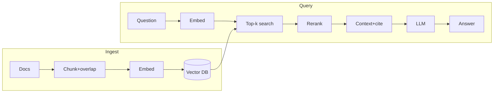
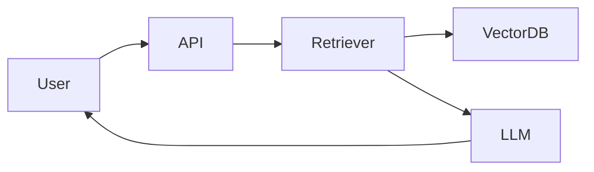
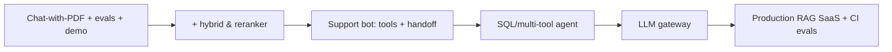

# AI Real Projects — Cheatsheet

> Dense one-page reference: project catalog, a README template, and an interview talking-points checklist. Skim before an interview.

---

## 1. Project Catalog (difficulty · tech · what it proves)

| Project | Level | Core tech | What it proves |
|---|---|---|---|
| **Chat-with-PDF (RAG)** | Beginner | Embeddings, vector DB, LLM, chunker, UI | Full RAG loop, grounding, citations |
| Resume analyzer | Beginner | Structured output (Pydantic), embeddings | Extraction, schema validation, bias awareness |
| Semantic search engine | Beginner | Embeddings, ANN/HNSW, hybrid, reranker | Retrieval + relevance metrics |
| Content summarizer | Beginner | Map-reduce, long-context, structured output | Context management, faithfulness |
| Customer support bot | Intermediate | RAG + function calling, escalation | Retrieval + actions + safe handoff |
| Multi-tool agent | Intermediate | Tool calling, agent loop, MCP, limits | Agentic control, loop/cost guards |
| SQL analytics agent | Intermediate | Text-to-SQL, validation, self-correct | Grounding in data + SQL safety |
| Code review assistant | Intermediate | Diff parsing, repo retrieval, GitHub API | Code grounding, actionable output |
| Meeting notes / voice-in | Intermediate | ASR (Whisper), structured extraction | Multimodal pipeline |
| **Multi-agent research** | Advanced | Orchestration, critic loop, citations | Decomposition, verification, cost control |
| **LLM gateway/router** | Advanced | Provider abstraction, cache, fallback, metering | Platform thinking, reliability, cost |
| **Production RAG SaaS** | Advanced | Async ingest, multi-tenant, CI evals | Scale + security + eval end-to-end |
| **Voice assistant** | Advanced | Streaming ASR/LLM/TTS, barge-in, WebRTC | Latency engineering, real-time UX |
| **Agentic coding tool** | Advanced | Repo index, sandbox exec, self-correct | Long-horizon agency + safety |

---

## 2. The RAG loop (memorize this)



**Improve RAG (cheapest → priciest):** better chunking → hybrid (BM25+vector) → reranker → tune k → tighten prompt/grounding → upgrade model. Verify each on an eval set.

---

## 3. Metrics by project type

| Type | Metrics |
|---|---|
| RAG / Q&A | Faithfulness, answer correctness, context precision/recall, citation accuracy |
| Retrieval | Recall@k, MRR, nDCG, hit rate |
| Agents | Task success, tool-call accuracy, steps-to-success, cost/successful task |
| Extraction/classify | Precision, recall, F1 |
| Always | p50/p95/p99 latency, cost/request, error rate |

**Eval tools:** RAGAS, DeepEval, promptfoo. **Observability:** Langfuse, LangSmith, Phoenix, OpenTelemetry.

---

## 4. Cost & latency levers

| Lever | Saves | Risk |
|---|---|---|
| Exact + semantic cache | Calls/tokens | Stale / privacy |
| Model routing (cheap↔strong) | Tokens | Router errors break UX |
| Smaller/quantized model | Tokens+latency | Quality drop (eval it!) |
| Trim context / fewer chunks | Input tokens | Missing context |
| Prompt caching | Input tokens | Only stable prefixes |
| Streaming | Perceived latency | — |
| Batching | Throughput | Per-request latency |

Rule: never cut cost below your quality threshold. Measure before/after.

---

## 5. Security checklist (every project)

- [ ] Prompt injection: treat retrieved/tool text as **data, not instructions**
- [ ] Tool safety: allowlist + argument validation + least privilege
- [ ] SQL agent: read-only user, SELECT-only, table allowlist, forced LIMIT, replica
- [ ] Code exec: **sandboxed**, no secrets/network, resource caps
- [ ] Multi-tenant: derive tenant from **auth token**, server-side filter, RLS/namespaces
- [ ] PII: detect + redact before the model; mind log retention
- [ ] Secrets: server-side only, rotate, never in client
- [ ] Destructive actions: require human confirmation
- [ ] Output: filter harmful content, don't echo secrets, validate JSON

---

## 6. Scale & reliability quick reference

- Stateless services + load balancer → scale horizontally
- Async ingestion via queue + worker pool; idempotent upserts; DLQ
- Vector DB: shard + replicas; tune HNSW (recall vs latency vs memory)
- Retries (backoff+jitter), timeouts, circuit breakers, fallback provider
- Graceful degradation: skip reranker/tool, return partial answer
- Autoscale on **queue depth / latency**, not just CPU
- Load test with k6/Locust; watch **p95/p99** + cost/req

---

## 7. Project README template

```markdown
# <Project Name>
> One-sentence problem statement anyone can understand.

## Demo
  ·  Live: <url>

## Architecture


## Quickstart
    docker compose up          # or: make run
    open http://localhost:8000

## How it works
- Ingestion: <chunking, embedding, indexing>
- Query: <retrieval, rerank, grounding, citations>

## Evaluation
| Metric | Value | Notes |
|---|---|---|
| Faithfulness | 0.91 | 60-question set, LLM-judge |
| Recall@5 | 0.88 | labeled retrieval set |
| p95 latency | 1.8s | streaming |
| Cost/query | $0.004 | gpt-cheap + rerank |

## Design decisions (tradeoffs)
- Chose <X> over <Y> because <cost/latency/accuracy>.
- Added <reranker> → faithfulness 0.82 → 0.91 (+40ms, +12% cost).

## Limitations & next steps
- Prototype vs. hardened: <what's real>.
- Known failure modes: <list>.

## Tech stack
- LLM: · Embeddings: · Vector DB: · Framework: · Deploy:
```

---

## 8. Interview talking-points checklist

**Before you speak, have ready per project:**
- [ ] One-sentence problem statement
- [ ] Architecture diagram from memory
- [ ] The **key decision + tradeoff** ("X over Y because Z")
- [ ] 2–3 **eval numbers** (quality, latency, cost)
- [ ] 2–3 **failure modes** and mitigations
- [ ] "How I'd scale it to 10k users" answer
- [ ] "What I'd do next with more time"

**STAR structure:** Situation → Task (+constraint) → Action (+tradeoff) → Result (+metric) → Next.

**Tradeoff sentence:** "I chose **X** over **Y** because **Z**; verified with **metric M**; downside **W**, which I'd fix by **V**."

**Red flags to avoid:** no evals, no demo, over-claiming "production-grade", can't explain your own code, ignored cost/latency/security.

---

## 9. Build path (depth > breadth)



---

*Content synthesized from general domain knowledge and current (2025-2026) interview trends; rephrased for compliance with licensing restrictions.*
