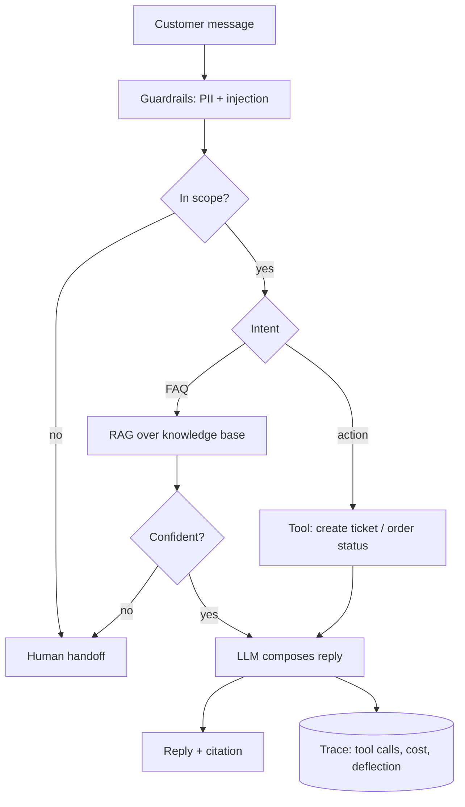
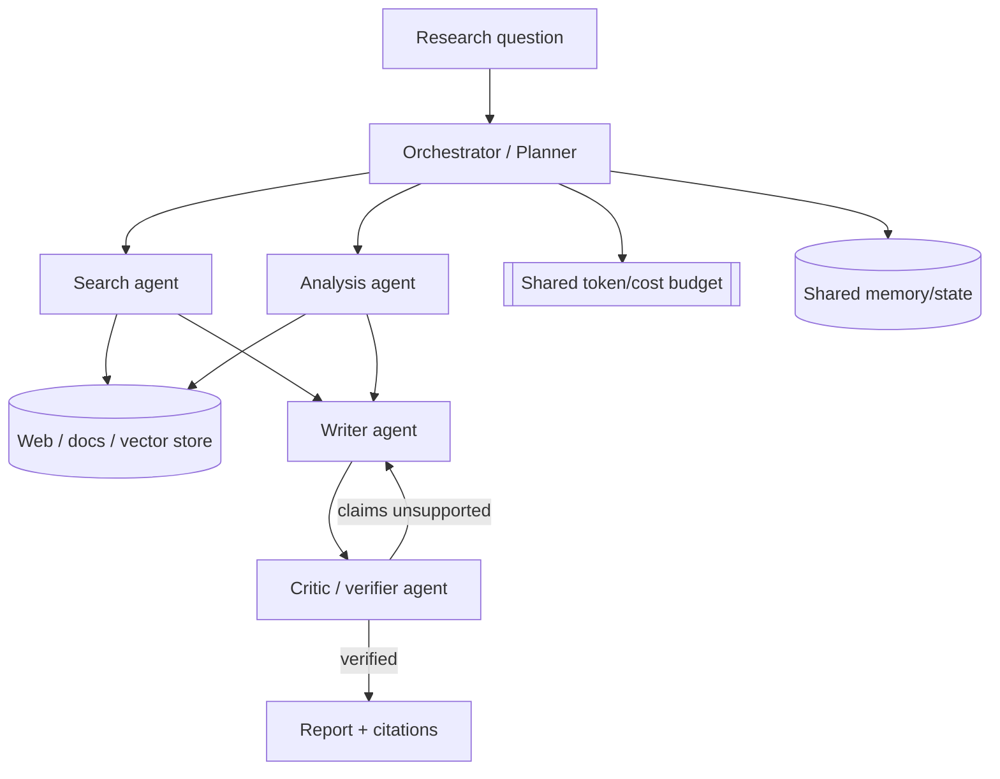
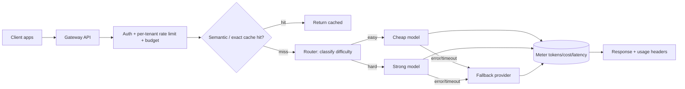
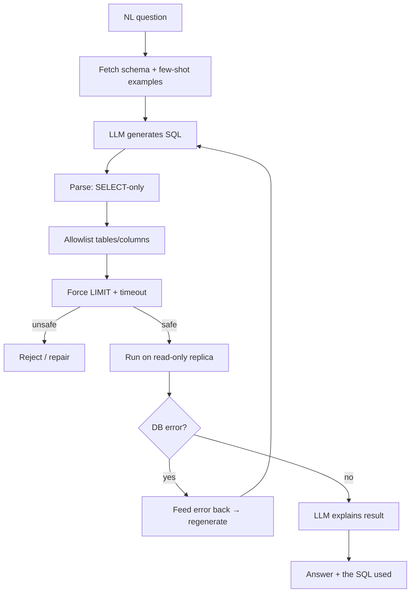
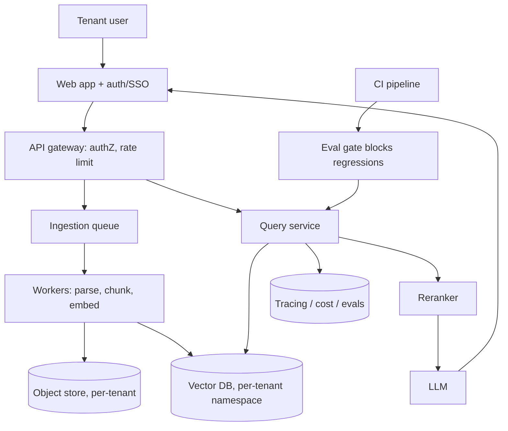
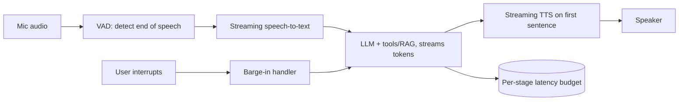
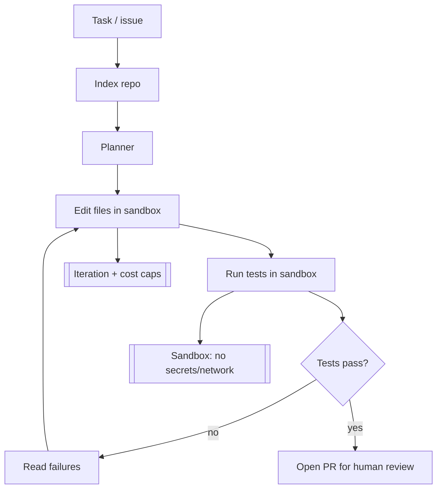

# AI Real Projects — Use-Case & Architecture Diagrams

> Flagship project architectures as Mermaid diagrams you can reproduce on a whiteboard. Each has a short "what to say" note so you can narrate it in an interview. Draw the diagram, then talk through the data flow, the key decision, and the failure mode.

---

## 1. Chat-with-your-PDF (RAG)

```mermaid
flowchart TD
    subgraph Ingestion (offline)
      P[PDF upload] --> LD[Load + extract text]
      LD --> CH[Chunk with overlap]
      CH --> EM[Embed chunks]
      EM --> VDB[(Vector store)]
    end
    subgraph Query (online)
      U[User question] --> QE[Embed query]
      QE --> SR[Top-k similarity search]
      VDB --> SR
      SR --> RR[Rerank (optional)]
      RR --> CB[Build context + citations]
      CB --> LLM[LLM: answer only from context]
      LLM --> ANS[Answer + page citations]
      LLM -.no good context.-> IDK[I don't know / closest section]
    end
```
**What to say:** "Two phases. Ingestion is offline; query is online. The key decision was grounding strictly and citing pages, plus an 'I don't know' path so retrieval misses don't become hallucinations. Adding the reranker moved faithfulness from 0.82 to 0.91."

---

## 2. Customer Support Bot (RAG + actions + handoff)


**What to say:** "The bot blends retrieval with actions. The safety net is a confidence gate plus a scope check that routes to a human. I measure deflection rate alongside a quality check, so it can't 'win' by answering everything badly."

---

## 3. Multi-Agent Research Assistant


**What to say:** "A planner decomposes the task and delegates to specialized agents. The critic verifies claims against sources to cut hallucination. A shared cost budget stops the agents from talking in circles and blowing the bill — the main risk with multi-agent."

---

## 4. LLM Gateway / Router (platform)


**What to say:** "One API in front of many providers: caching, routing by difficulty, retries, circuit breakers, fallback, and per-tenant budgets. The trap I call out is that naive routing to cheap models can degrade the product — so I measure quality per route, not just cost."

---

## 5. SQL Analytics Agent (text-to-SQL)


**What to say:** "Schema-aware generation, then layered safety: SELECT-only parsing, table allowlist, forced LIMIT, and a read-only replica. The self-correction loop stays inside those guardrails. I also surface the SQL so users can trust the answer."

---

## 6. Production RAG SaaS (multi-tenant, end-to-end)


**What to say:** "The demo hardens into services: async ingestion so uploads don't block, per-tenant isolation via namespaces, an eval gate in CI so prompt changes can't silently regress quality, and cost metering per tenant. Tenant isolation is derived from the auth token, never from request params."

---

## 7. Voice Assistant (real-time, streaming)


**What to say:** "Latency is a budget split across stages. Everything streams — STT, LLM tokens, and TTS starts on the first sentence — so the turn feels sub-second even if the full answer takes longer. Barge-in lets the user interrupt, which is essential for natural voice UX."

---

## 8. Agentic Coding Tool (sandboxed self-correction)


**What to say:** "Tests are the ground truth for the self-correction loop. Everything runs in a locked-down sandbox — no network, no secrets, resource caps — and it never auto-merges; a human approves the PR. The biggest risk to guard is unsandboxed code execution."

---

## 9. Semantic Search Engine (hybrid + rerank)

```mermaid
flowchart LR
    C[Corpus] --> IDX1[BM25 keyword index]
    C --> IDX2[Embed → vector index]
    Q[Query] --> K[Keyword search]
    Q --> V[Vector search]
    IDX1 --> K
    IDX2 --> V
    K --> FUSE[Fuse scores (RRF)]
    V --> FUSE
    FUSE --> RER[Cross-encoder rerank]
    RER --> RES[Ranked results + filters]
```
**What to say:** "Hybrid retrieval fuses keyword and vector results (reciprocal rank fusion), then a cross-encoder reranks the top candidates. I report Recall@k and MRR versus pure keyword search to prove the hybrid approach actually helps."

---

*Content synthesized from general domain knowledge and current (2025-2026) interview trends; rephrased for compliance with licensing restrictions.*
