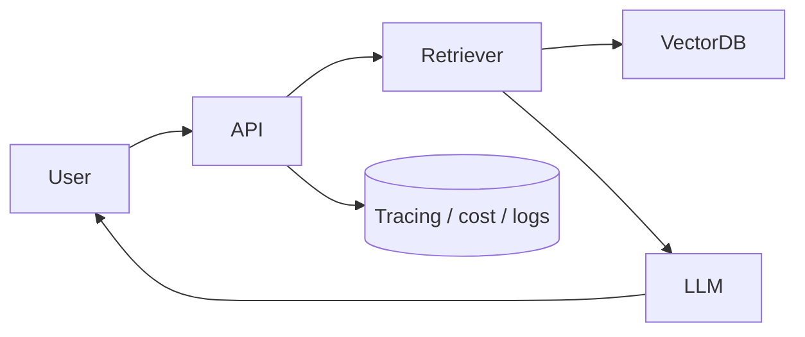

# PROJECT-TEMPLATE.md — scaffold for any AI portfolio project

> Copy this into a new repo's `README.md` and fill every section. The goal: a
> reviewer understands the problem, sees it run, trusts the numbers, and reads
> your reasoning — in under two minutes. The sections are ordered the way a
> hiring manager scans, not the way you built it.

---

## <Project Name>

> **One sentence:** what problem this solves, in words a non-engineer gets.

## Demo
-    <!-- a GIF beats paragraphs; record the happy path -->
- Live: `<url>`   ·   or run locally in one command (below)

## Quickstart
```bash
cp .env.example .env      # add your API keys (NEVER commit real keys)
docker compose up         # or: make run  /  pip install -r requirements.txt
# open http://localhost:8000
```

## Architecture
<!-- One Mermaid diagram of the data flow. This is the first thing you'll be
     asked to walk through in an interview — make it whiteboard-able. -->


## How it works
- **Ingestion:** <how data is loaded, chunked, embedded, indexed>
- **Query:** <retrieval, reranking, grounding, citations, guardrails>
- **Key components:** <models, vector store, framework, deploy target>

## Evaluation
<!-- THE differentiator. Even 30-100 labeled cases + a table beats "it works". -->
| Metric | Value | How measured |
|---|---|---|
| Faithfulness | 0.91 | 60-question set, LLM-as-judge |
| Recall@5 | 0.88 | labeled retrieval set |
| p95 latency | 1.8 s | streaming enabled |
| Cost / query | $0.004 | cheap model + rerank |

Failure modes observed:
- <e.g., ambiguous queries> → mitigated by <e.g., clarifying question>
- <e.g., retrieval miss> → mitigated by <e.g., "I don't know" guard>

## Design decisions (tradeoffs)
<!-- Each bullet: "chose X over Y because Z". Interviewer catnip. -->
- Chose **<X>** over **<Y>** because **<cost / latency / accuracy / simplicity>**.
- Added **<reranker>** → faithfulness 0.82 → 0.91 (+40 ms, +12% cost); worth it for <use case>.
- Deferred **<hardening item>**; this is a **prototype**, not production, on <axis>.

## Security & safety
- [ ] Secrets server-side only (`.env`, not committed)
- [ ] Untrusted input (docs/tools) treated as data, not instructions
- [ ] Tool/SQL/code execution sandboxed & least-privilege
- [ ] PII handling / data-retention noted

## Scaling notes (what I'd do for 10k users)
- <stateless services + LB, async ingestion queue, caching, autoscale on latency>

## Tech stack
- **LLM:** · **Embeddings:** · **Vector DB:** · **Framework:** · **Deploy:** · **Observability:**

## Limitations & next steps
- <honest scope: what's real vs. planned>

## Repo layout
```
.
├─ ingest.py            # offline: build the index
├─ app.py / main.py     # online: query path + UI/API
├─ eval/                # test set + eval harness (the credibility layer)
├─ requirements.txt
├─ .env.example
└─ docker-compose.yml
```
