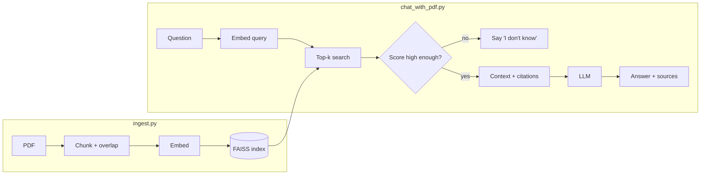

# Implementation Code Examples — AI Real Projects

This folder contains a **runnable starter for a flagship project** (Chat-with-your-PDF, a minimal but complete RAG app) plus a **reusable project scaffold**. The code is heavily commented to explain the *why* behind each decision — the reasoning is what you defend in an interview.

## Index

| File | What it is | Why it's here |
|---|---|---|
| `ingest.py` | Offline RAG ingestion: PDF → chunk → embed → FAISS index | Shows the "index once" half of RAG, separated from queries (production instinct) |
| `chat_with_pdf.py` | Online RAG query path + CLI + Streamlit UI | The full retrieve → ground → cite → answer loop with an "I don't know" guard |
| `requirements.txt` | Pinned dependencies with rationale | Reproducible setup; explains each library choice |
| `PROJECT-TEMPLATE.md` | Copy-paste README scaffold for any AI project | Enforces demo + evals + tradeoffs — the things that get callbacks |

## The Chat-with-PDF app

### Architecture



### Run it

```bash
# 1. Install deps (a virtualenv is recommended)
pip install -r requirements.txt

# 2. Set your key (never hard-code it)
export OPENAI_API_KEY=sk-...        # or put it in a .env file

# 3. Build the index from a PDF (offline, run once per document set)
python ingest.py path/to/document.pdf

# 4a. Ask from the command line
python chat_with_pdf.py "What is the refund policy?"

# 4b. ...or launch the clickable demo
streamlit run chat_with_pdf.py
```

> Note: this is a learning/reference starter. Do not run it in this environment — copy it into your own repo, add your API key, and run it there.

### What this starter deliberately demonstrates

- **Separation of ingestion and query** — mirrors real pipelines (batch index, online serve).
- **Token-based chunking with overlap** — respects real token/context budgets.
- **Batched embeddings** — the easiest throughput win at scale.
- **Grounded prompting + citations** — every claim is traceable to a page.
- **An "I don't know" confidence guard** — a graceful failure beats a confident wrong answer.
- **Latency reporting** — a metric you can quote in an interview.

### How to level it up (and talk about it)

These are the upgrades that turn the starter into an interview-winning project:

1. **Add an eval set** — 30–100 Q&A pairs; measure faithfulness + Recall@k before/after each change.
2. **Add hybrid search** — combine BM25 keyword + vector; report the metric gain.
3. **Add a reranker** — cross-encoder over the top candidates; show the precision boost vs. added latency/cost.
4. **Swap FAISS for pgvector/Pinecone/Qdrant** — same interface, real scale story.
5. **Add tracing + cost logging** — Langfuse/Phoenix; screenshot a trace in your README.
6. **Deploy it** — Streamlit on a public host so a reviewer can click, not clone.

See `../1-Detailed-Learning/Detailed-Learning.md` for the full catalog and `PROJECT-TEMPLATE.md` for the README scaffold.

---

*Content synthesized from general domain knowledge and current (2025-2026) interview trends; rephrased for compliance with licensing restrictions.*
