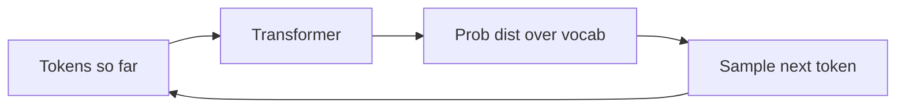
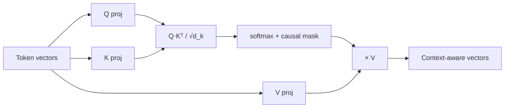
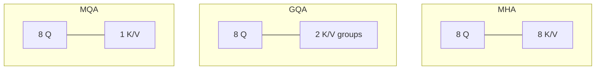
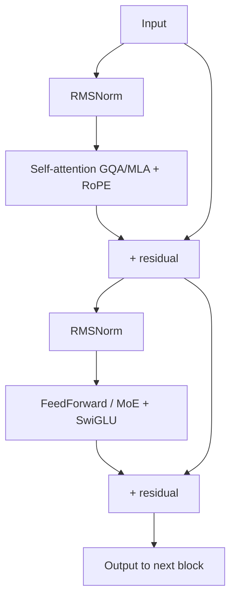
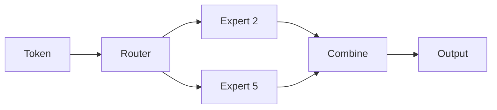
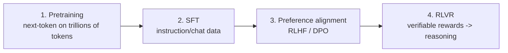
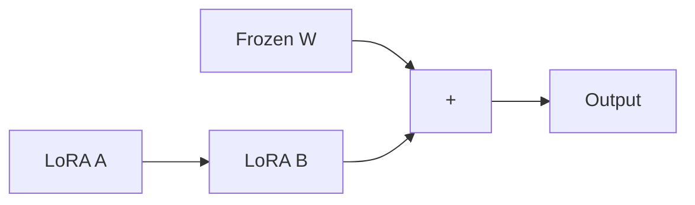
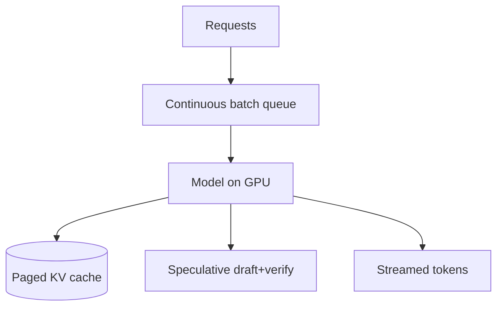

# LLMs — Detailed Learning (Deep Dive)

> The "understand LLMs deeply enough to defend any answer" guide. From tokens to attention math, through modern attention variants (GQA/MLA), training and alignment (SFT → DPO → RLVR/GRPO), to production inference. Every section explains the *why*, with 2025–2026 practice and diagrams. Read once end-to-end, then use headings for revision.

---

## Table of Contents
1. [What an LLM really is](#1-what-an-llm-really-is)
2. [Tokenization](#2-tokenization)
3. [Embeddings & the residual stream](#3-embeddings--the-residual-stream)
4. [Self-attention from first principles](#4-self-attention)
5. [Multi-head attention & modern variants (MQA/GQA/MLA)](#5-multi-head-attention--variants)
6. [Positional encoding (RoPE)](#6-positional-encoding)
7. [The full Transformer block](#7-the-full-transformer-block)
8. [Mixture-of-Experts (MoE)](#8-mixture-of-experts)
9. [How LLMs are trained (pretraining → post-training)](#9-training-lifecycle)
10. [Alignment: RLHF, DPO, RLVR, GRPO](#10-alignment)
11. [Parameter-efficient fine-tuning (LoRA/QLoRA)](#11-peft)
12. [Inference & decoding](#12-inference--decoding)
13. [Serving at scale (KV cache, batching, FlashAttention, vLLM)](#13-serving-at-scale)
14. [Quantization](#14-quantization)
15. [Context windows & long context](#15-context-windows)
16. [Security](#16-security)
17. [Evaluation](#17-evaluation)
18. [Interview power-answers](#18-interview-power-answers)

---

## 1. What an LLM really is

An LLM is an **autoregressive next-token predictor**. Given a sequence of tokens, it outputs a probability distribution over the next token, samples one, appends it, and repeats. That's the entire inference loop.



Everything impressive — reasoning, coding, translation — is an emergent consequence of doing this extremely well at scale. The "intelligence" lives in billions of learned weights (**parametric memory**).

> Interview framing: an LLM doesn't "know" facts like a database; it has *learned a probability distribution over text*. This is why it hallucinates and why RAG/tools matter.

---

## 2. Tokenization

Models don't see characters or words — they see **tokens** (integers) produced by a tokenizer, usually **Byte-Pair Encoding (BPE)** or similar (WordPiece, Unigram, SentencePiece).

- Sub-word units balance vocabulary size vs coverage: common words = 1 token, rare words split into pieces, so unknown words never break the model.
- English rule of thumb: **1 token ≈ 4 characters ≈ 0.75 words**.
- Tokenization affects **cost** (billed per token), **context limits**, **latency**, and even **math ability** (numbers tokenize awkwardly).

```python
import tiktoken
enc = tiktoken.get_encoding("cl100k_base")
print(enc.encode("unbelievable"))   # -> multiple sub-word tokens
```

> Gotcha: non-English text and code often use *more* tokens per word, raising cost and reducing effective context.

---

## 3. Embeddings & the residual stream

Each token id → a learned **embedding vector** (dimension `d_model`, e.g. 4096). These vectors flow through the network via the **residual stream**: every layer *reads* from it and *adds* its contribution back (`x = x + sublayer(x)`).

Why residual connections matter:
- They let gradients flow through very deep networks (no vanishing gradients).
- Conceptually, each layer *refines* the representation rather than replacing it.

At the end, a final linear layer (the **unembedding**, often tied to the input embedding) projects back to vocabulary size to produce **logits**, which softmax turns into probabilities.

---

## 4. Self-attention

Attention lets every token gather information from other tokens. The core equation:

```
Attention(Q, K, V) = softmax( (Q · Kᵀ) / √d_k ) · V
```

Step by step, in plain terms:
1. From each token's vector, learn three projections: **Query** (what I'm looking for), **Key** (what I offer), **Value** (the info I carry).
2. **Q · Kᵀ** — dot every Query with every Key → a matrix of relevance scores (who should attend to whom).
3. **÷ √d_k** — scale down. Without this, large dot products push softmax into saturated regions with vanishing gradients, destabilizing training. This is the "scaled" in scaled dot-product attention.
4. **softmax** — normalize each row into weights summing to 1.
5. **· V** — weighted sum of Values → each token's new, context-aware representation.

**Causal masking:** in decoder LLMs, a token may only attend to *earlier* tokens (mask future positions to −∞ before softmax), so training matches left-to-right generation.

**Complexity:** attention is **O(n²)** in sequence length `n` — the reason long context is expensive and why FlashAttention and attention variants exist.



---

## 5. Multi-head attention & variants

**Multi-Head Attention (MHA):** run attention `h` times in parallel with different projections. Each **head** specializes (syntax, coreference, position, topic). Outputs are concatenated and projected. More heads = richer relational modeling.

### The KV-cache problem drives modern variants
At inference, we cache each token's K and V (see §13). MHA stores K and V for *every head* → huge memory. For a 32-head, 80-layer model that's `32 × 2 × 80 = 5,120` vectors **per token**. This memory limits how many concurrent/long requests you can serve, so architectures evolved to shrink it:

| Variant | Idea | KV cache | Quality | Used by |
|---|---|---|---|---|
| **MHA** | Each head has its own K,V | Largest | Best | Original Transformer, GPT-2 |
| **MQA** | All heads share ONE K,V | ÷ heads (tiny) | Small drop | PaLM, early efficient models |
| **GQA** | Heads grouped; each group shares K,V | Middle ground | ~MHA | Llama 2/3, Mistral, most open models |
| **MLA** | Compress K,V into a low-rank **latent**, decompress on use | Very small (~57× smaller reported) | ~MHA or better | DeepSeek-V2/V3 |

**GQA** is the pragmatic default: a few KV groups recover most of MHA's quality at a fraction of the memory. **MLA** (DeepSeek) goes further, jointly compressing K/V into a latent vector — it nearly saturates GPU throughput limits during decode. Interviewers love: *"Why did GQA and MLA appear? To shrink the KV cache, because decoding is memory-bandwidth-bound, not compute-bound."*



---

## 6. Positional encoding

Attention is **permutation-invariant** — without position info, "dog bites man" == "man bites dog". So we inject position.

- **Sinusoidal (original):** fixed sine/cosine signals added to embeddings. Simple; extrapolates poorly beyond training length.
- **Learned absolute:** a trainable vector per position; can't exceed max trained length.
- **RoPE (Rotary Position Embedding):** rotates Q and K by an angle proportional to position. It encodes **relative** position directly in the dot product and extends gracefully to longer contexts. This is why virtually all modern LLMs (Llama, Mistral, Qwen, etc.) use RoPE.
- **Long-context extension:** RoPE scaling tricks (**NTK-aware**, **YaRN**, position interpolation) stretch a model trained at 8k to 100k+ tokens without full retraining.
- **ALiBi:** adds a distance-based bias to attention scores; another extrapolation-friendly approach.

---

## 7. The full Transformer block

A decoder block, in order:



Modern building blocks worth naming:
- **Pre-norm** (normalize *before* the sublayer) — essential for training very deep, stable networks. Post-norm (original) is harder to train deep.
- **RMSNorm** instead of LayerNorm — cheaper, works as well.
- **SwiGLU** activation in the FFN — outperforms ReLU/GELU in practice.
- The **FFN** holds most of the parameters and is **compute-bound**; attention is **memory-bound** at decode. Knowing which part bottlenecks helps you reason about optimization.

Stack N of these blocks (e.g., 32–120), add embeddings + final norm + unembedding = a modern LLM.

---

## 8. Mixture-of-Experts (MoE)

In a **dense** model every parameter runs for every token. In **MoE**, the FFN is replaced by many "expert" FFNs plus a **router** that sends each token to only a few experts (e.g., top-2 of 8, or of 256).

- **Sparse activation:** huge *total* parameters, but only a fraction *active* per token → the capacity of a giant model at the compute cost of a smaller one. Used by Mixtral, DeepSeek-V3, and many frontier models.
- **Trade-off:** you must hold *all* experts in memory (high VRAM), routing can load-imbalance (mitigated with auxiliary/load-balancing losses), and training is trickier.
- Interview line: *"MoE buys cheaper compute, not cheaper memory."*



---

## 9. Training lifecycle



1. **Pretraining** — self-supervised next-token prediction on trillions of tokens. Produces a **base model** with broad knowledge. Costs millions of dollars, thousands of GPUs. Governed by **scaling laws** (loss improves predictably with data + params + compute; Chinchilla showed most models were under-trained on data).
2. **Supervised Fine-Tuning (SFT) / instruction tuning** — train on curated (instruction, good-response) pairs so the model follows instructions and chats.
3. **Preference alignment** — make it helpful/harmless/honest using human (or AI) preferences (see §10).
4. **RLVR / reasoning post-training** — reinforcement learning with *verifiable* rewards (math/code that can be checked) to grow step-by-step reasoning. This is how modern "reasoning models" are produced.

---

## 10. Alignment

Base and SFT models still aren't optimally helpful/safe. Alignment fixes that. This area moved fast in 2024–2026:

### RLHF (Reinforcement Learning from Human Feedback)
1. Collect human rankings of model outputs.
2. Train a **reward model** to predict human preference.
3. Optimize the LLM with RL (**PPO**) to maximize reward, with a KL penalty to stay near the SFT model (avoid degenerate outputs).
Powerful but complex: multiple models in memory, unstable, sensitive to hyperparameters, prone to **reward hacking**.

### DPO (Direct Preference Optimization)
Skips the separate reward model and RL loop. Using preference pairs (chosen vs rejected), DPO optimizes a simple classification-style loss that directly increases the margin for preferred responses. **Simpler, stable, similar quality** — which is why many labs adopted it.

### RLAIF
Like RLHF but preferences come from an **AI** judge instead of humans — cheaper and scalable (Constitutional AI is a variant).

### RLVR + GRPO (the reasoning era)
- **RLVR (RL with Verifiable Rewards):** reward = "is the final answer correct?" for math/code where correctness is checkable. Drives genuine reasoning improvements without a learned (hackable) reward model.
- **GRPO (Group Relative Policy Optimization, DeepSeek):** a PPO simplification that **drops the value/critic model**. It samples a *group* of answers per prompt and estimates advantage from the group's relative rewards — cheaper memory and stable, key to training reasoning models. Related: DAPO.

| Method | Reward source | Complexity | Best for |
|---|---|---|---|
| RLHF (PPO) | Learned reward model | High | General alignment |
| DPO | Preference pairs directly | Low | Alignment, simpler pipeline |
| RLAIF | AI judge | Medium | Scaling preference data |
| RLVR (PPO/GRPO) | Verifiable correctness | Medium | Math/code reasoning |

> Say this: *"DPO replaced PPO for preference alignment at many labs due to simplicity/stability; GRPO + verifiable rewards drive the reasoning-model wave because they avoid a hackable learned reward model."*

---

## 11. PEFT — parameter-efficient fine-tuning

Full fine-tuning updates all billions of weights — expensive and storage-heavy (a full copy per task).

- **LoRA (Low-Rank Adaptation):** freeze the base model; inject small trainable low-rank matrices `A`,`B` into layers. The weight update `ΔW = B·A` is low-rank. You train <1% of parameters; adapters are a few MB.
- **QLoRA:** quantize the frozen base to 4-bit (NF4), then train LoRA adapters on top — fine-tune a large model on a *single* GPU.
- **Why it matters at serving time:** one base model + many hot-swappable adapters → serve thousands of customer-specific variants cheaply (multi-LoRA, see §13).



**Pros:** cheap, fast, tiny artifacts, swappable. **Cons:** slightly below full fine-tune on some tasks; adapter management overhead. **When to use:** the default for customizing open models.

---

## 12. Inference & decoding

Generation has two phases with very different performance profiles:

- **Prefill:** process the whole prompt in parallel → **compute-bound**. Determines **Time To First Token (TTFT)**.
- **Decode:** generate tokens one at a time, each attending to all prior tokens → **memory-bandwidth-bound**. Determines **Time Per Output Token (TPOT)**.

### Decoding strategies
| Strategy | How | Use |
|---|---|---|
| Greedy | Pick argmax | Deterministic, can loop |
| Beam search | Keep top-b sequences | Translation, structured |
| Top-k | Sample from k most likely | Balanced |
| Top-p (nucleus) | Sample from smallest set summing to p | Natural, adaptive |
| Temperature | Reshape distribution | Tune randomness |

Add **repetition/frequency/presence penalties** to avoid loops. For factual/code tasks use temperature ≈ 0; for creative, higher.

---

## 13. Serving at scale

### KV cache (the heart of fast serving)
Because each new token attends to all previous ones, we cache prior tokens' **K** and **V** so we don't recompute them. This makes decode fast — but the cache **grows linearly** with sequence length × layers × KV heads and can consume many GB. It's usually the limiter on **concurrency** and **max context**.

Memory-saving tactics: **GQA/MLA** (fewer KV heads/latent), **KV cache quantization**, **paged** allocation.

### Continuous (in-flight) batching
Instead of static batches (short requests wait for long ones to finish), the server adds/evicts requests every decoding step to keep the GPU saturated. **Biggest throughput win** in modern serving (vLLM, TGI).

### PagedAttention
Manages the KV cache like OS virtual memory — non-contiguous "pages" eliminate fragmentation and let far more sequences share GPU memory. vLLM's core innovation.

### FlashAttention
An **IO-aware** exact-attention kernel: it tiles the computation and avoids writing the full `n×n` attention matrix to slow HBM, computing softmax in a streaming fashion in fast SRAM. Big speedup + memory savings, especially for long sequences. (FlashAttention-2/3 push further.)

### Speculative decoding
A small **draft** model proposes several tokens; the big model **verifies** them in one parallel pass. Accepted tokens come "for free" → 2–3× faster with *identical* output distribution.

### Parallelism (for models too big for one GPU)
- **Tensor parallelism** — split each layer's matrices across GPUs.
- **Pipeline parallelism** — put different layers on different GPUs.
- **Expert parallelism** — spread MoE experts across GPUs.

### Multi-LoRA serving
Keep one base model resident; hot-swap per-request LoRA adapters (S-LoRA/LoRAX). Serve thousands of fine-tuned variants on shared hardware.



---

## 14. Quantization

Store/compute weights (and sometimes activations/KV) in lower precision to cut memory and boost speed.

| Precision | 70B weights | Quality |
|---|---|---|
| FP16/BF16 | ~140 GB | Baseline |
| INT8 | ~70 GB | Near-lossless |
| INT4 (NF4/GPTQ/AWQ) | ~35 GB | Great sweet spot |
| < 4-bit | smaller | Noticeable loss |

- **PTQ (post-training quantization):** quantize a trained model (GPTQ, AWQ). Fast, no retraining.
- **QAT (quantization-aware training):** simulate quantization during training for best low-bit quality.
- **Formats:** GGUF (llama.cpp/CPU), GPTQ/AWQ (GPU), bitsandbytes.
- **Interview point:** *"Weights set the memory floor; quantization is the first lever to fit a model on cheaper hardware, trading a little accuracy."*

---

## 15. Context windows & long context

The context window bounds prompt + output in tokens. Bigger enables more RAG context, longer chats, whole-document reasoning — but:
- Attention is **O(n²)**: cost and latency rise fast with length.
- KV cache grows linearly → memory pressure.
- **"Lost in the middle"**: models under-use info in the middle of very long contexts.

Enablers: RoPE scaling (YaRN/NTK), FlashAttention, GQA/MLA, and sometimes sparse/sliding-window attention. **Long context ≠ free RAG replacement** — retrieving the right 4k tokens usually beats dumping 1M on cost, latency, and precision.

---

## 16. Security

Map to the **OWASP LLM Top 10**:

- **Prompt injection (direct/indirect):** attacker text (or retrieved/tool content) overrides instructions. Mitigate: separate & label untrusted data, don't auto-execute actions from model output, injection detection.
- **Sensitive info disclosure:** leaking secrets/PII/system prompt. Mitigate: keep secrets out of prompts, output redaction.
- **Insecure output handling:** piping model output into shell/DB/HTML → RCE/SQLi/XSS. Mitigate: treat output as untrusted, sanitize.
- **Excessive agency:** over-privileged agents. Mitigate: least privilege, allowlists, human-in-the-loop, budgets.
- **Jailbreaks:** guardrail models (Llama Guard), layered defenses.
- **Unbounded consumption:** cost/DoS via expensive prompts. Mitigate: rate limits, token caps, timeouts.

**Principle:** never trust model / tool / retrieved input — validate at every boundary.

---

## 17. Evaluation

- **Benchmarks:** MMLU, GSM8K/MATH (reasoning), HumanEval/MBPP (code), plus leaderboards like LMArena (human preference). Beware **contamination** (test data leaking into training).
- **App-level:** golden datasets + regression tests in CI; **LLM-as-judge** (mind length/self bias); human eval for high stakes; task metrics (F1/accuracy) for extraction/classification.
- **Production:** log prompts/tokens/latency/cost/tool-calls + user feedback (Langfuse/LangSmith); monitor drift; canary/A-B new prompts and models; track refusal/safety rates.

---

## 18. Interview power-answers

- *"An LLM is an autoregressive next-token predictor; capabilities emerge from scale. It hallucinates because it models plausible text, not truth."*
- *"Scaled dot-product attention divides by √d_k to keep softmax gradients stable; attention is O(n²), which is why long context is costly."*
- *"GQA and MLA exist to shrink the KV cache because decoding is memory-bandwidth-bound; GQA is the open-model default, MLA (DeepSeek) compresses K/V into a latent."*
- *"RoPE encodes relative position and extends to long context with YaRN/NTK scaling."*
- *"For alignment, DPO replaced PPO in many pipelines for simplicity; GRPO with verifiable rewards drives reasoning models by dropping the hackable reward model."*
- *"vLLM wins on throughput via continuous batching + PagedAttention; FlashAttention is an IO-aware kernel; speculative decoding gives 2–3× with identical output."*
- *"Weights set the memory floor, KV cache sets concurrency — I quantize both when GPU-bound, and route easy queries to cheap models to control cost."*

## Further Reading
- [Attention Is All You Need](https://arxiv.org/abs/1706.03762) · [Illustrated Transformer](https://jalammar.github.io/illustrated-transformer/)
- [GQA](https://arxiv.org/abs/2305.13245) · [DeepSeek-V2 (MLA)](https://arxiv.org/abs/2405.04434) · [RoPE](https://arxiv.org/abs/2104.09864)
- [FlashAttention](https://arxiv.org/abs/2205.14135) · [vLLM/PagedAttention](https://arxiv.org/abs/2309.06180) · [Speculative decoding](https://arxiv.org/abs/2211.17192)
- [LoRA](https://arxiv.org/abs/2106.09685) · [QLoRA](https://arxiv.org/abs/2305.14314) · [DPO](https://arxiv.org/abs/2305.18290) · [DeepSeekMath/GRPO](https://arxiv.org/abs/2402.03300)
- [Chinchilla scaling laws](https://arxiv.org/abs/2203.15556) · [OWASP LLM Top 10](https://genai.owasp.org/)

*Content synthesized from general domain knowledge and current (2025–2026) research; rephrased for compliance with licensing restrictions.*
