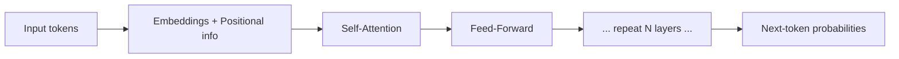

# LLM Interview Questions — Basic Level

> For freshers and early-career AI engineers. These build the vocabulary and mental models every LLM interview assumes you already have. Answers are in plain English with analogies so the concepts actually stick.

---

## Q1. What is a Large Language Model (LLM)? (Architecture)

**Simple answer:** An LLM is a neural network trained on massive amounts of text to predict the next word (token) in a sequence. That's literally the whole training objective — "given these words, what comes next?" — but done at enormous scale, it produces a model that can write, summarize, translate, answer questions, and reason.

Think of it as an extremely well-read autocomplete. It learned patterns of language, facts, and reasoning by reading a huge chunk of the internet.

- **"Large"** = billions of parameters (the internal numbers it learned).
- **"Language Model"** = it models the probability of text sequences.
- Examples: GPT (OpenAI), Claude (Anthropic), Gemini (Google), Llama (Meta).

---

## Q2. What is a token? Why not just use words? (Architecture)

**Simple answer:** A token is a chunk of text — often a word or part of a word. Before an LLM reads text, a **tokenizer** breaks it into tokens and maps each to a number.

- "hamburger" might become `["ham", "burger"]` — 2 tokens.
- Roughly, **1 token ≈ 0.75 words** in English (~4 characters).

**Why sub-word tokens instead of whole words?**
- A whole-word vocabulary would be gigantic and still miss new/rare words.
- Sub-word units handle typos, new words, and other languages gracefully by combining pieces.

**Why you should care in practice:** you pay per token, context limits are measured in tokens, and latency scales with tokens. Cost math is done in tokens, not words.

```python
import tiktoken
enc = tiktoken.get_encoding("cl100k_base")
tokens = enc.encode("Tokenization matters for cost!")
print(len(tokens))  # number of tokens
```

---

## Q3. What is the Transformer, and why did it change everything? (Architecture)

**Simple answer:** The Transformer is the neural network architecture behind all modern LLMs, introduced in the 2017 paper "Attention Is All You Need." Before it, models (RNNs/LSTMs) read text word-by-word in order, which was slow and forgetful over long text.

The Transformer's superpower is **self-attention**: it looks at *all* the words at once and figures out which words are relevant to each other. This makes it:
- **Parallelizable** — trains fast on GPUs (no waiting word-by-word).
- **Good at long-range context** — it can connect "it" to a noun 50 words earlier.



---

## Q4. What is the attention mechanism, in simple terms? (Architecture)

**Simple answer:** Attention lets the model decide *how much each word should "listen to" every other word* when building meaning.

Analogy: reading the sentence "The trophy didn't fit in the suitcase because **it** was too big." To understand "it," you attend more to "trophy" than to "suitcase." Attention gives each word a set of weights saying how relevant every other word is.

Technically it uses three vectors per token — **Query, Key, Value**:
- **Query**: what this word is looking for.
- **Key**: what each word offers.
- **Value**: the actual information passed along.

The model compares Queries to Keys to get attention weights, then blends the Values accordingly. (The exact math shows up in the medium file.)

---

## Q5. What's the difference between pretraining and fine-tuning? (Architecture / Use Case)

**Simple answer:**
- **Pretraining**: the model learns general language from a massive, broad dataset. Hugely expensive (millions of dollars, thousands of GPUs). This produces a "base model."
- **Fine-tuning**: you take that pretrained model and train it a bit more on a smaller, specific dataset to specialize it (e.g., medical Q&A, your company's tone).

Analogy: pretraining is a general university education; fine-tuning is on-the-job training for a specific role.

There's also **instruction tuning** (teaching the base model to follow instructions/chat) and **alignment** (RLHF/DPO — making it helpful and safe).

---

## Q6. What do temperature and top-p do? (Performance / Use Case)

**Simple answer:** They control randomness in the model's output.

- **Temperature**: scales how "adventurous" the model is. Low (0–0.3) = focused, deterministic, repeatable. High (0.8–1.2) = creative, varied, riskier.
- **Top-p (nucleus sampling)**: only sample from the smallest set of tokens whose probabilities add up to `p` (e.g., 0.9). It trims the unlikely long tail.

**When to use what:**
| Task | Temperature |
|---|---|
| Code, math, extraction, classification | 0–0.2 (accurate, consistent) |
| Chat, general Q&A | 0.5–0.7 (balanced) |
| Brainstorming, creative writing | 0.8–1.2 (diverse) |

---

## Q7. What is the context window? (Architecture / Performance)

**Simple answer:** The context window is the maximum number of tokens the model can consider at once — your prompt **plus** its response must fit inside it.

- If it's 128k tokens, everything (system prompt + history + retrieved docs + answer) must fit in 128k.
- Go over the limit → you must truncate or summarize.

**Why it matters:** bigger windows let you feed more context, but they cost more and can be slower, and models still struggle to use the middle of very long contexts well ("lost in the middle").

---

## Q8. What is a hallucination and why does it happen? (Security / Performance)

**Simple answer:** A hallucination is when the model produces something that sounds confident and fluent but is factually wrong or made up.

**Why it happens:** the model is trained to produce *plausible* text, not *true* text. It has no built-in fact-checker. When it doesn't know, it still predicts the most likely-sounding continuation — which can be wrong.

**How to reduce it:**
- **RAG** — ground answers in retrieved real documents.
- **Lower temperature** for factual tasks.
- **Prompt it** to say "I don't know" when unsure.
- **Ask for citations** and verify.

---

## Q9. What's the difference between an LLM and a chatbot like ChatGPT? (Architecture)

**Simple answer:** The LLM is the *engine* (the model that predicts tokens). ChatGPT is the *product* built around it — it adds a chat interface, conversation memory, system prompts, safety filters, tools (web, code), and usually RAG. Interviewers ask this to check you don't confuse the model with the application.

---

## Q10. Give practical use cases for LLMs. (Use Case)

**Simple answer:** LLMs are general-purpose text engines. Common production uses:
- **Chat assistants & customer support** (often + RAG).
- **Summarization** (documents, meetings, tickets).
- **Code generation & review** (Copilot-style tools).
- **Information extraction** (turn messy text into structured JSON).
- **Classification & routing** (sentiment, intent, moderation).
- **Translation & rewriting.**
- **Agents** — LLMs that plan and use tools to complete tasks.

**When an LLM is the wrong tool:** exact math, deterministic rules, or cases where a small classifier/regex is cheaper and more reliable. Don't use a giant model where a simple function will do.

---

## Quick Coverage Map
- **Architecture:** LLM/tokens/Transformer/attention (Q1–Q4), context window (Q7).
- **Security:** hallucination (Q8).
- **Performance:** temperature/top-p (Q6), context window (Q7).
- **Use Case:** pretraining vs fine-tuning (Q5), applications (Q10).

## Further Reading
- [Attention Is All You Need (2017)](https://arxiv.org/abs/1706.03762)
- [The Illustrated Transformer (Jay Alammar)](https://jalammar.github.io/illustrated-transformer/)
- [OpenAI tokenizer explainer](https://platform.openai.com/tokenizer)

*Content synthesized from general domain knowledge and current (2025–2026) interview trends; rephrased for compliance with licensing restrictions.*
