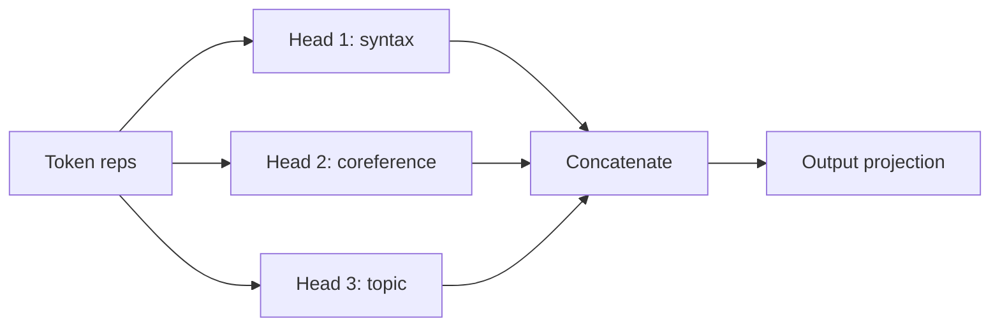
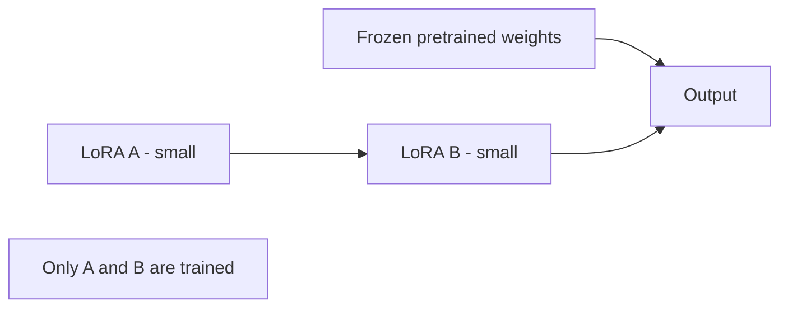

# LLM Interview Questions — Medium Level

> For mid-level AI engineers (2–5 years). This is where you must go past "attention lets the model focus" and actually justify design choices: the attention math, positional encodings, the KV cache, fine-tuning methods, and how models are aligned. Answers stay natural but get specific.

---

## Q1. Explain the self-attention formula and what each part does. (Architecture)

**Simple answer:** The core equation is:

```
Attention(Q, K, V) = softmax( (Q · Kᵀ) / √dₖ ) · V
```

Breaking it down naturally:
1. **Q · Kᵀ** — compare every token's Query with every token's Key. This gives a grid of "how relevant is token j to token i" scores.
2. **/ √dₖ** — divide by the square root of the key dimension. Without this, large dot products push softmax into tiny gradients ("saturation"), and training becomes unstable. This scaling keeps things well-behaved.
3. **softmax** — turn scores into weights that sum to 1 (a probability distribution over which tokens to attend to).
4. **· V** — use those weights to take a weighted average of the Value vectors. That blended vector is the token's new, context-aware representation.

> Interviewers love asking *"why divide by √dₖ?"* — it's the detail that separates memorizers from people who understand it.

---

## Q2. What is multi-head attention and why use multiple heads? (Architecture)

**Simple answer:** Instead of computing attention once, the model splits into several **heads** that each learn to focus on different kinds of relationships — one head might track grammar (subject–verb), another might track long-range references, another topic.

It's like having multiple readers each highlighting the text for a different reason, then combining their notes. This gives a richer representation than a single attention pattern could.



---

## Q3. Why do Transformers need positional encodings? Compare sinusoidal vs RoPE. (Architecture)

**Simple answer:** Attention has no built-in sense of order — to it, "dog bites man" and "man bites dog" look like the same bag of tokens. Positional encodings inject *where* each token sits.

- **Sinusoidal (original)**: fixed sine/cosine patterns added to embeddings. Simple, but doesn't generalize great to sequences longer than training.
- **RoPE (Rotary Position Embedding)**: rotates the Q/K vectors by an angle based on position. It encodes *relative* position naturally and extends to longer contexts much better — which is why almost all modern LLMs (Llama, etc.) use it.

**Why it matters at scale:** long-context models (100k+ tokens) rely on RoPE (often with scaling tricks like NTK/YaRN) to stay coherent far beyond their original training length.

---

## Q4. What is the KV cache and why is it critical? (Performance / Load)

**Simple answer:** LLMs generate one token at a time, and each new token attends to all previous tokens. Without caching, you'd recompute the Keys and Values for the entire sequence on every single token — hugely wasteful.

The **KV cache** stores the Key and Value vectors for tokens already processed, so each new token only computes its own K/V and reuses the rest. This is *the* thing that makes generation fast.

**The catch — memory:** the KV cache grows with sequence length × layers × heads and can consume gigabytes of GPU memory for long contexts and many concurrent users. Managing it is central to serving:
- **Prefill** (processing the prompt) is compute-bound and parallel.
- **Decode** (generating tokens) is memory-bandwidth-bound and sequential.

This split is why serving frameworks optimize them differently.

---

## Q5. What is LoRA / QLoRA and why is it so popular for fine-tuning? (Architecture / Performance)

**Simple answer:** Full fine-tuning updates *all* billions of parameters — expensive and memory-hungry. **LoRA (Low-Rank Adaptation)** freezes the original model and trains tiny "adapter" matrices injected into it. You update maybe <1% of the parameters but get most of the benefit.

**QLoRA** goes further: it quantizes the frozen base model to 4-bit to slash memory, then trains LoRA adapters on top — letting you fine-tune large models on a single consumer GPU.



**Pros:** cheap, fast, small artifacts (adapters are a few MB), you can swap adapters per task.
**Cons:** slightly below full fine-tuning quality for some tasks; managing many adapters adds complexity.
**When to use:** almost always the default for customizing open models on limited hardware.

---

## Q6. Explain RLHF, and why DPO has largely replaced PPO. (Architecture)

**Simple answer:** A base model predicts likely text, not *helpful, safe* text. **Alignment** fixes that.

- **RLHF (Reinforcement Learning from Human Feedback):** humans rank model outputs → train a **reward model** → use reinforcement learning (**PPO**) to push the LLM toward high-reward outputs. It works, but PPO is complex, unstable, and needs multiple models in memory.
- **DPO (Direct Preference Optimization):** skips the separate reward model and RL loop. It directly optimizes the model on preference pairs (chosen vs rejected answers) with a simple classification-style loss. Much simpler and more stable, similar quality — which is why most labs moved to DPO (and variants like ORPO, KTO).

> Saying "DPO replaced PPO at most frontier labs because it removes the reward-model + RL instability" is exactly the up-to-date signal interviewers look for.

---

## Q7. What decoding strategies exist beyond temperature? (Performance / Use Case)

**Simple answer:** Decoding = how you pick the next token from the probability distribution.

| Strategy | How | Best for |
|---|---|---|
| **Greedy** | Always pick the top token | Deterministic tasks, but repetitive |
| **Beam search** | Track several candidate sequences | Translation, structured output |
| **Top-k** | Sample from k most likely tokens | Balanced creativity |
| **Top-p (nucleus)** | Sample from smallest set summing to p | Natural, adaptive diversity |
| **Temperature** | Reshape the distribution | Tune randomness (combine with above) |

**Practical combo:** temperature + top-p is the common default. Add **repetition/frequency penalties** to avoid loops.

---

## Q8. What is quantization and what does it cost you? (Performance / Scale)

**Simple answer:** Quantization stores model weights in lower precision (e.g., 16-bit → 8-bit or 4-bit) so the model uses less memory and runs faster.

- A 70B model in FP16 needs ~140GB; in 4-bit (~INT4) it drops to ~35GB — the difference between "needs a multi-GPU server" and "fits on one GPU."
- **Formats:** GGUF (CPU/llama.cpp), GPTQ and AWQ (GPU), bitsandbytes.

**The trade-off:** you lose a little accuracy. 8-bit is usually near-lossless; 4-bit is often a great sweet spot; below that quality degrades noticeably.

**Why it matters:** quantization is a top lever for cutting inference cost and fitting models on cheaper hardware.

---

## Q9. How do you get reliable structured (JSON) output from an LLM? (Use Case / Architecture)

**Simple answer:** Don't just ask nicely and hope. Use enforcement:
- **Native structured outputs / JSON mode** (OpenAI, others) — constrains the model to valid JSON matching a schema.
- **Tool/function calling** — the model returns arguments matching your schema.
- **Constrained decoding / grammars** — only allow tokens that keep output valid.
- **Libraries** like Instructor / Pydantic — validate and auto-retry on failure.

```python
from pydantic import BaseModel
from openai import OpenAI

class Ticket(BaseModel):
    category: str
    priority: int
    summary: str

client = OpenAI()
resp = client.chat.completions.parse(
    model="gpt-4o",
    messages=[{"role": "user", "content": "Categorize: my app keeps crashing on login"}],
    response_format=Ticket,   # enforced schema
)
print(resp.choices[0].message.parsed)
```

**Why:** downstream systems need valid, predictable structure — free-text breaks pipelines.

---

## Q10. How do you evaluate an LLM application without a single "correct" answer? (Performance)

**Simple answer:** Text quality is subjective, so combine methods:
- **Reference-based metrics** (BLEU/ROUGE) — only useful when there's a gold answer; weak for open-ended text.
- **LLM-as-a-judge** — use a strong model to score outputs against a rubric (accuracy, helpfulness, tone). Watch for biases (it favors longer answers and its own style).
- **Human eval** — gold standard for high-stakes; expensive.
- **Task metrics** — for extraction/classification, use accuracy/F1 against labels.
- **Golden datasets + regression tests in CI** — so a prompt or model change can't silently degrade quality.

> Key line: *"I never trust a single metric or a demo that 'looks good'; I gate changes on a golden set and monitor live traffic."*

---

## Quick Coverage Map
- **Architecture:** attention math (Q1), multi-head (Q2), positional/RoPE (Q3), LoRA (Q5), alignment (Q6), structured output (Q9).
- **Performance/Load:** KV cache (Q4), decoding (Q7), quantization (Q8), evaluation (Q10).
- **Use Case:** structured output (Q9), decoding choices (Q7).

## Further Reading
- [RoFormer / RoPE paper](https://arxiv.org/abs/2104.09864)
- [LoRA paper](https://arxiv.org/abs/2106.09685)
- [DPO paper](https://arxiv.org/abs/2305.18290)
- [QLoRA paper](https://arxiv.org/abs/2305.14314)

*Content synthesized from general domain knowledge and current (2025–2026) interview trends; rephrased for compliance with licensing restrictions.*
