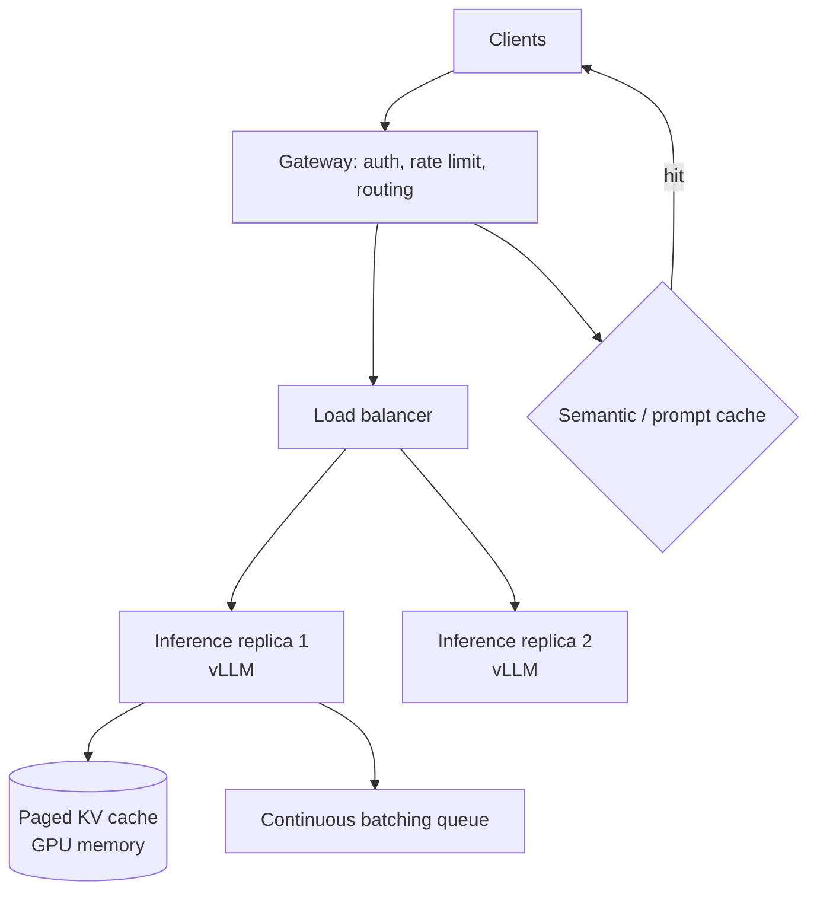
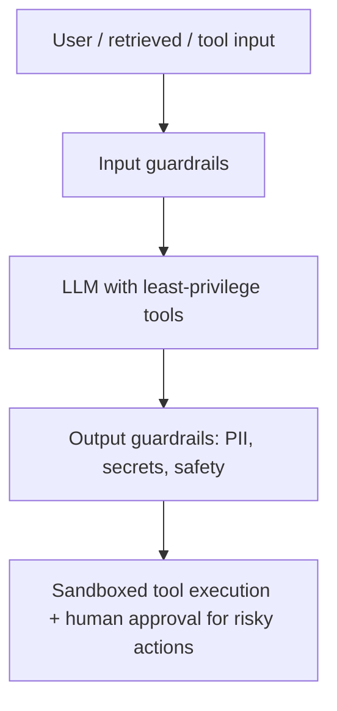

# LLM Interview Questions — Advanced / Expert Level

> For senior/staff AI engineers and system-design rounds. These test whether you can serve LLMs under real load, do cost/throughput math live, reason about GPU memory, and defend the whole system against attack. Answers are natural but assume deep familiarity.

---

## Q1. Design an LLM serving system for high throughput and low latency. (Architecture / Scale / Load)

**Simple framing:** Serving LLMs is unusual because generation is sequential and memory-bandwidth-bound, and requests have wildly different lengths. The whole game is keeping expensive GPUs busy.

**Techniques that matter:**
- **Continuous (in-flight) batching:** instead of waiting for a batch to fill, the server adds/removes requests every step as sequences finish. This is the single biggest throughput win (vLLM, TGI). Naive static batching wastes GPU because short requests wait for long ones.
- **PagedAttention:** manages the KV cache like OS virtual memory (pages), eliminating fragmentation and allowing many more concurrent sequences. This is vLLM's core innovation.
- **Prefill/decode split:** prefill is compute-heavy and parallel; decode is memory-bound and sequential. Some systems (disaggregated serving) run them on separate hardware pools.
- **Tensor/pipeline parallelism:** shard a model too big for one GPU across many GPUs.
- **Speculative decoding:** a small draft model proposes several tokens, the big model verifies them in one pass — big speedup with identical output.

---

## Q2. Do the GPU memory math: can a 70B model serve on one 80GB GPU? (Scale / Load)

**Simple answer:** Two memory costs: **weights** + **KV cache**.

- **Weights:** params × bytes-per-param. 70B × 2 bytes (FP16) = **140GB**. That does *not* fit on one 80GB GPU. Options: quantize to 4-bit → ~35GB (fits), or shard across 2+ GPUs.
- **KV cache per token:** roughly `2 (K and V) × layers × hidden_dim × bytes`. For a 70B model this is on the order of hundreds of KB to ~1MB per token; multiply by sequence length and concurrent requests and it adds up fast.

**Why interviewers ask:** they want to see you reason that *weights set the floor* and *KV cache sets how many concurrent long conversations you can serve*. Long contexts + many users can OOM you even when weights fit. Levers: quantize weights, quantize/compress KV cache, cap context, or add GPUs.

---

## Q3. How do you compute and control cost per request? (Performance / Load)

**Simple answer:** For API models, cost = `(input_tokens × input_price) + (output_tokens × output_price)`. Output tokens are usually 2–4× more expensive than input, and generation dominates latency too.

**Worked example (illustrative prices):** a RAG call with 3,000 input tokens (context) and 500 output tokens at $2.50/M input and $10/M output:
`(3000 × 2.5 + 500 × 10) / 1,000,000 = (7500 + 5000)/1e6 = $0.0125` per request. At 1M requests/day that's ~$12,500/day — so the interviewer wants your cost levers:

- **Semantic + prompt caching** (avoid repeat work; prompt caching cuts input cost on shared prefixes).
- **Model routing** — cheap model for easy queries, frontier only when needed.
- **Trim context** — retrieve less, dedupe, summarize history.
- **Cap output length**; stream to improve perceived latency.
- **Self-host** at high, steady volume where per-token economics beat API pricing.

---

## Q4. What is a Mixture-of-Experts (MoE) model and what's the trade-off? (Architecture / Scale)

**Simple answer:** In a dense model, every parameter runs for every token. In **MoE**, the feed-forward layer is split into many "experts," and a **router** sends each token to only a few of them (e.g., 2 of 8). So the model has a huge *total* parameter count but only activates a fraction per token.

**Why it's powerful:** you get the capacity/quality of a giant model at the *compute cost* of a much smaller one (Mixtral, DeepSeek, many frontier models use MoE).

**The trade-off:** you still must hold *all* experts in memory (high VRAM), routing can load-imbalance, and training is trickier. So: cheaper compute, but not cheaper memory.

---

## Q5. How do you serve many fine-tuned variants efficiently? (Scale / Architecture)

**Simple answer:** Don't deploy a full copy per customer — that's absurdly expensive. Use **multi-LoRA serving**: keep one base model in GPU memory and hot-swap small LoRA adapters per request (frameworks like vLLM/LoRAX/S-LoRA support this).

- Thousands of tenant-specific adapters share one base model.
- Each adapter is a few MB vs a full multi-GB model.
- Router picks the right adapter per request.

**Pros:** massive cost saving, fast tenant onboarding.
**Cons:** slight per-request overhead; adapters must be compatible with the base.

---

## Q6. Walk through the LLM security threat model. (Security)

**Simple answer:** Map it to the **OWASP LLM Top 10**. The big ones:

- **Prompt injection (direct & indirect):** attacker text overrides your instructions. Indirect = malicious content arrives via retrieved docs, web pages, or tool output. Mitigate: separate/label untrusted data, don't auto-execute actions from model output, validate tool calls.
- **Sensitive data disclosure:** model leaks secrets, PII, or the system prompt. Mitigate: output filters, redaction, don't put secrets in prompts.
- **Insecure output handling:** treating LLM output as trusted → XSS, SQLi, RCE if you pipe it into a shell/DB/browser. Mitigate: sanitize outputs like any untrusted input.
- **Excessive agency:** an agent with unchecked tool power does damage. Mitigate: least privilege, allowlists, human-in-the-loop for high-risk actions, spend/step budgets.
- **Jailbreaks:** crafted prompts bypass safety. Mitigate: guardrail models (Llama Guard), layered defenses.
- **Unbounded consumption:** expensive prompts as a DoS/cost attack. Mitigate: rate limits, token caps, timeouts.

**Key principle:** never trust model output or retrieved/tool content; validate at every boundary.

---

## Q7. How do you reduce latency for the *first* token vs *total* generation? (Performance / Load)

**Simple answer:** Split the two — they have different fixes.

- **TTFT (Time To First Token)** = prefill time. Driven by prompt length. Fixes: shorter prompts, prompt caching (reuse computed KV for shared prefixes), faster prefill hardware.
- **TPOT / ITL (Time Per Output Token)** = decode speed. Driven by model size + memory bandwidth. Fixes: quantization, speculative decoding, smaller/distilled model, better batching.

**Perceived latency:** always **stream** tokens. Users tolerate a slow total if the first words appear quickly. For a chat UI, low TTFT + streaming feels fast even at modest tokens/sec.

---

## Q8. When do you fine-tune vs RAG vs prompt engineering vs long context? (Use Case / trade-offs)

**Simple answer:** Go up the ladder only as needed — cheapest, most flexible first.

| Approach | Best for | Cost/effort | Updates |
|---|---|---|---|
| **Prompt engineering** | Quick behavior shaping | Lowest | Instant |
| **RAG** | Injecting changing/private knowledge | Medium | Instant (edit docs) |
| **Long context** | Small corpora, one-off large inputs | Per-call $$ | Instant |
| **Fine-tuning** | Consistent style/format/skill | High, retrain | Slow (retrain) |

**The senior answer:** start with prompting; add RAG for knowledge; fine-tune only for *behavior* you can't get otherwise (tone, format, a narrow skill), or to shrink prompts/cost at scale. Often combine: fine-tune for style **+** RAG for facts. Fine-tuning to "teach facts" is usually the wrong call — facts change and RAG handles them better.

---

## Q9. How do you detect and handle model/prompt regressions in production? (Performance / everything)

**Simple answer:** Treat prompts and models like code with tests.

- **Versioning:** every prompt and model version is tracked; you can roll back.
- **Offline eval gate:** golden set runs in CI; block deploy on quality/latency/cost regression.
- **Canary / A-B:** ship to a small % of traffic, compare quality, cost, latency, error rate.
- **Online monitoring & tracing:** log prompts, tokens, latency, cost, tool calls, user feedback (Langfuse/LangSmith). Alert on drift.
- **Guardrail metrics:** track refusal rates, safety flags, hallucination signals.

Provider models can change under you, so continuous eval catches silent quality drops.

---

## Q10. How do you pick between a hosted API model and self-hosting an open model? (Use Case / Scale / trade-offs)

**Simple answer:** It's a classic build-vs-buy with an inflection point at volume.

**Hosted API (OpenAI/Anthropic/etc.)**
- Pros: best quality, no infra, instant scaling, fast to ship.
- Cons: per-token cost adds up, data leaves your boundary, rate limits, vendor lock-in, model can change.

**Self-hosted open model (Llama/Qwen/Mistral on vLLM)**
- Pros: data stays in-house (privacy/compliance), predictable cost at high volume, full control, can fine-tune freely.
- Cons: you own GPUs, scaling, uptime, and MLOps; quality may trail frontier models.

**Decision drivers:** data-residency/compliance needs (→ self-host), steady high volume (→ self-host economics win), need for top-tier reasoning or small team (→ API). Many mature systems do **both** via a gateway (LiteLLM): route sensitive/cheap traffic to self-hosted, hard queries to a frontier API, with fallback for outages.

---

## Rapid Expert Checklist (say these under pressure)
- Continuous batching + PagedAttention to keep GPUs saturated.
- Weights set the memory floor; KV cache sets concurrency — quantize both if needed.
- Cost = input + (pricier) output tokens; cache, route, trim, cap.
- Speculative decoding + streaming for latency; split TTFT vs TPOT.
- Multi-LoRA for many tenants on one base model.
- Never trust model/tool/retrieved input; guardrails + least privilege + sandbox.
- Version prompts/models; gate on golden-set evals; canary; monitor drift.

## Further Reading
- [vLLM & PagedAttention](https://blog.vllm.ai/2023/06/20/vllm.html)
- [Speculative decoding](https://arxiv.org/abs/2211.17192)
- [Mixtral / MoE](https://arxiv.org/abs/2401.04088)
- [OWASP Top 10 for LLM Applications](https://genai.owasp.org/)
- [S-LoRA: serving thousands of adapters](https://arxiv.org/abs/2311.03285)

*Content synthesized from general domain knowledge and current (2025–2026) interview trends; rephrased for compliance with licensing restrictions.*
