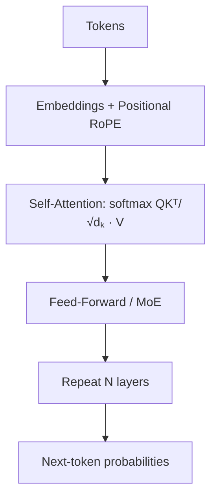

# LLM Cheatsheet

> One-page quick reference for LLMs. Skim before an interview or when making a serving/fine-tuning decision.

---

## The Transformer in One Diagram



**Attention:** `softmax( (Q·Kᵀ) / √dₖ ) · V` — √dₖ keeps gradients stable.

---

## Key Concepts At A Glance

| Concept | One-liner |
|---|---|
| Token | ~0.75 words; billing + limits are in tokens |
| Context window | Prompt + response must fit inside |
| Multi-head attention | Parallel heads capture different relationships |
| Positional encoding | RoPE (relative, long-context) > sinusoidal |
| KV cache | Reuse past K/V so decode is fast (costs memory) |
| MoE | Route tokens to few experts; big capacity, low compute |
| Hallucination | Confident wrong output; mitigate with RAG + grounding |

---

## Sampling Settings

| Task | Temperature | Notes |
|---|---|---|
| Code / math / extraction | 0–0.2 | Deterministic, consistent |
| Chat / Q&A | 0.5–0.7 | Balanced |
| Creative / brainstorm | 0.8–1.2 | Diverse |

Pair with **top-p ~0.9**; add frequency/presence penalties to stop loops.

---

## Fine-tuning Options

| Method | What | When |
|---|---|---|
| Prompt engineering | No training | First resort |
| **LoRA** | Train small adapters, freeze base | Default customization |
| **QLoRA** | 4-bit base + LoRA | Single-GPU fine-tune |
| Full fine-tune | Update all weights | Rarely needed, expensive |
| RAG | External knowledge | Facts that change |

**Alignment:** RLHF (reward model + PPO) → **DPO** (direct, no RL, simpler/stable, now standard).

---

## Quantization Reference

| Precision | 70B model size | Quality |
|---|---|---|
| FP16 | ~140 GB | Baseline |
| INT8 | ~70 GB | Near-lossless |
| INT4 | ~35 GB | Great sweet spot |
| < 4-bit | smaller | Noticeable degradation |

Formats: **GGUF** (CPU/llama.cpp), **GPTQ/AWQ** (GPU), bitsandbytes.

---

## Serving & Performance

| Technique | Benefit |
|---|---|
| **Continuous batching** | Keeps GPU saturated (biggest throughput win) |
| **PagedAttention** | No KV fragmentation → more concurrency (vLLM) |
| **Speculative decoding** | Draft + verify → faster, same output |
| **Tensor/pipeline parallel** | Fit models too big for one GPU |
| **Prompt caching** | Reuse shared-prefix KV → lower TTFT + cost |
| **Streaming** | Lower *perceived* latency |
| **Multi-LoRA** | Many tenants on one base model |

**Memory:** weights set the floor; **KV cache** sets concurrency. Quantize both if tight.
**Latency split:** TTFT (prefill, prompt length) vs TPOT (decode, model size/bandwidth).

---

## Cost Math

```
cost = input_tokens × in_price + output_tokens × out_price
```
- Output tokens cost 2–4× input.
- Levers: **semantic + prompt caching**, **model routing** (cheap→frontier), trim context, cap output, self-host at high steady volume.

---

## Structured Output

```python
from pydantic import BaseModel
class Out(BaseModel):
    category: str
    priority: int

resp = client.chat.completions.parse(
    model="gpt-4o", messages=msgs, response_format=Out)  # enforced schema
```
Options: native JSON mode / structured outputs, function calling, constrained decoding, Instructor.

---

## Security (OWASP LLM Top 10 — the big ones)

- [ ] **Prompt injection** (direct & indirect) — label untrusted data, don't auto-act on it.
- [ ] **Sensitive data disclosure** — redact PII/secrets, keep them out of prompts.
- [ ] **Insecure output handling** — sanitize output before shell/DB/browser.
- [ ] **Excessive agency** — least privilege, allowlists, human-in-the-loop.
- [ ] **Unbounded consumption** — rate limits, token caps, timeouts.
- [ ] **Jailbreaks** — guardrail models (Llama Guard), layered defense.

**Principle:** never trust model / tool / retrieved input — validate at every boundary.

---

## Decision: API vs Self-hosted

| | Hosted API | Self-hosted open model |
|---|---|---|
| Quality | Top-tier | May trail frontier |
| Cost | Per-token (adds up) | Predictable at high volume |
| Data | Leaves boundary | Stays in-house |
| Ops | None | You own GPUs/scaling |
| Best for | Fast ship, small team | Compliance, steady high volume |

Mature systems often do **both** via a gateway (LiteLLM) with routing + fallback.

---

## Eval & Reliability
- Version prompts + models; roll back on regression.
- Gate deploys on a **golden set** in CI.
- Canary / A-B new versions; monitor cost, latency, quality, safety.
- LLM-as-judge (mind length/self bias) + human eval for high stakes.

*Rephrased for compliance with licensing restrictions. See interview-prep files for full explanations.*
