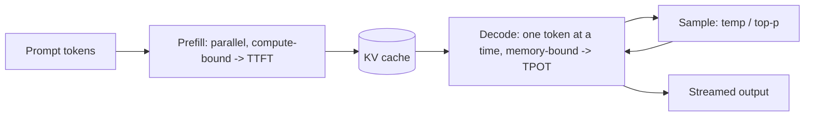
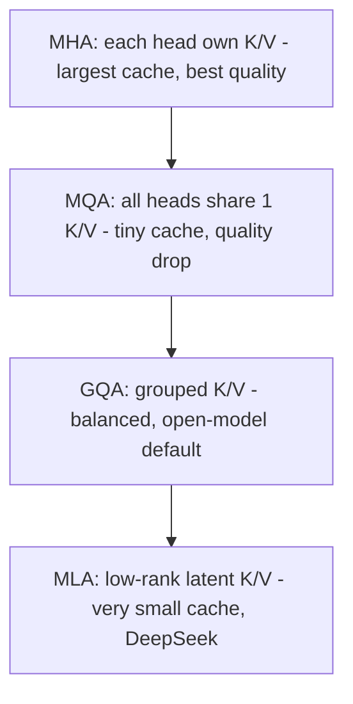
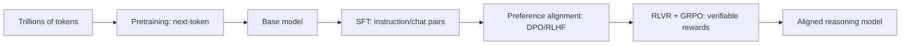
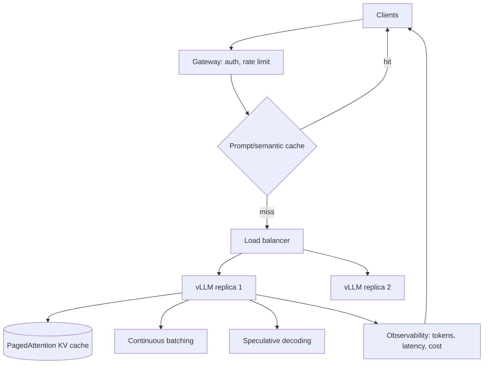
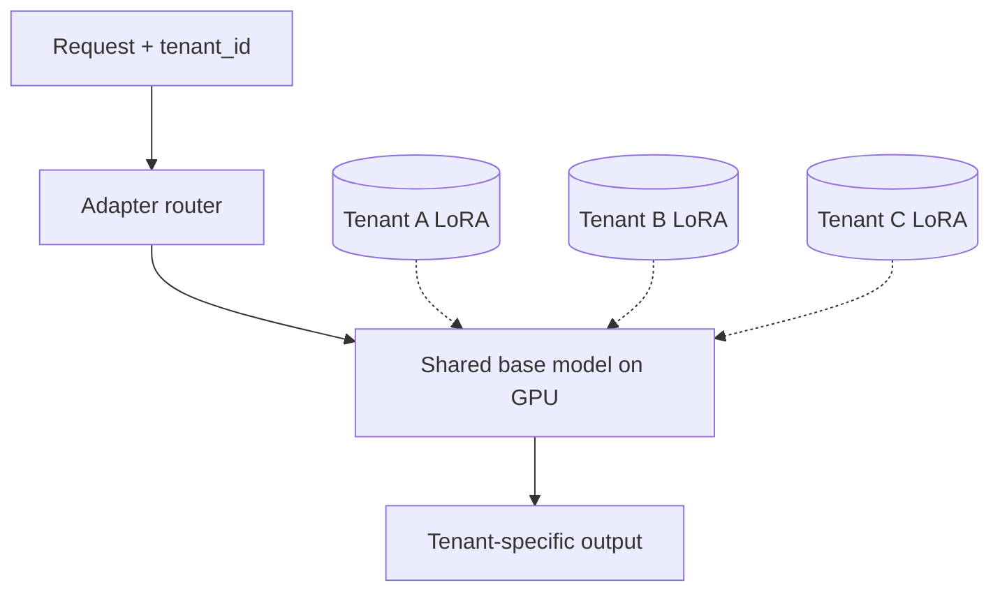
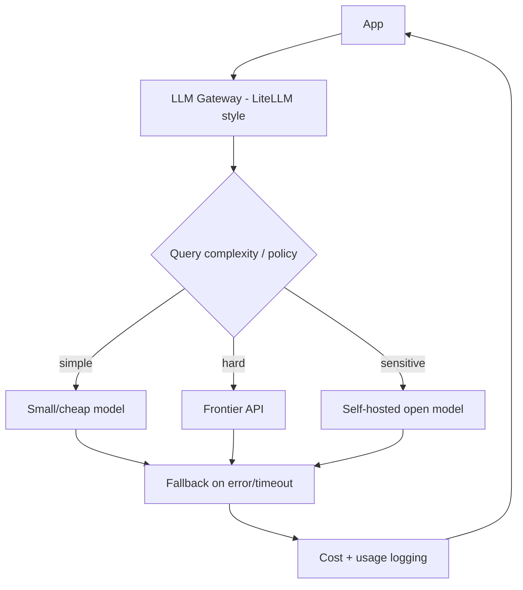
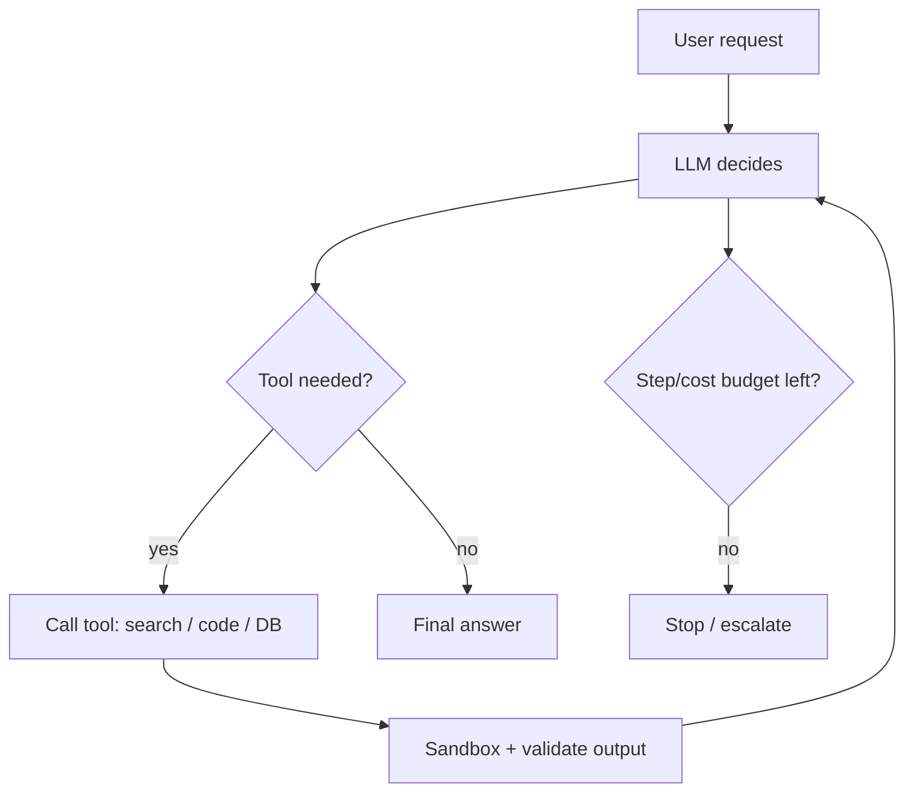
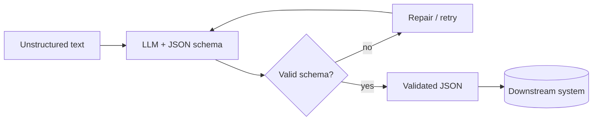
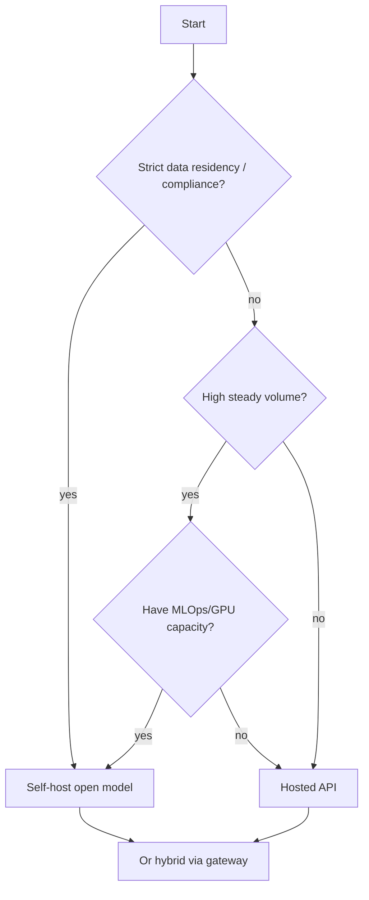

# LLMs — Use Case Diagrams

> Visual architectures for how LLMs are used and served in production. Mermaid renders automatically on GitHub. Each diagram includes the problem and the design notes interviewers probe.

---

## 1. LLM Inference Loop (what happens per request)

**Notes:** prefill vs decode have different bottlenecks; stream tokens for low perceived latency; KV cache reuse makes decode fast.

---

## 2. Attention Variants (KV-cache trade-off)

**Notes:** the industry moved MHA → GQA → MLA to shrink the KV cache because decode is memory-bandwidth-bound.

---

## 3. Training / Post-training Pipeline

**Notes:** each stage adds capability; DPO simplified preference alignment; RLVR/GRPO produce reasoning.

---

## 4. Production LLM Serving Stack

**Notes:** continuous batching + PagedAttention for throughput; caching + speculative decoding for latency/cost; full observability.

---

## 5. Multi-LoRA Serving (many tenants, one base model)

**Notes:** one resident base + thousands of few-MB adapters swapped per request → cheap customization at scale.

---

## 6. LLM Gateway (routing, fallback, cost control)

**Notes:** model routing cuts cost; fallback handles provider outages; sensitive data routed to self-hosted for compliance.

---

## 7. Tool-Calling / Agent Loop

**Notes:** least-privilege tools, sandbox execution, step/cost budgets to prevent loops and runaway spend (excessive agency risk).

---

## 8. Structured Output Extraction

**Notes:** enforce schema via structured outputs / function calling / constrained decoding; validate + auto-retry (Instructor/Pydantic).

---

## 9. Deployment Decision: API vs Self-Hosted

**Notes:** compliance and steady high volume favor self-hosting; small teams / top quality favor API; mature systems often do both.

*Diagrams synthesized from general domain knowledge and current best practices; rephrased for compliance with licensing restrictions.*
