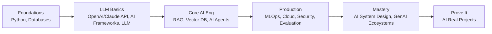

# 🧠 AI Engineering — Complete Learning & Interview Prep

A structured, hands-on curriculum to go from solid engineer to **expert AI Engineer** and to clear the toughest AI-engineering interviews at top companies.

Every topic is a self-contained module with the **same six sections** — deep-dive learning, tiered interview questions, a cheatsheet, rapid-fire recall, use-case diagrams, and runnable code. All content is written in plain, natural language, with Mermaid diagrams, real code, trade-offs, and "why / when to use" guidance, and reflects current **2025–2026** practice.

> Maintained by **Ravi Sharma** · ravisharmacs09@gmail.com

---

## 📚 How each topic is organized

Inside **every** topic folder you'll find the same six subfolders:

| # | Subfolder | What's inside |
|---|-----------|---------------|
| 1 | `1-Detailed-Learning/` | A deep, first-principles-to-production guide (the flagship read) |
| 2 | `2-Interview-Preparation/` | Q&A at **Basic**, **Medium**, and **Advanced/Expert** levels with detailed answers |
| 3 | `3-Cheatsheet/` | Dense one-page quick reference to skim before an interview |
| 4 | `4-RapidFire/` | ~50 one-line Q&A for fast recall drilling |
| 5 | `5-UseCase-Diagram/` | Mermaid architecture/flow diagrams for real scenarios |
| 6 | `6-Implementation-Code-Examples/` | Runnable, heavily-commented code you can study and explain |

Every module covers these dimensions where relevant: **architecture, security, scale, load, performance, and use cases.**

---

## 🗺️ Curriculum

| # | Topic | Focus |
|---|-------|-------|
| 01 | [Python](./01-Python) | Language internals, GIL/free-threading, asyncio, typing, performance, NumPy/Pandas, FastAPI serving |
| 02 | [AI Frameworks](./02-AI-Frameworks) | LangChain/LCEL, LangGraph, LlamaIndex, DSPy, Instructor, PyTorch, Hugging Face |
| 03 | [OpenAI / Claude API](./03-OpenAI-Claude-API) | Chat/messages APIs, tool calling, streaming, structured outputs, prompt caching, cost & reliability |
| 04 | [RAG](./04-RAG) | Retrieval-Augmented Generation: chunking, hybrid search, reranking, contextual retrieval, GraphRAG, agentic RAG |
| 05 | [Vector DB](./05-VectorDB) | Embeddings, similarity metrics, ANN indexes (HNSW/IVF-PQ/DiskANN), quantization, scaling |
| 06 | [AI Agents](./06-AI-Agents) | ReAct loop, planning, tools, memory, multi-agent, MCP/A2A, reliability |
| 07 | [Databases](./07-Databases) | SQL/NoSQL, indexing, ACID & isolation, CAP, caching, pgvector, semantic cache |
| 08 | [MLOps & LLMOps](./08-MLOps) | Tracking, versioning, deployment, model servers, CI/CD, monitoring, drift, prompt/eval ops |
| 09 | [Cloud](./09-Cloud) | AWS/Azure/GCP AI services, GPUs, Kubernetes, cost optimization, multi-region HA, IaC |
| 10 | [AI System Design](./10-AI-System-Design) | A design framework + worked designs (support bot, code assistant, RAG SaaS, LLM gateway) |
| 11 | [Security](./11-Security) | OWASP LLM Top 10, prompt injection, guardrails, secure agents/RAG, privacy & compliance |
| 12 | [AI Evaluation](./12-AI-Evaluation) | Offline/online eval, LLM-as-judge, RAG/agent metrics, golden sets, CI gating |
| 13 | [GenAI Ecosystems](./13-GenAI-Ecosystems) | Model landscape, modalities, SFT/RLHF/DPO/RLVR, PEFT, quantization, tooling |
| 14 | [AI Real Projects](./14-AI-Real-Projects) | A portfolio catalog + a runnable Chat-with-your-PDF starter + interview storytelling |
| ➕ | [LLM](./LLM) | Transformer internals, attention variants (MHA/GQA/MLA), training & alignment, inference & serving |

---

## 🧭 Suggested Learning Path

1. **Foundations** → Python (01), Databases (07)
2. **LLM Basics** → OpenAI/Claude API (03), AI Frameworks (02), LLM internals
3. **Core AI Engineering** → RAG (04), Vector DB (05), AI Agents (06)
4. **Production** → MLOps (08), Cloud (09), Security (11), Evaluation (12)
5. **Mastery** → AI System Design (10), GenAI Ecosystems (13)
6. **Prove it** → AI Real Projects (14)

---

## ✅ How to Use This Repo

- **Learn:** read `1-Detailed-Learning` for the topic, then internalize the `3-Cheatsheet`.
- **Practice:** work through `2-Interview-Preparation` (basic → medium → advanced) and run the code in `6-Implementation-Code-Examples`.
- **Revise:** drill `4-RapidFire` and glance at `5-UseCase-Diagram` the day before an interview.
- **Build:** ship and document projects from `14-AI-Real-Projects` — a strong portfolio beats any certificate.

> 💡 GitHub renders the Mermaid diagrams automatically, so all flow/architecture charts display visually in the browser.

---

## 📊 Progress Tracker

- [ ] 01 Python
- [ ] 02 AI Frameworks
- [ ] 03 OpenAI / Claude API
- [ ] 04 RAG
- [ ] 05 Vector DB
- [ ] 06 AI Agents
- [ ] 07 Databases
- [ ] 08 MLOps & LLMOps
- [ ] 09 Cloud
- [ ] 10 AI System Design
- [ ] 11 Security
- [ ] 12 AI Evaluation
- [ ] 13 GenAI Ecosystems
- [ ] 14 AI Real Projects
- [ ] LLM (transformers, attention, training, serving)

---

## 📝 Notes

- Code examples are teaching scaffolds — add production error handling, retries, secrets management, and observability before shipping. Most require an API key (e.g. `OPENAI_API_KEY`) and dependencies from each folder's `requirements.txt`.
- Content is synthesized from general domain knowledge and current (2025–2026) research and documentation; rephrased for compliance with licensing restrictions. Source links are provided in each module's "Further Reading".

*Happy learning — and good luck in your interviews! 🚀*
